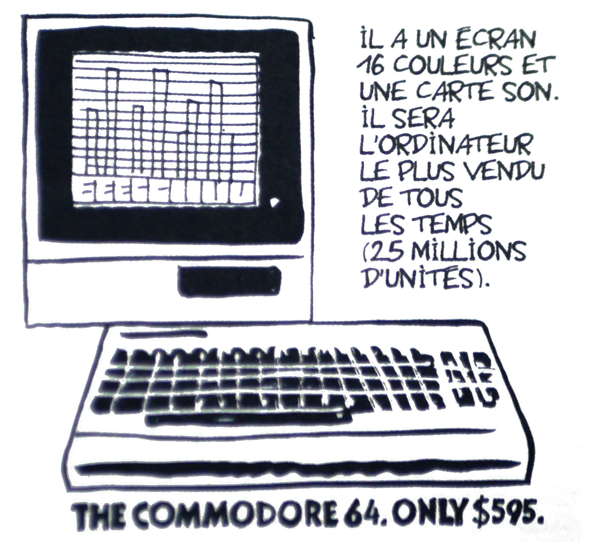
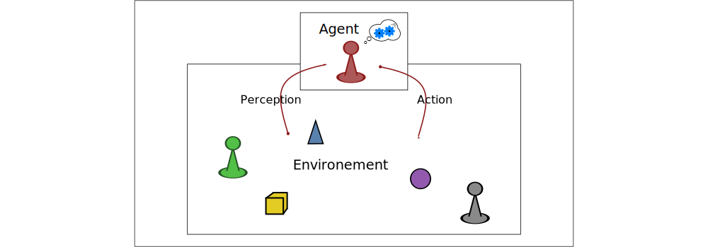
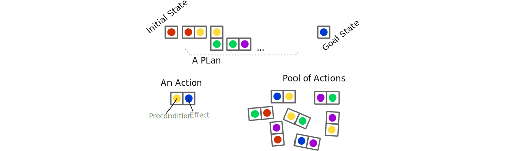
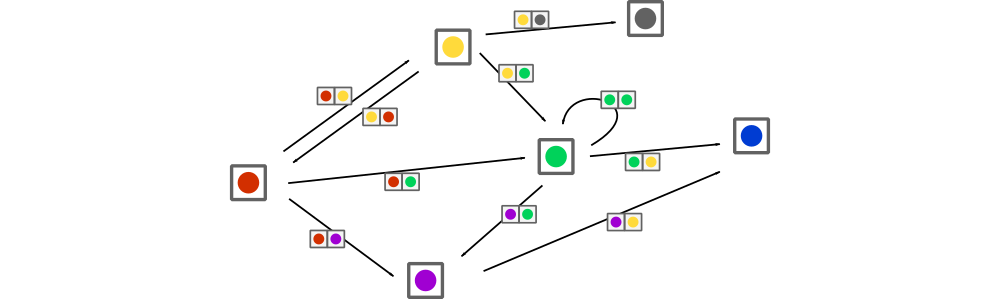
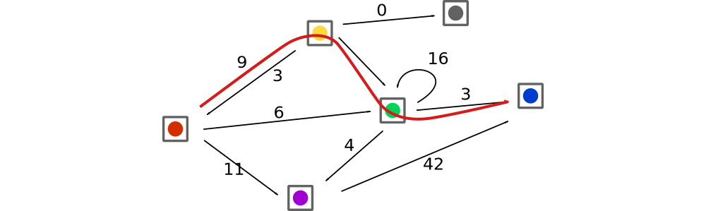
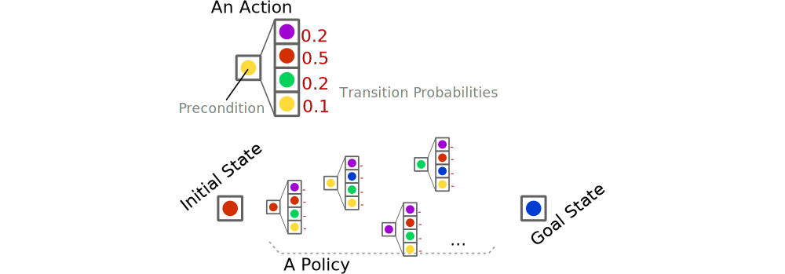
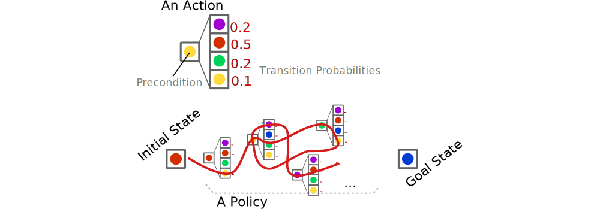
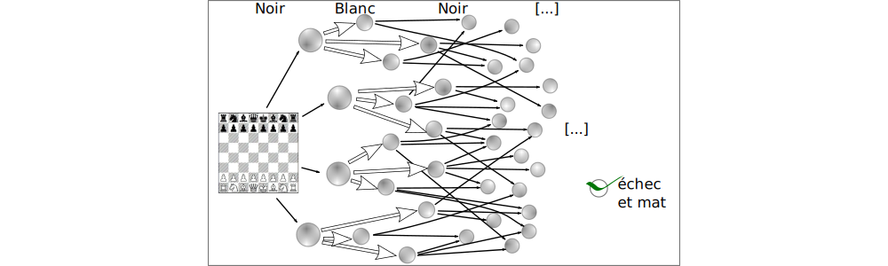

<!-- --------------------------------------------------------------- -->

# Decision Under Uncertainty

### An introduction

 

**Guillaume.Lozenguez**
[@imt-nord-europe.fr](mailto:guillaume.lozenguez@imt-nord-europe.fr)

---
<!-- --------------------------------------------------------------- -->

## Our topic: Autonomous Decision Making

 
 
 

- Model the capability of actions
- Learn / Optimize policies of actions
- Handle large problem...

---
<!-- --------------------------------------------------------------- -->

- **Quick Domain History**
- **Agent and Behavior**
- **Complexity**

---
<!-- --------------------------------------------------------------- -->

## Au commencement... - Les années 40

### Alan Turing (1912 - 1954)

- **1936 -** On Computable Numbers with an Application
to the Entscheidungsproblem (14k citation)
  - _The Universal Machine_ $\rightarrow$ _The Turing Machine_.
- **1950 -**  Computing Machinery and Intelligence
  - Le test de Turing (21k citation)

 

> Computing Science and Artificial Intelligence are already close notions

---

## Les années 60 - IA théorique et âge d'or de l'informatique

### Richard E. Bellman (1920 - 1984)

- **1957 -** A Markovian Decision Process
  - Mathématique appliqué

### Edsger W. Dijkstra (1922 - 2002)

#### **« La science informatique n’est pas plus la science des ordinateurs   que l’astronomie n’est celle des télescopes »**

- **1959 -** A note on two problems in connexion with graphs
    - Algorithme de Dijkstra

---
<!-- --------------------------------------------------------------- -->

## Les années 80 - L'âge d'or de l'ordinateur

### 1982: Le Comodore 64

(La Revue Dessinée Vol.5)

> L'IA trouve un support pour exécuter ces théories.

---
<!-- --------------------------------------------------------------- -->

## L'IA moderne - sur le devant de la scène

### Une triple conjoncture:

- Une théorie et des algorithmes matures
- Des clusters de calculs démocratisés
- Des données brutes à profusion

 

> L'avènement du Deep-Learning.

---
<!-- --------------------------------------------------------------- -->

## L'IA moderne - quelques dates

- **1998 -** LeNet - un réseau neuronal convolutif (1989-1998)
    - "Gradient-based learning applied to document recognition"
    _Y. LeCun_, _L. Bottou_, _Y. Bengio_ et _P. Haffner_ 
- *Nov. 2007*, Carnegie-Mellon win the Darpa Urban Challenge ($2M\$$)

- **Oct. 2015 -** First release of Tesla Autopilot

---
<!-- --------------------------------------------------------------- -->

## L'IA moderne - quelques dates (suite)

- **Oct. 2015 -** Victory of d'**AlphaGo** over professional player

- **2017 -** "Attention is all you need"
_A. Vaswani, N. Shazeer, N. Parmar, J. Uszkoreit, L. Jones,_
_A.N. Gomez, Ł. Kaiser, I. Polosukhin_ (92k citations)
  - Solution pour l'IA générative.
- **nov. 2022**, Lancement de ChatGPT

---
<!-- --------------------------------------------------------------- -->

## My Research Topic - Distributed Decision Making

### Distributed Artificial Intelligence

- **Intelligence** - Simpelly referencing natural intelligence
- **Artifical** - But not natural (based on computing technic)

#### AI: The models and algorithms coping natural intelligence

- **Distributed** - In opposition to centralized - spread on distinct systems

### Decision Making Under Uncertainty

- **Planning** - infers consequences of choices (retro-action)
- **Coordination** - and do it with multiple entities

---
<!-- --------------------------------------------------------------- -->

- Quick Domain History
- **Agent and Behavior**
- Complexity

---
<!-- --------------------------------------------------------------- -->

## Notion of Agent - Simple definition

 
 

**An agent:**

#### An entity capable of perception and action  evolving in an environment.

 

**Question:**

#### How to choose appropriate action to perform  considering the perception at a each time step ?

---
<!-- --------------------------------------------------------------- -->

## Notion of Agent - Not reserved to Artificial Intelligence

 
 

#### "I act therefore I am"

- my actions have an effect on the world
- **and** I have the choice to act or not

 
 
 
 

cf. _"BullShit Jobs"_ - David Graeber (2019)
(p.132-133 fr. in version )

or _"The joy to be cause"_ - Karl Groos (1901)

<!-- Pour approfondir: : broucek francis « the sense of self » 1977 - Klein G. S. « the vital pleasures » 1976.-->

---
<!-- --------------------------------------------------------------- -->

## Perception/Action Loop - notion of Retro-Action

 
 

Rarely determinist, mostly uncertain (even stochastic)

---
<!-- --------------------------------------------------------------- -->

## Notion of Agent - Complementary Notions

 

### Agent:

- Defining by a perception-state, goals and a policy to achieve its goals (*BDI* model: Belief - Desire - Intention)
- with different positions in social structure (*AGR* model: Agent - Group - Role )
- Capable of communication
- Capable of adaptation (learning)
- Driven by emotions
- ...

---
<!-- --------------------------------------------------------------- -->

## Rational Agent 

 
 

- Capable of **perception** and **action**
- Driven toward its **goals** (**Desire** in **BDI** model)

(_I.E._ Somehow, a value function allows to optimise the course of actions)

---
<!-- --------------------------------------------------------------- -->

## Deterministic Planning

 
 

Determining *a succession of actions* to drive a system from an initial state to a target state.

**Deterministic case**:

- the effects, by doing an action, from a specific state is certain.

---
<!-- --------------------------------------------------------------- -->

## Deterministic Planning

 
 

Determining *a succession of actions* to drive a system from an initial state to a target state.

**Deterministic case**:

- the effects, by doing an action, from a specific state is certain.

---
<!-- --------------------------------------------------------------- -->

## Determine a Plan

 
 

Finding a *path* in a *graph* modeling all possible evolutions

---
<!-- --------------------------------------------------------------- -->

## Plan Optimization

 
 

Finding an *optimized* path in a *weighted* Graph

- Tipically: _Finding the shortest path from `A` to `B`_

---
<!-- --------------------------------------------------------------- -->

## Stokastic Planning

 
 

Build a *policy*:

- Associate an *action* to perform *to each* reachable *state*

---
<!-- --------------------------------------------------------------- -->

## Stokastic Planning

 
 

Execute a *policy*:

- Then, the effective succession of actions remains stochastic

---
<!-- --------------------------------------------------------------- -->

## Game Theory

 
 

*Few entities* (players) control a system (with different goals)

- Which actions for each entity ?
- Which consequences ?

---
<!-- --------------------------------------------------------------- -->

## Class of problems - Game theory

 
 

*Few entities* control the same system (with different goals)

- *Uncertainty*: At least on the actions of the other players.

---
<!-- --------------------------------------------------------------- -->

- Quick Domain History
- Agent and Behavior
- **Complexity**

---
<!-- --------------------------------------------------------------- -->

## Evaluate a complexity

- **Number of States** or configurations  Number of possible snapshot of a system   
- **Number of Actions** - Number of control possibilities   
- **Branching** - Number of reachable states from a given configuration   
- **Horizon** - Number of time steps before feedback

---
<!-- --------------------------------------------------------------- -->

## The notion of complexity (example of Go)

 
 

**_GO:_** $19\times19$ positions $\rightarrow$ $10^{170}$ configurations $\rightarrow$ $10^{600}$ games

**For comparison:** $10^{120}$ possible games in chess
**Professional AI:** 2015

---
<!-- --------------------------------------------------------------- -->

## The notion of complexity (example of Go)

 

**A classical $3$ GHz computer:** $3\times10^9$ op. per second
$\rightarrow$ $~ 2.6 \times 10^{14}$ op. a day $\rightarrow$ $~ 10^{17}$ op. a year

 

**Enumerating all games:** $O(n)$ with $n=10^{600}$: _$10^{583}$ years_
$\rightarrow$ requires decomposed model and statistics...

 

**Sun life:** arround _$10^{30}$ years_

---
<!-- --------------------------------------------------------------- -->

## Decision Making Problem

 

#### How to compute ~~optimal~~ appropriate responses to control dynamic systems ?

**Knowing that:**

- Evolutions are generally uncertain
- We potentially do not have the model
- Model could require very large exploration

---
<!-- --------------------------------------------------------------- -->

## Game: 421

 

**Reaching the best combination**
**by rolling 3 dices**

### Goal :

- Optimize the 2 re-roll possibility
- By choosing dices to roll again.
- The best ever is _$4-2-1$_

---
<!-- --------------------------------------------------------------- -->

## Game 421 - The Quiz...

- **Number of States ?**

---
<!-- --------------------------------------------------------------- -->

## Game 421 - The Quiz...

- **Number of States ?** As a cartesian product of state variables:
  * variable: _Die-1_ ; domain: _1-6_ 
  * variable: _Die-2_ ; domain: _1-6_ 
  * variable: _Die-3_ ; domain: _1-6_ 
  * variable: _Counter_ ; domain: _1-3_

 

$$ 6 \times 6 \times 6 \times 3 = 648$$

---
<!-- --------------------------------------------------------------- -->

## Game 421 - The Quiz...

- **Number of States ?**  In facts, the order do not mater.

 

(Mathematiques area: [Combinatorics](https://en.wikipedia.org/wiki/Combinatorics))

 
 

Get 3 elements in 1-6 : _56_ $\times counter =$ _168_

---
<!-- --------------------------------------------------------------- -->

## Game 421 - The Quiz...

- **Number of Action ?**

---
<!-- --------------------------------------------------------------- -->

## Game 421 - The Quiz...

- **Number of Action ?**
  * variable: _Act-1_ ; domain: _Keep-Roll_ 
  * variable: _Act-2_ ; domain: _Keep-Roll_
  * variable: _Act-3_ ; domain: _Keep-Roll_

 
 

$$ 2 \times 2 \times 2 = 2^3 = 8$$

---
<!-- --------------------------------------------------------------- -->

## Game 421 - The Quiz...

- **Branching ?**

---
<!-- --------------------------------------------------------------- -->

## Game 421 - The Quiz...

- **Branching ?**

 

Worst case: with action "_roll-roll-roll_" $\rightarrow$ _56_ posibilities

 

- **Horizon ?** $\quad$ _3_

 

- **Games ?** $\quad$ $56 \times 56 \times 56 =$ _175 616_

---
<!-- --------------------------------------------------------------- -->

## Game 421 - Implementation:

[https://ktorz-net.github.io/hackagames/](https://ktorz-net.github.io/hackagames/)

 
 
 

Web dev. environment: [https://replit.com](https://replit.com)
