# Decision Under<br />Uncertainty

### State and decision in 421 game

Guillaume Lozenguez

[@imt-nord-europe.fr](mailto:guillaume.lozenguez@imt-nord-europe.fr)


---

## Grail: Control complex system

_as efficiently as possible..._

1. Determine State and Action space:
   * List the variables describing the system configurations
   * List the variables describing the possibility of control.
   * Evaluate the branching

_That drawback a first estimation of the complexity of our system_ 

### In 421: 

$$\text{State:} \left\{ h \in [0, 2], \quad d1, d2, d3, \in[0, 6]^3 \right\} (648 states) $$


$$\text{Action:} \left\{ a1, a2, a3, \in[\mathit{keep}, \mathit{roll}]^3 \right\} (8 actions)$$

---

## Grail: Control complex system

_as efficiently as possible..._

1. Determine State and Action space:
2. Define, compute, learn, optimize a **policy** 
    * i.e. a function that returns an action to perform considering a reached state $s$.

$$\text{Policy:}\quad \pi(s) \in \text{Action}$$

_Markovian condition:_

The state is sufficient to determine the best action to perform, no need to look back all the history of the trajectory of the system.


---

## Scripted policy

A succession of `if`, `them`, `else` statement:

```python
state= { "D1": self.dices[0], "D2": self.dices[1],
    "D3": self.dices[2] }

if state["D3"] == 1 :
    if state["D2"] == 2 :
        if state["D1"] == 4 :
            action= "keep-keep-keep"
        else:
            action= "roll-keep-keep"
    else:
        action= "roll-roll-keep"
else:
    action= "roll-roll-roll"
```
---

## Scripted Policy as Decision Tree

### A Tree:

 - is a directed graph structure (with **Nodes**  and **Oriented Edges**),
 - connected, with no loop  and a unique path from any 2 nodes.
 


---

## Scripted Policy as Decision Tree

### A Decision Tree

**Nodes:** variables ; **Edges:** assignment ; **leaf:** group of states / actions


- Expert based Decision tree or learned :[ID3 algorithm](https://en.wikipedia.org/wiki/ID3_algorithm) (supervised learning))

---

## Scripted Policy as Decision Tree


- $\pi( 2, False, 42 )$ = **Action-4**

---

## Based on state variable prevalence

### Decision Tree (421):


Score: **222** (vs **160** for random)

---

## A Second Decision Tree



(with a score around **320**)

---

## A Second Decision Tree 

```python
if state["D3"] == 1 :
    if state["D2"] == 2 :
        if state["D1"] == 4 :
            action= "keep-keep-keep"
        else:
            action= "roll-keep-keep"
    elif state["D2"] == 1 :
        if state["D1"] == 1 :
            action= "keep-keep-keep"
        else:
            action= "roll-keep-keep"
    else:
        action= "roll-roll-keep"
else:
    action= "roll-roll-roll"
```
