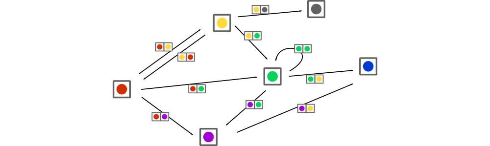
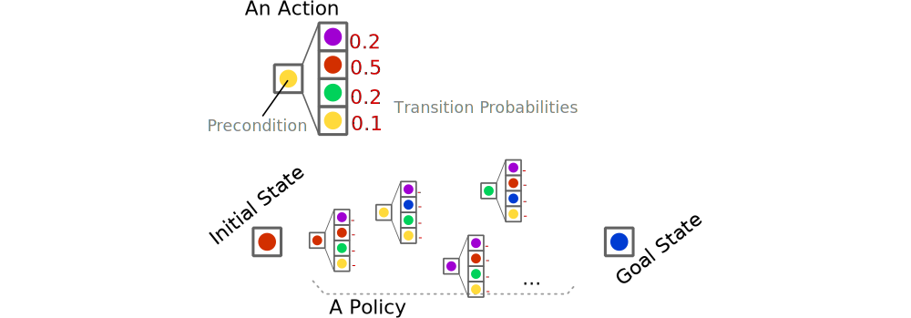
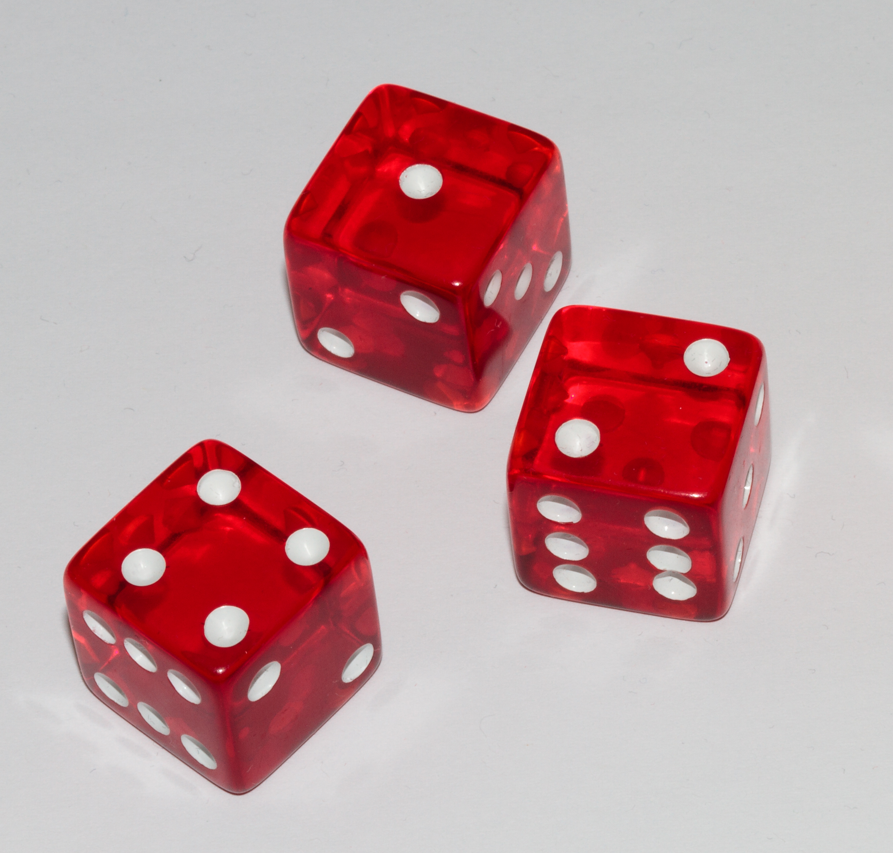

<!-- -------------------------------------------------- -->

# Projet Int. Art. and Optimization

### An introduction

Guillaume Lozenguez

[@imt-nord-europe.fr](mailto:guillaume.lozenguez@imt-nord-europe.fr)

---
<!-- -------------------------------------------------- -->

## Last improvement in Artificial Intelligence

- *Nov. 2007*, Carnegie-Mellon win the Darpa Urban Challenge ($2M\$$)
- *Oct. 2015*, First release of Tesla Autopilot

- *Oct. 2015*, Victory of d'**AlphaGo** over professional player

---
<!-- -------------------------------------------------- - ->

## Last improvement in Artificial Intelligence

 
 

In France:

- *March 2018*, Rapport Villani - [www.aiforhumanity.fr](http://www.aiforhumanity.fr) -

---
<!-- -------------------------------------------------- -->

## Our topic: Autonomous Decision Making

 
 
 

- Model the capability of actions
- Learn action interest
- Optimize policies of actions
- Handle large problem with optimization techniques 

---
<!-- -------------------------------------------------- -->

## The notion of complexity (Go)

GO: $10^{170}$ positions, $10^{600}$ games (chess: $10^{120}$ games)

---
<!-- -------------------------------------------------- -->

## The notion of complexity (Go)

 

**A classical $3$ GHz computer:** $3\times10^9$ op. per second
$\rightarrow$ $~ 2.6 \times 10^{14}$ op. a day $\rightarrow$ $~ 10^{17}$ op. a year

**Enumerating all games:** $O(n)$ with $n=10^{600}$: around $10^{583}$ years.
$\rightarrow$ requires decomposed model and statistics...

**Sun Life:** around $10^{30}$ years

---
<!-- -------------------------------------------------- -->

## Decision Making Problem

 

#### How to compute ~~optimal~~ appropriate responses to control dynamic systems ?

**Knowing that:**

- Evolutions are generally uncertain
- We potentially do not have the model
- Model could require very large exploration

---
<!-- -------------------------------------------------- -->

## Introduction to Decision Under Uncertainty

#### Is an introduction to models and algorithms to perform decision-making   at a time step *t*, by considering potential effects.

- 2 course sessions : $3$ hours $30$ with theory and practices
- 2 tutorial sessions : $2 \times 4$ hours
  * Apply and optimize Q-Learning
  * Simple games as a playground
- Integration to a larger project : The remaining times

---
<!-- -------------------------------------------------- -->

 

1. **Introduction**
  - The notion of Agent
  - Class of problems
  - Practice

---
<!-- -------------------------------------------------- -->

## Notion of Agent - Simple definition

 
 

**An agent:**

#### An entity capable of perception and action  evolving in an environment.

 

**Question:**

#### How to choose appropriate action to perform  considering the perception at a each time step ?

---
<!-- -------------------------------------------------- -->

## Notion of Agent - Not reserved to Artificial Intelligence

 
 

#### "I act therefore I am"

- my actions have an effect on the world
- **and** I have the choice to act or not

 
 
 
 

cf. "BullShit Jobs" - David Graeber (2019)
(p.132-133 fr. in version )

or the joy to be cause - Karl Groos (1901)

<!-- Pour approfondir: : broucek francis « the sense of self » 1977 - Klein G. S. « the vital pleasures » 1976.-->

---
<!-- -------------------------------------------------- -->

## Notion of Agent - Simple definition

rarely determinist, mostly uncertain (even stochastic)

---
<!-- -------------------------------------------------- -->

## Notion of Agent - Complementary Notions

### Agent:

- Defining by a perception-state, goals and a policy to achieve its goals (*BDI* model: Belief - Desire - Intention)
- with different positions in social structure (*AGR* model: Agent - Group - Role )
- Capable of communication
- Capable of adaptation (learning)
- Driven by emotions
- ...

---
<!-- -------------------------------------------------- -->

## Notion of Agent - rational Agent

- Capable of **perception** and **action** *&* driven toward its **goals** (**Desire** in **BDI** model)
- _I.E._ Somehow, a value function allows optimizing the course of actions.

---
<!-- -------------------------------------------------- -->

## Class of problems - Deterministic Planning

Determining *a succession of actions* to drive a system from an initial state to a target state.

**Deterministic case**:

- the effects, by doing an action, from a specific state is certain.

---
<!-- -------------------------------------------------- -->

## Class of problems - Deterministic Planning

Determining *a succession of actions* to drive a system from an initial state to a target state.

**Deterministic case**:

- the effects, by doing an action, from a specific state is certain.

---
<!-- -------------------------------------------------- -->

## Class of problems - Determine a Plan

Finding a *path* in a *graph* modeling all possible evolutions

---
<!-- -------------------------------------------------- -->

## Class of problems - Plan Optimization

Finding an *optimized* path in a *weighted* Graph

- Tipically: _Finding the shortest path from `A` to `B`_

---
<!-- -------------------------------------------------- -->

## Class of problems - Stokastic Planning

Build a *policy*:

- Associate an *action* to perform *to each* reachable *state*

---
<!-- -------------------------------------------------- -->

## Class of problems - Stokastic Planning

Execute a *policy*:

- Then, the effective succession of actions remains stochastic

---
<!-- -------------------------------------------------- -->

## Class of problems - Game Theory

*Few entities* (players) control a system (with different goals)

- Which actions for each entity ?
- Which consequences ?

---
<!-- -------------------------------------------------- -->

## Class of problems - Game theory

*Few entities* control the same system (with different goals)

- *Uncertainty*: At least on the actions of the other players.

---
<!-- -------------------------------------------------- -->

## Game: 421

- Get the best combination
- by rolling 3 dices

### Goal :

- Optimize the 2 re-roll possibility
- by choosing dices to roll again.

### Tools :

- HackaGame:  
[imt-mobisyst.bitbucket.io](https://imt-mobisyst.bitbucket.io/hackagames)
- Salon virtuel: [discord.gg/anGJR5RH](https://discord.gg/anGJR5RH)

---
<!-- -------------------------------------------------- -->

## Game: 421

 
 

### Code:

- On [replit.com](https://replit.com/teams/join/uwiarllynbhxlxftwgdkvfvwywrxrsvx-ChefProjetIA22) (for instance)

### Expected:

- Get the code philosophy
- Developpe a scripted AI.
