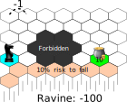

<!-- --------------------------------------------------------------- -->

# Decision Under Uncertainty

### An introduction

Guillaume Lozenguez

[@imt-nord-europe.fr](mailto:guillaume.lozenguez@imt-nord-europe.fr)

---
<!-- --------------------------------------------------------------- -->

## Last improvement in Artificial Intelligence

- *Nov. 2007*, Carnegie-Mellon win the Darpa Urban Challenge ($2M\$$)
- *Oct. 2015*, First release of Tesla Autopilot

- *Oct. 2015*, Victory of d'**AlphaGo** over professional player

---
<!-- --------------------------------------------------------------- -->

## Last improvement in Artificial Intelligence

 
 

In France:

- *March 2018*, Rapport Villani - [www.aiforhumanity.fr](http://www.aiforhumanity.fr) -

---
<!-- --------------------------------------------------------------- -->

## Our topic: Autonomous Decision Making

 
 
 

- Model the capability of actions
- Learn action interest
- Optimize policies of actions
- Handle large problem with optimization techniques 

---
<!-- --------------------------------------------------------------- -->

## The notion of complexity (Go)

GO: $10^{170}$ positions, $10^{600}$ games (chess: $10^{120}$ games)

---
<!-- --------------------------------------------------------------- -->

## The notion of complexity (Go)

 

**A classical $3$ GHz computer:** $3\times10^9$ op. per second
$\rightarrow$ $~ 2.6 \times 10^{14}$ op. a day $\rightarrow$ $~ 10^{17}$ op. a year

**Enumerating all games:** $O(n)$ with $n=10^{600}$: arround $10^{583}$ years.
$\rightarrow$ requires decomposed model and statistics...

**Sun life:** arround $10^{30}$ years

---
<!-- --------------------------------------------------------------- -->

## Decision Making Problem

 

#### How to compute ~~optimal~~ appropriate responses to control dynamic systems ?

**Knowing that:**

- Evolutions are generally uncertain
- We potentially do not have the model
- Model could require very large exploration

---
<!-- --------------------------------------------------------------- -->

## Introduction to Decision Under Uncertainty

#### Is an introduction to models and algorithms to perform decision-making   at a time step *t*, by considering potential effects.

- 1 course sessions : $2$ hours with the theory
- 2 tutorials sessions : $2 \times 4$ hours
  * Implement a Decision-Tree
  * Applying Q-Learning
  * Simple dice game as a playground

---
<!-- --------------------------------------------------------------- -->

 

1. **Introduction**
  - Class of problems
  - The notion of Agent
2. **Markov Decision Process**
3. **Q-Learning**

---
<!-- --------------------------------------------------------------- -->

## Notion of Agent - Simple definition

 
 

**An agent:**

#### An entity capable of perception and action  evolving in an environment.

 

**Question:**

#### How to choose appropriate action to perform  considering the perception at a each time step ?

---
<!-- --------------------------------------------------------------- -->

## Notion of Agent - Not reserved to Artificial Intelligence

 
 

#### "I act therefore I am"

- my actions have an effect on the world
- **and** I have the choice to act or not

 
 
 
 

cf. "BullShit Jobs" - David Graeber (2019)
(p.132-133 fr. in version )

or the joy to be cause - Karl Groos (1901)

<!-- Pour approfondir: : broucek francis « the sense of self » 1977 - Klein G. S. « the vital pleasures » 1976.-->

---
<!-- --------------------------------------------------------------- -->

## Notion of Agent - Simple definition

rarely determinist, mostly uncertain (even stochastic)

---
<!-- --------------------------------------------------------------- -->

## Notion of Agent - Complementary Notions

### Agent:

- Defining by a perception-state, goals and a policy to achieve its goals (*BDI* model: Belief - Desire - Intention)
- with different positions in social structure (*AGR* model: Agent - Group - Role )
- Capable of communication
- Capable of adaptation (learning)
- Driven by emotions
- ...

---
<!-- --------------------------------------------------------------- -->

## Notion of Agent - rational Agent

- Capable of **perception** and **action** *&* driven toward its **goals** (**Desire** in **BDI** model)
- _I.E._ Somehow, a value function allows to optimise the course of actions.

---
<!-- --------------------------------------------------------------- -->

## Class of problems - Deterministic Planning

Determining *a succession of actions* to drive a system from an initial state to a target state.

**Deterministic case**:

- the effects, by doing an action, from a specific state is certain.

---
<!-- --------------------------------------------------------------- -->

## Class of problems - Deterministic Planning

Determining *a succession of actions* to drive a system from an initial state to a target state.

**Deterministic case**:

- the effects, by doing an action, from a specific state is certain.

---
<!-- --------------------------------------------------------------- -->

## Class of problems - Determine a Plan

Finding a *path* in a *graph* modeling all possible evolutions

---
<!-- --------------------------------------------------------------- -->

## Class of problems - Plan Optimization

Finding an *optimized* path in a *weighted* Graph

- Tipically: _Finding the shortest path from `A` to `B`_

---
<!-- --------------------------------------------------------------- -->

## Class of problems - Stokastic Planning

Build a *policy*:

- Associate an *action* to perform *to each* reachable *state*

---
<!-- --------------------------------------------------------------- -->

## Class of problems - Stokastic Planning

Execute a *policy*:

- Then, the effective succession of actions remains stochastic

---
<!-- --------------------------------------------------------------- -->

## Class of problems - Game Theory

*Few entities* (players) control a system (with different goals)

- Which actions for each entity ?
- Which consequences ?

---
<!-- --------------------------------------------------------------- -->

## Class of problems - Game theory

*Few entities* control the same system (with different goals)

- *Uncertainty*: At least on the actions of the other players.

---
<!-- --------------------------------------------------------------- -->

## Game: 421

 

- Get the best combination
- by rolling 3 dices

### Goal :

- Optimize the 2 re-roll possibility
- by choosing dices to roll again.

---
<!-- --------------------------------------------------------------- -->

## Game: 421

### Code:

- On [replit.com](https://replit.com/teams/join/uwiarllynbhxlxftwgdkvfvwywrxrsvx-ChefProjetIA22)

---

 

1. **Introduction**
2. **Decision Process**
  - Notion of Policy
  - Markov Decision Process
  - Solving MDP
3. **Q-Learning**

---
<!-- --------------------------------------------------------------- -->

## Notion of Policy- Acting in specific situation

**Decision process :** The application of a policy

- *A policy* ($\pi$) : a function returning an _action to perform_ for each _reached state_:

$$\pi : S \rightarrow A$$
$$\pi(s): \ \text{the action to perform if } s$$

---
<!-- --------------------------------------------------------------- -->

## Notion of Policy - Example in 421

$\pi^{421}$: Always target a 4-2-1 (keep only one **4**, one **2** and one **1**).

$s$ | $\pi^{421}(s)$ | $\quad$ | $s$ | $\pi^{421}(s)$ |
------------|------------------|-|-----------|-------------
h-*1*-1-1   | *keep*-roll-roll   | | ...
h-*2*-*1*-1 | *keep*-*keep*-roll | | h-*4*-*2*-*1* | *keep*-*keep*-*keep*
h-3-*1*-1   | roll-*keep*-roll   | | ...
h-*4*-*1*-1 | *keep*-*keep*-roll | | h-6-6-5 | roll-roll-roll
... |                          | | h-6-6-6 | roll-roll-roll

(Invariant over the horizon h)

---
<!-- --------------------------------------------------------------- -->

## Notion of Policy - Decision Tree

A data structure for compact discrete function representation:

- _Structure:_ **Nodes:** variables ; **Edges:** assignment ; **leaf:** group of states and action

- _Input:_ variable affectations - _Output:_ a tree leaf

---
<!-- --------------------------------------------------------------- -->

## Markov Decision Process - A theoretical Model

 

**The idea**

1. Model a _controled_ system evolving under _uncertainty_
2. Integrate goals/desires _evaluation_
3. Compute the _optimal policy_ ($\pi^*$)

---
<!-- --------------------------------------------------------------- -->

##  Markov Decision Process -  Evolution under uncertainty

- **States**: set of configurations defining the studied system
- **Action**: finite set of possible actions to perform
- **Transitions**: Describe the possible evolution of the system state

### Transition function:

The probabilistic evolution depends on the performed action.

$$T : S \times A \times S \rightarrow [0, 1]$$

$T(s_t,\ a,\ s_{t+1})$ return the probability to reach $s_{t+1}$ by doing $a$ from $s_t$ (at time $t$):

$$T(s_t,\ a,\ s_{t+1}) = P(s_{t+1} | s_t,  a)$$

---
<!-- --------------------------------------------------------------- -->

## Markov Decision Process -  Acting to optimize Gain

 

Require to evaluate the interest of each action on the system evolution:

- *Reward/Cost function* (R) :

$$R : S \times A \rightarrow \mathbb{R}$$

$$R(s_t,\ a) \text{ is the reward by doing } a \text{ in } s_t $$

---
<!-- --------------------------------------------------------------- -->

## Markov Decision Process - Gain: accumulated rewards

- *From a policy* ($\pi$) : 

$$\pi : S \rightarrow A$$

- *Bellman Equation* :

$$V^\pi(s)= R(s, a) + \gamma \sum_{s'\in S} T(s,a,s') \times V^\pi(s')$$

with: $\quad a=\pi(s)$
and: $\quad \gamma \in [0, 1[\quad$ (the discount factor, typically 0.99)

---
<!-- --------------------------------------------------------------- -->

## Markov Decision Process - reward in 421-game

Over the final combination only with the action "*keep*-*keep*-*keep*" or when the horizon is $0$

$\mathit{score}(\text{4-2-1}) \qquad = 800$
$\mathit{score}(\text{1-1-1}) \qquad = 700$
$\mathit{score}(\text{x-1-1}) \qquad = 400 + x$
$\mathit{score}(\text{x-x-x}) \qquad = 300 + x$
$\mathit{score}(\text{(x+2)-(x+1)-x}) = 202 + x$
$\mathit{score}(\text{x-x-y}) \qquad = 100 + x$
$\mathit{score}(\text{y-x-x}) \qquad = 100 + y$
$\mathit{score}(\text{x-y-z}) \qquad = x$
$\mathit{score}(\text{2-2-1}) \qquad = 0$

---
<!-- --------------------------------------------------------------- -->

## Markov Decision Process The Model

**MDP:** $\langle S, A, T, R \rangle$:

*S :* set of system's states
*A :* set of possible actions
*T :* S × A × S → [0, 1] : transitions
*R :* S × A → R : cost/rewards

**Optimal policy:**

The policy $\pi^*$ maximizing Bellman

---
<!-- --------------------------------------------------------------- -->

## Solving MDP - Value Iteration

 

*Input:* an **MDP:** $\langle S, A, T, R \rangle$ ; precision error: *$\epsilon$* ; discount factor: *$\gamma$* ; initial **V(s)**

1. Repeat until the **maximal delta *< $\epsilon$**   For each state **$s \in S$**
   - Search the action **$a^*$** maximizing the Bellman Equation on **$s$**
   - Update $\pi(s)$ and **V()** by considering action **$a^*$** 
   - Compute the delta value between the previous and the new **V(S)**

*Output:* an optimal $\pi^*$ and associated V-values

---
<!-- --------------------------------------------------------------- -->

## Solving MDP - Example Dangerous move

  
  
  
  
 

### Probleme definition

---
<!-- --------------------------------------------------------------- -->

## Solving MDP - Example Dangerous move

  
  
  
  
 

### Value-Iteration: first iteration

---
<!-- --------------------------------------------------------------- -->

## Solving MDP - Example Dangerous move

  
  
  
  
 

### Value-Iteration: second iteration

---
<!-- --------------------------------------------------------------- -->

## Solving MDP - Example Dangerous move

  
  
  
  
 

### Value-Iteration: $4^{th}$ iteration

---
<!-- --------------------------------------------------------------- -->

## Solving MDP - Example Dangerous move

  
  
  
  
 

### Value-Iteration: $6^{th}$ iteration

---
<!-- --------------------------------------------------------------- -->

## Solving MDP - Example Dangerous move

  
  
  
  
 

### Value-Iteration: $7^{th}$ iteration

---
<!-- --------------------------------------------------------------- -->

## Solving MDP - Example Dangerous move

  
  
  
  
 

### Value-Iteration: $8^{th}$ iteration

---
<!-- --------------------------------------------------------------- -->

 

1. **Introduction**
2. **Decision Process**
3. **Reinforcement Learning**
  - Model-Free Approaches
  - Markov Decision Process

---
<!-- --------------------------------------------------------------- -->

## Model-Free Approaches - Reinforcement Learning

 
 

### Learn the optimal policy

- Without knowledge over the transition probabilities and/or the rewards,
- but, by getting feedback from acting randomly.

### 2 approaches

- **model-based:** Learn the model ($T$, $R$), and compute a policy.
- **model-free:** Learn the policy directly.

---
<!-- --------------------------------------------------------------- -->

## Model-Free Approaches - Concept

 

### The idea

- Learn without generating **transition** and **reward** models.
- Build the **policy** directly from the interactions

### Interactions

- A succesion of reached state and reward, depending on the executed actions 

$$state,\ action,\ reward,\ state,\ action, \ \ldots $$

---
<!-- --------------------------------------------------------------- -->

##  Model-Free Approaches - Exploration versus Exploitation

### The Exploration–Exploitation tradeoff dilemma

The agent build an optimal behavior from trials and errors. 

- **Exploration**
    - Try new actions to learn unknown feedback
    - Better understand the dynamics of the system
    - Risky output
- **Exploitation**
    - Use the best-known action
    - Potentially suboptimal

---
<!-- --------------------------------------------------------------- -->

##  Model-Free Approaches - Exploration versus Exploitation

### Examples:

- **Exploitation**: apply a known game strategy _vs_ **Exploration** investigate new actions.
- **Exploitation**: go to your favorite restaurant _vs_ **Exploration** try a new one.

### Classical approach:

- Trigger exploration *when* the old fashion strategy doesn't work anymore
  Problems:
  - Determine that "a strategy doesn't work" ?
  - Determine that "a new policy is well defined" (exploration end) ?
- Continuously Explore and Exploite with a fixed ratio.
  - (take wrong decision periodically)

<!--  ******************************************** -->
<!--  ******************************************** -->
<!--  ******************************************** -->

---

## Model-Free Approaches - $\epsilon$-Greedy

A Simple heuristic for Continuous Exploration–Exploitation

- Random decision with:
    - a probability $\epsilon$ to choose a random action (exploration)
    - a probability $1-\epsilon$ to choose the best-known action (exploitation)
- Classically $\epsilon$ is set to $0.1$
- A $\epsilon$-greedy agent behavior punctually takes off-policy action

Then the challenge consists in varying $\epsilon$ depending of the knowledge the agent has of the area he is interacting in.

---
<!-- --------------------------------------------------------------- -->

## Q-learning - Concept

 
 
 

One of the most important discoveries in Reinforcement Learning (simple and efficient)

- At each step, **Q-learning** updates the value attached to a couple (state, action)
- Updates are performed integrate expected future gains
- The update is performed accordingly to a learning rate $\alpha \in ]0, 1[$
    $\rightarrow \alpha$ : ratio between new vs old accumulated information.

---
<!-- --------------------------------------------------------------- -->

## Q-learning - based on a Q function

Considering it is not possible to evaluate state without a policy yet

$$V^\pi(s)= R(s, a) + \gamma \sum_{s'\in S} T(s,a,s') \times V^\pi(s')$$

the **Q-values** evaluate each action performed from each state:

$$ Q : S \times A  \rightarrow \mathbb{R}, \qquad Q(s,\ a) \text{ is the value of doing } a \text{ from } s $$

and, a **Q-value** is updated iteratively from succession of: $\langle s,\ a,\ s',\ r\rangle$

$$Q(s, a) = (1-\alpha)Q(s,a) + \alpha \left(r + \gamma \max_{a'\in A} Q(s', a')\right)$$

---
<!-- ************************************************************** -->

## Q-learning - the algorithm

*Input:* state and action spaces: *A* ; a step engine *Perform* ;
exploration ratio: *$\epsilon$* ; learning rate: *$\alpha$* ; discount factor *$\gamma$*

1. Read the initial state $s$
2. Initialize $Q(s,a)$ to 0 for any action $a$
3. Repeat until convergence
   1. At *$\epsilon$* random: get a random $a$ *or* $a$ maximizing $Q(s, a)$
   2. *Perform* $a$ and read the reached state $s'$ and the associated reward $r$
   3. If necessary, add $s'$ to $Q$ ( with value $0$ for any action $a$)
   4. Update $Q(s,a)$ accordingly to *$\alpha$* and *$\gamma$*
   5. set $s=\ s'$

*Output:* the **Q-values**.

---
<!-- ************************************************************** -->

## Q-learning - the algorithm

In agent-based programming:

- As an initial step (**wakeUp**) : 
   1. Initialize $Q$
   2. Initialize state $s$ and action $a$ variables.
- At each itereration (**perceive**):
   1. Read the reached state $s'$ and the associated reward $r$
   2. If necessary, add $s'$ to $Q$ (with value $0$ for any action $a$)
   3. Update $Q(s,a)$ accordingly to *$\alpha$* and *$\gamma$*
   4. reccord $s=\ s'$
- taking decisions (**decide**):
   1. At *$\epsilon$* random: get a random $a$ *or* $a$ maximizing $Q(s, a)$

---

##  Q-learning - the main equation

### Update Q each time a tuple $\langle s^t, a, s^{t+1}, r \rangle$ is read

$$\mathit{newQ}(s^t, a) = (1-\alpha)Q(s^t,a) + \alpha \left(r + \gamma \max_{a'\in A} Q(s^{t+1}, a')\right)$$

- $Q : S\times A \rightarrow \mathbb{R}$ : the value function we build.
- $\alpha$ : the learning rate, $\qquad \epsilon$ : the Exploration-Exploitation ratio
- $\gamma$ : the discount factor

### The known optimal policy:

$$\pi^*(s) = \max_{a\in A} Q(s, a)$$

---
<!-- --------------------------------------------------------------- -->

## Q-learning - Simple Example

 
 

- **States**: 4 positions
  $s_0$, $s_1$, $s_2$ and $s_3$
- **Actions**: left, right, up, down
- **Transitions**: determinist
- **Rewards**:
  10 for reaching $s_3$, -1 else

($\epsilon= 0.1$, $\alpha= 0.1$ and $\gamma=0.99$)

---
<!-- --------------------------------------------------------------- -->

## Q-learning - Simple Example

- From $s_0$ get action *left* (explore)
  reaches $s_0$ with $-1$
  updates $Q(s_0, \mathit{left}) = -0.1$
- $s_0$ gets *right* (best) $\rightarrow$ ($s_0$, $-1$)
  updates $Q(s_0, \mathit{right}) = -0.1$
- $s_0$ gets *down* (exp.) $\rightarrow$ ($s_1$, $-1$)
  updates $Q(s_0, \mathit{down}) = -0.1$
...
- $s_2$ gets *up* (exp.) $\rightarrow$ ($s_3$, $10$) 
  updates $Q(s_2, \mathit{up}) = 1$
  **End Episode**

---
<!-- --------------------------------------------------------------- -->

## Q-learning - Simple Example

($\alpha= 0.1$, $\epsilon= 0.1$ and $\gamma=0.99$)

- **Episode 1**: ($~18$ action)

S           |  $s_0$  |  $s_1$  | $s_2$ |
------------|---------|---------|-------|
$\mathit{max}\ Q$    | $-0.39$ | $-0.19$ |   $1$ |

- **Episode 2**: ($~15$ action)

S           |    s_0  |   s_1  | s_2 |
------------|---------|--------|-----|
$\mathit{max}\ Q$ | $-0.43$ |  $0.9$ | $1.9$ |

...

---
<!-- --------------------------------------------------------------- -->

## Q-learning - Simple Example

($\alpha= 0.1$, $\epsilon= 0.1$ and $\gamma=0.99$)

 
 

- **Episode N**: ($3$-$4$ actions)

S           |  $s_0$  |  $s_1$  | $s_2$ |
------------|---------|---------|-------|
$\mathit{max}\ Q$    |   $7.8$ |   $8.9$ |  $10$ |
$\mathit{argmax}\ Q$ | $\downarrow$ | $\rightarrow$ | $\uparrow$ |

---

 
 
 
 
 

#### Let's go on 421 game....
