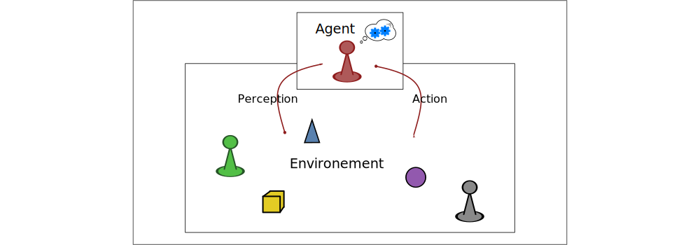

# Decision Under Uncertainty

### An introduction

Guillaume Lozenguez

[@imt-lille-douai.fr](mailto:guillaume.lozenguez@imt-lille-douai.fr)

---

## Last improvement in Artificial Intelligence

- *Nov. 2007*, Carnegie-Mellon win the Darpa Urban Challenge ($2M\$$)
- *Oct. 2015*, First release of Tesla Autopilot

- *Oct. 2015*, Victory of d'**AlphaGo** over professional player

---

## Last improvement in Artificial Intelligence

 
 

In France:

- *March 2018*, Rapport Villani - [www.aiforhumanity.fr](http://www.aiforhumanity.fr) -

---

## Our topic: Autonomous Decision Making

 
 
 

- Model the capability of actions
- Learn action interest
- Optimize policies of actions
- Handle large problem with optimization techniques 

---

## The notion of complexity (Go)

GO: $10^{170}$ positions, $10^{600}$ games (chess: $10^{120}$ games)

---

## The notion of complexity (Go)

 

**A classical $3$ GHz computer:** $3\times10^9$ op. per second
$\rightarrow$ $~ 2.6 \times 10^{14}$ op. a day $\rightarrow$ $~ 10^{17}$ op. a year

**Enumerating all games:** $O(n)$ with $n=10^{600}$: arround $10^{583}$ years.
$\rightarrow$ requires decomposed model and statistics...

**Sun life:** arround $10^{30}$ years

---

## Decision Making Problem

 

#### How to compute ~~optimal~~ appropriate responses to control dynamic systems ?

**Knowing that:**

- Model could require very large exploration
- We potentially do not have the model
- Evolutions are generally uncertain

---

## Introduction to Decision Under Uncertainty

#### Is an introduction to models and algorithms to perform decision-making   at a time step *t*, by considering potential effects.

- 19 hours (5 sessions)
- Mainly as tutorials
  * Simple dice games as a playground
  * Strategic 2-players games

---

 

1. **Introduction**
1. **Class of problems**
1. **The notion of Agent**
1. **Decision Making Process of an Agent**
1. **An Agent for the 421 games**

---

## Class of problems - Deterministic Planning

Determining *a succession of actions* to drive a system from an initial state to a target state.

**Deterministic case**:

- the effects, by doing an action, from a specific state is certain.

---

## Class of problems - Deterministic Planning

Determining *a succession of actions* to drive a system from an initial state to a target state.

**Deterministic case**:

- the effects, by doing an action, from a specific state is certain.

---

## Class of problems - Determine a Plan

Finding a *path* in a *graph* modeling all possible evolutions

---

## Class of problems - Plan Optimization

Finding an *optimized* path in a *weighted* Graph

- Tipically: _Finding the shortest path from `A` to `B`_

---

## Class of problems - Stokastic Planning

Build a *policy*:

- Associate an *action* to perform *to each* reachable *state*

---

## Class of problems - Stokastic Planning

Execute a *policy*:

- Then, the effective succession of actions remains stochastic

---

## Class of problems - Game Theory

*Few entities* (players) control a system (with different goals)

- Which actions for each entity ?
- Which consequences ?

---

## Class of problems - Game theory

*Few entities* control the same system (with different goals)

- *Uncertainty*: At least on the actions of the other players.

---

## Class of problems - Game theory

Difficulty:

- The _size_ of the system
  * The number of variables describing the system
- The branching possibilities 
  * The number of both actions and outcomes possibilities
  * Stochastic interactions
- The observability
  * Typically the goals and actions or possibility of actions of the opponents
- The number of players

---

## Class of problems - Control Complex systems

The Grail : **Control Complex Systems**

- A lot of entities in interactions

_An entity:_an autonomous sub-system with its own goals and capabilities (an agent)

---

## Vocabulary

 
 
 

- **graph** composed of **node** and **edges**
- **State Automata** composed of **state** and **action**
- **planning**: finding a valid succession of **actions**
- **policy**: An **action** response to ever reachable situation (**state**)
- **determinist** versus **uncertain** / **stochastic**
- **system**, **control** (automation science)
- **Multi-Agent System**, **Decision Making** (AI)

---

## Notion of Agent

 
 

#### "I act therefore I am"

- my actions have an effect on the world
- **and** I have the choice to act or not

 
 
 
 

cf. "BullShit Jobs" - David Graeber (2019)
(p.132-133 fr. in version )

or the joy to be cause - Karl Groos (1901)

<!-- Pour approfondir: : broucek francis « the sense of self » 1977 - Klein G. S. « the vital pleasures » 1976.-->

---

## Notion of Agent - Simple definition

 
 

**An agent:**

#### An entity capable of perception and action  evolving in an environment.

 

**Question:**

#### How to choose appropriate action to perform  considering the perception at a each time step ?

---

## Notion of Agent - Simple definition

rarely determinist, mostly uncertain (even stochastic)

---

## Notion of Agent - Complementary Notions

### Agent:

- Defining by a perception-state, goals and a policy to achieve its goals (*BDI* model: Belief - Desire - Intention)
- with different positions in social structure (*AGR* model: Agent - Group - Role )
- Capable of communication
- Capable of adaptation (learning)
- Driven by emotions
- ...

---

## Notion of Agent - rational Agent

An Agent: is an entity 

- capable of **perceiving** and **acting** in its environment
- and driven toward its **goals**.

---

## Course notion to acquire

 

### Decision-making under uncertainty

- **Policy** as Script and Decision Tree
- Theoretical basis: **Markov Decision Process**
- The simplest algorithmic response: **Reinforcement Learning** 
- **The curse of Dimentionallity**
- Divide and Rule: **clustered** and **factored** model

---

## Game: 421

 

- Get the best combination
- by rolling 3 dices

### Goal :

- Optimize the 2 re-roll possibility
- by choosing dices to roll again.

---

 
 
 
 
 
---

## Game: 421

1. Understand the game
2. Implement your first AI
3. Think with Decision-Tree

#### Let's go....
