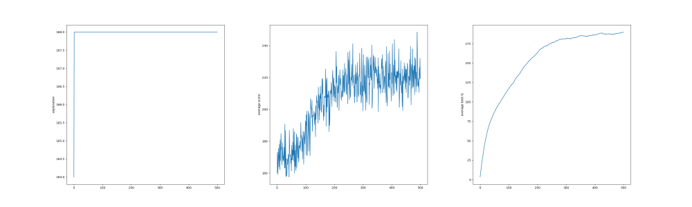

# Learning 421 game 

### Model-Based Learning

Guillaume Lozenguez

[@imt-nord-europe.fr](mailto:guillaume.lozenguez@imt-nord-europe.fr)


---


<br/>

1. **Back to Q-Learning on 421**
2. **ON or OFF policy**
3. **Scale-Up**

---

## Q-Learning: the basics

<br >

- Iterative update on (**state**, **action**) evaluation
- Q-Value equation:

$$Q(s, a) = (1-\alpha)Q(s,a) + \alpha \left(r + \gamma Q(s', a')\right)$$

- Few parameters:<br /> *$\alpha$* learning rate ; *$\epsilon$* Exploration-Exploitation ratio and *$\gamma$* discount factor.  

---

## Q-Learning: for instance

<br >

- Reaching *4-2-1* from *6-2-1* by doing *roll-keep-keep*.

$$Q(\text{6-2-1},\ \text{r-k-k}) = (1-\alpha)Q(\text{6-2-1},\ \text{r-k-k}) + \alpha \left(r + \gamma Q(\text{4-2-1},\ a')\right)$$


$$Q(\text{2-6-2-1},\ \text{r-k-k}) = (1-\alpha)\ 40.0 + \alpha \left( 0.0 + 80.0 \right) \quad (a' = \text{keep}^3)$$

<br />

- With *$\alpha$* learning rate at _0.1_, $Q(\text{6-2-1},\ \text{r-k-k})$ is now equals to _44_

---

## Q-Learning: the basics

- With 500 steps of 500 games:


- *$\alpha$*: $0.1$ ; *$\epsilon$* : $0.1$ ; *$\gamma$* : $0.99$ ;


---

## Drawing plot in Python: pyplot

Codes: 

```python
import matplotlib.pyplot as plt

...

plt.plot( values )
plt.ylabel( "mean of the y value" )
plt.show()
```

<br />

- Where `values` is a list of values in $\mathbb{R}$

---

## Q-Learning: the basics

- With 500 steps of 500 games:


- With optimal threshold

---

## Q-Learning: the basics

- With 500 steps of 500 games:


- *$\alpha$*: $0.01$ ; *$\epsilon$* : $0.1$ ; *$\gamma$* : $0.99$ ;


---

## Q-Learning: the basics

- With 500 steps of 500 games:



- *$\alpha$*: $0.01$ ; *$\epsilon$* : $0.6$ ; *$\gamma$* : $0.99$ ;


---

## Playing with the parameters:

<br/>
<br/>
<br/>
<br/>
<br/>

- Generate rapidly "good" policies
- Converge on a maximal and stable Q-Values<br /> (an indicator for optimal policy)
- Potentially: be reactive to system modification (recovery)

#### Ideally: implement dynamic parameters

---


<br/>

1. Back to Q-Learning on 421
2. **ON or OFF policy**
3. Scale-Up

---

## On or Off Policy: The main idea

<br />

<br />

#### Does the Q-values match the actual in-use policy ?

<br />

- **ON** the _Q-values_ and the in-use policy _$\pi$_ are aligned.
<br />
- **OFF** the learning _Q-values_ model something else.
   * Generally _$\pi$_ is $\epsilon$-greedy and _Q-values_ optimals 


---

## On or Off Policy: more formally

<br />

$$Q(s, a) = (1-\alpha)Q(s,a) + \alpha \left(r + \gamma Q(s', a')\right)$$

- **ON:**

$$ a'= \pi(s') \quad (\text{with} \quad \pi \quad \text{the $\epsilon$-greedy policy for instance})$$

- **OFF:** 

$$ a'= \max_{a'\in A} Q(s', a') \quad \left(\text{and} \quad \pi^*(s) = \arg\max_{a\in A} Q(s, a)\right) $$

---

## On or Off Policy: with an example:


- Deterministic action outcome but 10% to random action.

---


<br/>

1. Back to Q-Learning on 421
2. ON or OFF policy
3. **Scale-Up**

---

## Scale-Up:
<br />

#### The central difficulty in Machine-Learning

<br />
<br />

- You are encouraged to try _QLearning_ on 421 Duo mode...
   - From scratch to win random AI.
   - From 421-Solo to win 421-Solo playing Duo. 

---

## Scale-Up:

### Heuristic values

- Expert-oriented reward function.
- Expert-based qvalue initialization.

### Iterative Learning

- Start with few state and action and grow the model.

### Hybrid Approach

- Process Q-Learning a record in the same time
- Use punctually heavy 'classical' learning
   - Typically estimate $V$ or $T$ with deep-neural model 

