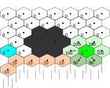
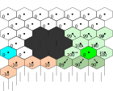

# Learning 421 game 

### Model-Based Learning

Guillaume Lozenguez

[@imt-nord-europe.fr](mailto:guillaume.lozenguez@imt-nord-europe.fr)


---


<br/>

1. **Back to Q-Learning on 421**
2. **Model-Based Learning**
3. **Let's play a more Complicated game**

---
<!-- --------------------------------------------------------------- -->


## Hypotesis: it's Markovian

#### The system to control <br /> matches a Markov Decision Process

**MDP:** $\langle S, A, T, R \rangle$:

*S :* set of system's states
*A :* set of possible actions
*T :* S × A × S → [0, 1] : transitions
*R :* S × A → R : cost/rewards


#### We do have _S_ and _A_ <br /> but not _t_ and _r_

---

## Q-Learning: the basics

<br >

- Iterative update on (**state**, **action**) evaluation
- Q-Value equation:

$$Q(s^t, a) = (1-\alpha)Q(s^t,a) + \alpha \left(r + \gamma \max_{a'\in A} Q(s^{t+1}, a')\right)$$

- Few parameters:<br /> *$\alpha$* learning rate ; *$\epsilon$* Exploration-Exploitation ratio and *$\gamma$* discount factor.  

---

## Q-Learning: for instance
<br >

- Reaching *4-2-1* at *h-1* from *6-2-1* at *h-2* by doing *roll-keep-keep*.

$$Q(\text{2-6-2-1},\ \text{r-k-k}) = (1-\alpha)Q(\text{2-6-2-1},\ \text{r-k-k}) + \alpha \left(r + \gamma \max_{a'\in A} Q(\text{1-4-2-1},\ a')\right)$$


$$Q(\text{2-6-2-1},\ \text{r-k-k}) = (1-\alpha)\ 40.0 + \alpha \left( 0.0 + 80.0 \right) \quad (a' = \text{keep}^3)$$

- With *$\alpha$* learning rate at _0.1_, $Q(\text{2-6-2-1},\ \text{r-k-k})$ is now equals to _44_

---

## Q-Learning: the basics

- With 500 steps of 500 games:


- *$\alpha$*: $0.1$ ; *$\epsilon$* : $0.1$ ; *$\gamma$* : $0.99$ ;


---

## Drawing plot in Python: pyplot

Codes: 

```python
import matplotlib.pyplot as plt

...

plt.plot( values )
plt.ylabel( "mean of the y value" )
plt.show()
```

<br />

- Where `values` is a list of values in $\Reals$

---

## Q-Learning: the basics

- With 500 steps of 500 games:


- With optimal threshold

---

## Q-Learning: the basics

- With 500 steps of 500 games:


- *$\alpha$*: $0.01$ ; *$\epsilon$* : $0.1$ ; *$\gamma$* : $0.99$ ;


---

## Q-Learning: the basics

- With 500 steps of 500 games:


- *$\alpha$*: $0.01$ ; *$\epsilon$* : $0.6$ ; *$\gamma$* : $0.99$ ;


---

## Playing with the parameters:

<br/>
<br/>
<br/>
<br/>
<br/>

- Generate rapidly "good" policies
- Converge on a maximal and stable Q-Values<br /> (an indicator for optimal policy)
- Potentially: be reactive to system modification (recovery)

#### Ideally: implement dynamic parameters

---


<br/>

1. Back to Q-Learning
2. **Model-Based Learning**
3. Let's play a more Complicated game


---

## Model-based learning

### Main Idea:

- Random trajectories (a lot)
- Until each transition is visited several times.
- Compute an optimal policy.

### Potentially:

- Require drived exploration to go in every 'niche' 
- But generally: only incomplete exploration can be performed

---

## But first the Model

### Markov Decision Process

A framework for modeling stochastic evolution of the system to control.

### Bellman equation

Recursive evaluation of states to compute expected gains.

### Solving algorithms

- Value iteration
- Policy iteration

---

## Markov Decision Process

**MDP:** $\langle S, A, T, R \rangle$:

*S :* set of system's states
*A :* set of possible actions
*T :* S × A × S → [0, 1] : transitions
*R :* S × A → R : cost/rewards


**Optimal policy:**

$\pi$: a function returning the action to perform in each crossed states.

$\pi^*$: the optimal policy maximizing the gains (expected cumulated rewards).

---

<!-- --------------------------------------------------------------- -->

## Choosing : building a policy of action

### Example of policy in 421:

$\pi^{421}$: Always target a 4-2-1 (keep only one **4**, one **2** and one **1**).

$s$ | $\pi^{421}(s)$ | $\quad$ | $s$ | $\pi^{421}(s)$ |
------------|------------------|-|-----------|-------------
h-*1*-1-1   | *keep*-roll-roll   | | ...
h-*2*-*1*-1 | *keep*-*keep*-roll | | h-*4*-*2*-*1* | *keep*-*keep*-*keep*
h-3-*1*-1   | roll-*keep*-roll   | | ...
h-*4*-*1*-1 | *keep*-*keep*-roll | | h-6-6-5 | roll-roll-roll
... |                          | | h-6-6-6 | roll-roll-roll

(Invariant over the horizon h)

---

## Bellman Equation

### State evaluation for a given policy $\pi$ :

$$V^\pi(s)= R(s, a) + \gamma \sum_{s'\in S} T(s,a,s') \times V^\pi(s')$$
$$\text{with :} \ a=\pi(s) \text{ and } \gamma \in [0, 1] \text{ the discount factor (typically 0.99)}$$

### As a sum of gains:

- The immediate reward: $R(s, a)$.
- The future gains $V^{\pi}(s')$, for all possible next states $s' \in S$,
- proportionally to the probability to reach them $T(s, a, s')$

---

## Solving MDP: Value Iteration

<br />

*Input:* an **MDP:** $\langle S, A, T, R \rangle$ ; precision error: *$\epsilon$* ; discount factor: *$\gamma$* ; initial **V(s)**

1. Repeat until the **maximal delta *< $\epsilon$** <br /> For each state **$s \in S$**
   - Search the action **$a^*$** maximizing the Bellman Equation on **$s$**
   - Update $\pi(s)$ and **V()** by considering action **$a^*$** 
   - Compute the delta value between the previous and the new **V(S)**

*Output:* an optimal $\pi^*$ and associated V-values

---

## Example: Dangerous move.


<br /><br />
<br /><br />
<br /><br />
<br /><br />
<br />

### Probleme definition

---

## Example: Dangerous move.



<br /><br />
<br /><br />
<br /><br />
<br /><br />
<br />

### Value-Iteration: first iteration

---

## Example: Dangerous move.



<br /><br />
<br /><br />
<br /><br />
<br /><br />
<br />

### Value-Iteration: second iteration


---

## Example: Dangerous move.


<br /><br />
<br /><br />
<br /><br />
<br /><br />
<br />

### Value-Iteration: $4^{th}$ iteration


---

## Example: Dangerous move.


<br /><br />
<br /><br />
<br /><br />
<br /><br />
<br />

### Value-Iteration: $6^{th}$ iteration


---

## Example: Dangerous move.


<br /><br />
<br /><br />
<br /><br />
<br /><br />
<br />

### Value-Iteration: $7^{th}$ iteration


---

## Example: Dangerous move.


<br /><br />
<br /><br />
<br /><br />
<br /><br />
<br />

### Value-Iteration: $8^{th}$ iteration

---

## Solving MDP: Policy Iteration

<br />

*Input:* an **MDP:** $\langle S, A, T, R \rangle$ ; precision error: *$\epsilon$* ; discount factor: *$\gamma$* ; initial **V(s)**

1. Compute **$\pi(s)$** according to **$V(s)$**, for each state **$s \in S$**
1. Repeat until $\pi(s)$ is stable:
   - Update **$V(s)$** with **$\pi(s)$** at **$\epsilon$** error, for each state **$s \in S$** 
   - Update **$\pi(s)$** according to **$V(s)$**, for each state **$s \in S$**

*Output:* an optimal $\pi^*$ and associated V-values

---

## Ok now learn the model...

<br />
<br />
<br />

- Define the state-space (small but covering).
- Define the action-space.
- Explore the system:
   - Compute the average rewards $R(s,a)$.
   - Compute all transition probability $T(s,a,s')$

---

## Learn the transition

<br >
<br >

### The transition function is the core object to learn.

It is a 3-dimension structure of floating point values (probabilities).

$$|S|^2\times|A| \text{ values.}$$

A simple game as **421** with **168** states and **8** actions <br />would requires **225 792** values.

Luky for us, in application, most of the transitions are null (ie. imposible),<br /> and it is possible to take advandages from structures in the systems mechanism.

---


<br/>

1. Back to Q-Learning on 421
2. Model-Based Learning
3. **Let's learn the Solo421 model**
