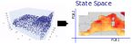
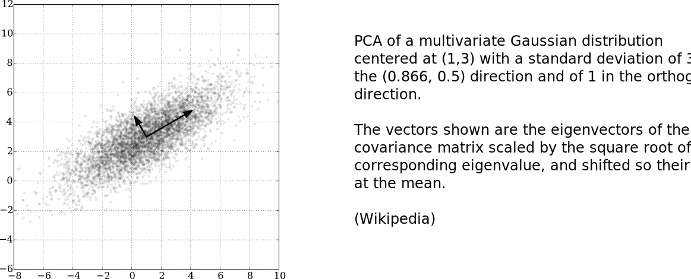
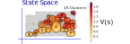
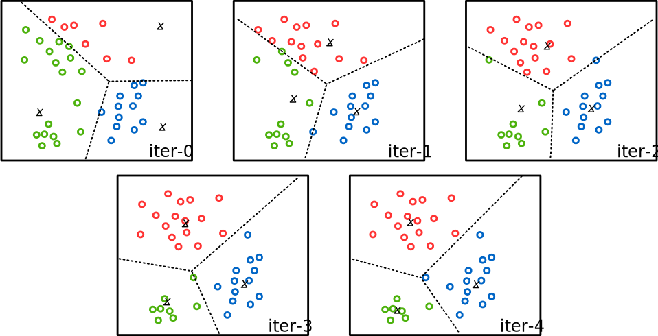
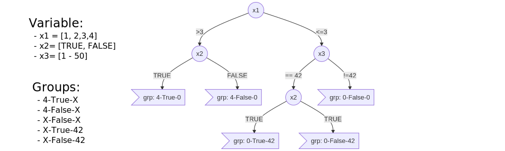
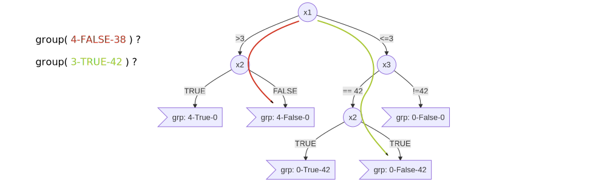
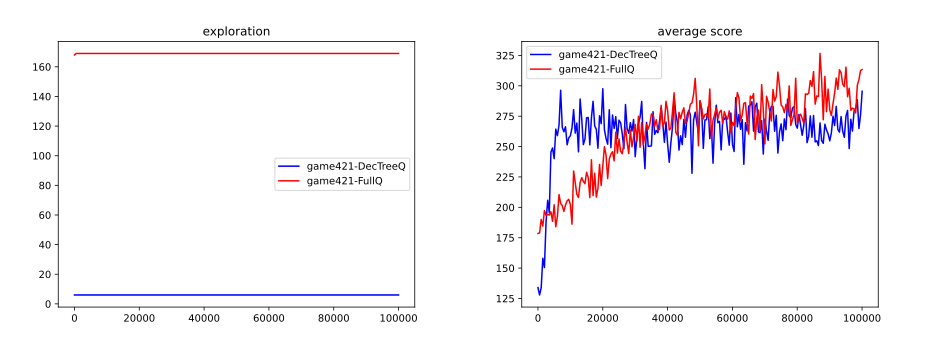
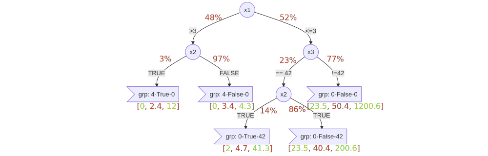

# The Curse of<br />Dimensionality

### State Reduction/Decomposition

Guillaume Lozenguez

[@imt-nord-europe.fr](mailto:guillaume.lozenguez@imt-nord-europe.fr)


---


<br/>

1. **The Curse of Dimensionality**
2. **Geometric Reduction**
3. **State Decomposition**

---

## Before to go...

<br />

**Some Reminders on the Background here**

- **Statistical Automata**
- **Dynamic Programming** (simplifying a complicated problem by breaking it down into simpler sub-problems in a recursive manner)
   - Bellman and it's equation 
- **Agent Based Modeling** - **Event-Driven Programming**

---


<br/>

1. **The Curse of Dimensionality**
   - Example With 2 players 421
2. Geometric Reduction
3. State Decomposition

---

## System Difficulty

### Directly correlated to the state space:

**The number of states:** the Cartesian product of variable domains $|S|$ <br /> (minus some unreachable states)

- **421 game:** $3$ dice-$6$ at the horizon $3$: $\left( 3 \times 6^3 = 648 \right)$ but $168\ (56\times 3)$ effectives.

### Then the branching:

### Finally, the number of games:

---

## System Difficulty

### Directly correlated to the state space

### Then the branching:

**The number of possible actions and actions' outcomes.**

- **421 game:** $2^3$ actions,  $6^r$ action outcomes ($r$, the number of rolled dice - _max. 3_).

### Finally, the number of games:

**The number of all game trajectories** (possible succession of states)
until an end is reached.

$|Branching|^h$ ($h$ the horizon) - Potentially $|S|^h$. $\quad$ **421 game:** $(6^3)^3$ games

---

## Reminder over Combinatorics

**With a Classical 32-card game:** Possible distribution *$32!= \quad 2.6 \times 10^{35}$*


**Human life:** around *$5 \times 10^{7}$* seconds

Probability to play 2 times the same distribution in a human life is very close to 0

---

## Learning 2-players-421
<br />

### State space ?

<br />

### Branching ?

<br />

### Estimation of the complexity and first ideas ?

---

## Learning in Combinatorics Context

<br />

### The root problem: handle large systems

- Build a policy $\quad \pi: S \rightarrow A$
- Evaluate states $\quad V: S \rightarrow \mathbb{R} \quad \text{or} \quad Q: S \times A \rightarrow \mathbb{R}$
- Build a model $\quad T: S \times A \times S \rightarrow [0, 1]$

<br />

### A first basic solution:

- **Reduce the state space definition**

---
## State reduction in QLearning

### Project the states in a smallest space (dimension and size)


By mitigate the negative impact on the resulting built policy.


---


<br/>

1. The Curse of Dimensionality
2. **Geometric Reduction**
   - Reduce the dimension (PCA)
   - Clustering (K-means)
3. State Decomposition
4. Quid of ...

---

## Geometry Reduction

- Consider that **close** states are similar.
- Based on the assumption that: _it is possible to define a **distance** between States_
- By using regular discretization or adaptative clustering


---

## Reduce the dimension - (Principal Component Analysis)

#### Searching the hyper-plan that better separate the data, in a given dimension.



[PCA on Wikipedia](https://en.wikipedia.org/wiki/Principal_component_analysis)


---

## Reduce the dimension - (Principal Component Analysis)

### A Component $k$:

- A vector of weight: $w_{(k)}= (w_1, w_2, \ldots, w_p )_{(k)}$ over the $p$ dimensions
- That maximize the variance.

### Initialized with the first ($k=1$):

$$w_{(1)}=\arg\max_{||w||=1} \left( \sum_{x \in X} ( x\cdot w )^2 \right)$$

### Then recursively:
Same equation but, the $k$-th component can be found
by subtracting the first k − 1 principal components from $X$.


---

## Reduce the dimension - (Principal Component Analysis)

### An example on generated values:




---

## Clustering

#### Regroup the states in coherent sets



**Attention:** the action will be the same for all states in a same group. 


---

## Clustering - (K-means)

**K-means:** <br />Searching the optimal *k* center positions that better group/separate data

*Input:* Observations $X$, $k$ centers $C= \{c_1, c_2 \ldots c_k\}$

1. Repeat until: **stable**

   - Tags the observations $\mathit{tag}(x)= \arg\min_{i \in [1\ldots k]}(\mathit{distance}(x, c_i))$
   - Update the center $c_i= \mathit{average}(X_i), \quad X_i=\{x \in X, \mathit{tag}(x)= i\}$

*Output:* local optimal $k$ centers.

**In real life:** 
Start k-means several times, with different random initialization.

---

## Clustering - Example on K-means



---

## Basic 'simple' classification method

### Principal Component Analysis (PCA)

Searching the hyper-plan that better separate the data, in a given dimension.

Python scikit-learn module: **sklearn.decomposition.PCA**

### K-means

Searching the optimal *k* center positions that better group the data together.

Python scikit-learn module: **sklearn.cluster.KMeans**

<br />

- Work well with 'linear state transitions' and variation in density.

---

## Geometric Reduction: Quid of ...

<br />
<br />

- The notion of distances
   - Several definitions: Euclidean, Manathan, ...
   - Normalization.
   - Large dimension systems.
- The evaluation of the number of PCA, clusters, ...
   - precision vs noise
   - likelihood between a model and data: [Likelihood function](https://en.wikipedia.org/wiki/Likelihood_function)


---


<br/>

1. The Curse of Dimensionality
2. Geometric Reduction
3. **State-Space Decomposition**
   - Decision Tree (on 421)
   - Extended Definition
- Learning Decision Tree
   - Limits of the approach


---

## State-Space Decomposition

<br />

Factorized method: Based on state variable prevalence

- _Decision tree:_ **Nodes:** variables ; **Edges:** assignment ; **leaf:** group of states



---

## State-Space Decomposition: A Tree

 - Is a directed graph structure (with **Nodes**  and **Oriented Edges**),
 - Connected, with no loop  and a unique path from any 2 nodes.
 


---

## Decision Tree On 421 Q-Learning

<figure>

<figure>

---

## Decision Tree On 421 Q-Learning

Simply reduce the state definition to _7_ states...

```python
def state(self):
   if self.turn == 0 :
      return 'end'
   if self.dices[2] == 1 :
      if self.dices[1] == 2 :
            if self.dices[0] == 4 :
               return "4-2-1"
            return "X-2-1"
      if self.dices[1] == 1 :
            return "X-1-1"
      return "X-X-1"
   return "X-X-X"
```

---

## Decision Tree On 421 Q-Learning

### Results (Q-Learning over all the 168 states vs selected 7 states):



<!-- python code: [Decision Tree Q-Learning](https://bitbucket.org/imt-mobisyst/lecture-d2u/raw/master/resources/game421-playerQ.py) - [plotting](https://bitbucket.org/imt-mobisyst/lecture-d2u/raw/master/resources/plotstat.py) -->

---

## Decision Tree: Extended Definition

<br />

### A tool for decision makers:

- A simple tool to depict decision rules historically draw by hand.
- As an opposition to black-box solution (deep learning for instance)

### An Analytic tool:

By integrating probabilities, cost, evaluations...


---

## Decision Tree: An Analytic tool:


- population proportion **/** experience evaluations




- **On 421:** _H(X)-4-2-1_ : weak proportion,  very weak variation
_H(X)-X-X-1_ : important proportion, huge variation

---

## Decision Tree: But require a tree...

### Problem: **It is all about defining the appropriate variable prevalence**


**What-if:** $X3$ variable would be visited first ?

---

## ID3 Algorythm (Iterative Dichotomiser 3)

*Input:* Examples $X$, Attributes $A$, Labels $[+, -]$ | *Output:* Decision Tree (local optimal)

- **If** All Examples positive : **return** $\mathit{leaf}(+)$
**If** All Examples negative : **return** $\mathit{leaf}(-)$
**If** $A$ is empty : **return** $\mathit{leaf}(\cdot)$, $\cdot$ most common + or - in Examples
- **Otherwise** :
   1. define $\mathit{tree}(a)$, with $a$, the attribute in $A$ that best classifies examples
   2. for each possible value $vi$ of $a$
      - add $\mathit{branch}(vi)$ to $\mathit{tree}(a)$
      - **If** $X(vi)$ is empty ( the subset of $X$ with $A= vi$):
      $\mathit{branch}(vi)= \mathit{leaf}(\cdot)$
      - **Otherwise** : $\mathit{branch}(vi)= \mathit{ID3}( X(vi),\ A\backslash a )$
   3. return $\mathit{tree}(a)$


---

## ID3 Algorythm - best classifier

### Select the attribute with the maximal **Information Gain (IG)**:

$IG(X, a)$ is the measure of the difference in entropy from
before after the set $X$ is split on an attribute $a$. 

$$IG(X, a) = H(X) - \sum_{vi \in \mathit{V(a)}} H(\ X(vi)\ ) $$

### Entropy:

$H(X)$ is a measure of the amount of uncertainty in the data set $X$.
Computed from the proportion of _positive/negative_ examples.

---

## ID3 Algorythm - properties

- _Local optimal_ - no possibility to remove one of the nodes.
- _Greedy strategy_ - not guarantee an optimal solution.
   - The best $IG$ over 2 or more attributes
 do not necessarily include the best single attribute
- _Can overfit_ training data. - no guarantee on smaller possible trees.
- _Not_ easily applicable to _continuous_ data.
- _Require examples_ - no easy inclusion into reinforcement processes.
- _no robustness to noise_ - noise will generate branches and leaves.

### But...

- A lot of variations exist.

---

## Random Forest

### **Idea:**

#### Genetic approach to Decision Tree.

- Confront efficiency of different trees.
- Remove non-efficient ones
- Generate new one by merging efficient trees

### **Decision:**

#### A vote over all the trees.


---

## Decision Tree: Conclusion

#### It is all about defining the appropriate variable prevalence (Decision Tree Structure)

### Appreciate solution

- Quite simple
- Good compromise between : Efficienty / Explicability

### But...

- Requires labialized observations (Examples).

The evaluation of the structure of the tree is performed by deadly execution of Q-Learning !

- Build/use Decision-Tree in a reinforcement process...


---

## Decision Tree: Conclusion

<br />
<br />
<br />

#### It is all about defining the appropriate variable prevalence (Decision Tree Structure)

### Tools:

- On scikit learn: [module tree](https://scikit-learn.org/stable/modules/tree.html), [random forest](https://scikit-learn.org/stable/modules/ensemble.html#forest).


---

## State-space Reduction/decomposition: Conclusion

<br />

### Reduce states ($S$) definition to reduce core decision structure:

- Build a policy $\quad \pi: S \rightarrow A$
- Evaluate states $\quad V: S \rightarrow \mathbb{R} \quad \text{or} \quad Q: S \times A \rightarrow \mathbb{R}$
- Build a model $\quad T: S \times A \times S \rightarrow [0, 1]$

<br />

### Can be applied over ($A$)

- Implies necessarily a lost over **fine** decision-making _(i.e. only best decision on average)_
