# The Curse of Dimensionality

### Factorized Transitions

Guillaume Lozenguez

[@imt-nord-europe.fr](mailto:guillaume.lozenguez@imt-nord-europe.fr)

---

## Before to go...

 

### Optimal decision-making  requires a model.

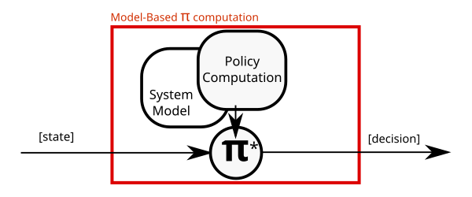

### Basic Dynamic Model: 

- a **Transition** function : $\quad T(s, a, s') \rightarrow [0, 1]$
  A potentially very huge object...

---

 

1. **Bayesian Network**
2. **Factorized Transition Function**

---

## Bayesian Network: General idea

#### Variables are not necessarly correlated over all the others.

**Example:**

- The probability of _Rain_ does not depend from _Car Velocity_.
- The _Car Velocity_ does not depend from _Rain_.
- Owever, the probability of _Accident_ depends from both _Rain_ and _Car Velocity_.

**Bayesian Network:**

#### A probabilistic graphical model that represents    a set of variables and their conditional dependencies

---

## Bayesian Network: Car accident Example

Graphical model: _Node:_ variable, _Orriented Edge_, dependancy

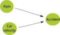

**ATTENTION:** _Correlation_ is not _Conditional Dependancy_

---

## Bayesian Network: Node's Probability Table

#### Propbality dependencies are defined node by node.

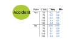

---

## Bayesian Network: Inference

#### Resulting propbality is computed recursivelly

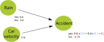

---

## Bayesian Network: Level-up

#### Growing the graph $\rightarrow$ no consequencies over existing nodes

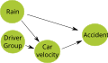

**ATTENTION:** _Correlation_ is not _Conditional Dependancy_ $\rightarrow$ **Directed Acyclic Graph**

---

## Bayesian Network: Toolbox

 
 

- Bayesian Network [on Wikipedia](https://en.wikipedia.org/wiki/Bayesian_network)
- In python - numerous implementations
   - [pomegranate](https://pomegranate.readthedocs.io/en/latest/) - define compute inferences and more.
   - [bnlearn](https://pomegranate.readthedocs.io/en/latest/) - Learning the bayesian structure (ie. detect the dependencies)
- Profesionals: [bayesia](https://www.bayesia.com/)

---

 

1. Bayesian Network
2. **Factorized Transition Function**

---

## Factorized Transition Function: Problem

#### Classically a multi-varibles probabilistic evolution problem

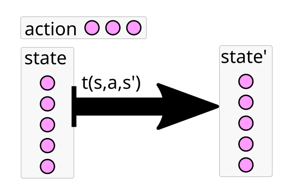

$$T(s, a, s') \rightarrow [0, 1]$$

So, it is about 
_$\mathit{Domain}(Var)^{|Var_S|\times2\times |Var_A|}$_
values

---

## Factorized Transition Function: As Bayesian Network

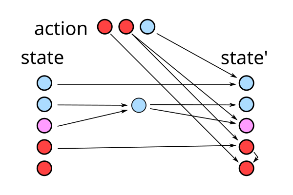

Each varaible evolution is dependant from few parents
Potentially with intermediate varaibles.

---

## Factorized Transition Function: Dynamic Bayesian Network

**Bayesian Network** with duplicated variables regarding their evolution in time.

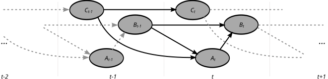

Considering a distribution of probability at time $t$,
it is possible to infers over the distribution of probabilities at time $t+N$

---

## Factorized Transition Function: Dynamic Bayesian Network

**Extended definition** over 3 times step.

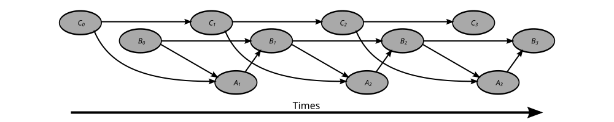

---

## Factorized Transition Function: 421 example

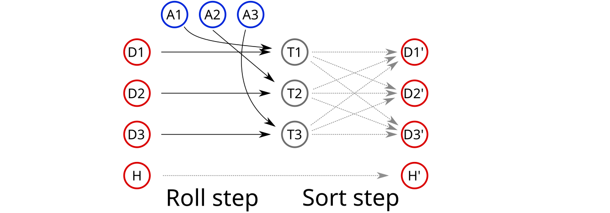

- Roll step: 2 entrances - Small tables 
- Sort step: 3 entrances but deterministic 

---

## Factorized Transition Function: 421 example

- Let consider cheat dice:
Learning transitions $\rightarrow$ computing $3 \times 12$ probabilities _vs_ ( $168^2 \times 8$)

---

## Factorized Transition Function: Zombie Dice Exemple

#### Naturrally the complexity of the networks grow linearly with the complexity of the game

---

## Factorized Transition Function: Zombie Dice Exemple

#### A 4 steps' game engine: 

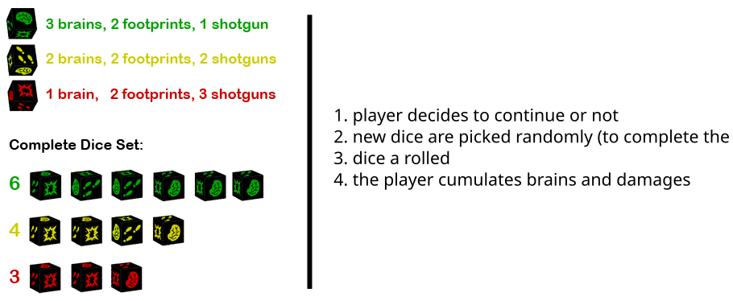

- **State Space ? Branching ?**

---

## Zombie Dice : Brut Transition Function (action: go)

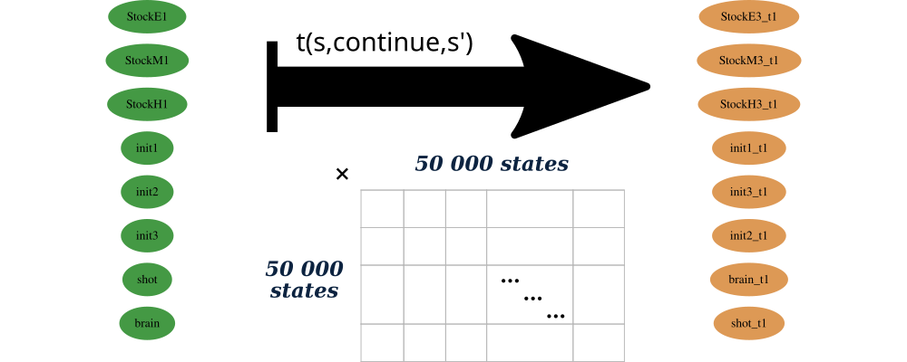

---

## Zombie Dice : Factorized Transition Function (action: go)

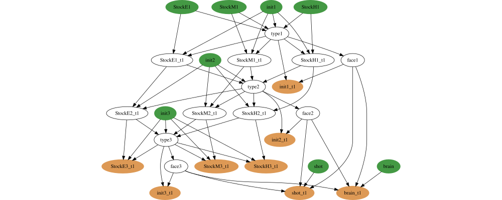

---

## Conclusion on Bayesian-network based transitions

- Bayesian Network allows for **efficient factorized transition** definition
- **Learning process:** (very hard)
  - Quid of network structure ? (correlation is not causality)
  ([recent survey](https://link.springer.com/article/10.1007/s10462-022-10351-w#auth-Neville_Kenneth-Kitson-Aff1))
  - And with hidden variables ?
- Going futher: [distribution models](https://en.wikipedia.org/wiki/Probability_distribution)...
