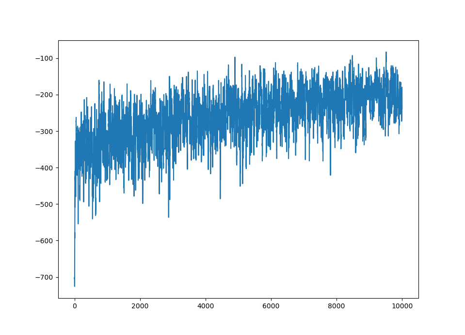
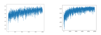

# MovitIt

### An HackaGames game.

Guillaume Lozenguez

[@imt-nord-europe.fr](mailto:guillaume.lozenguez@imt-nord-europe.fr)


---


<br/>

1. **Applying Q-Learning**
2. **Model-Based Decision Making**

---

## Basic State Representation

<br />

- Robot position ($6 \times 4$)
- Robot goal ($6 \times 4$)
- Robot direction ($6$)
- Obstacles Positions ($6 \times 4$) _($6$ obstacles)_
- Humans' position ($6 \times 4$), direction ($6$) _($2$ humans)_

<br />

**States:** $24^{(2+6+2)} \times 6^3 = 1.3 \times 10^{16}$

---

## Relative State Representation

<br />

- Robot goal direction ($6$), distance ($16$)
- Distance-1 Cells: obstacle?  ($2^6$)
- Humans' position-diretion ($6$), position-distance ($16$), movement-direction ($6$)

<br />

**States:** $6^5 \times 16^3 \times 2^6= 2.0 \times 10^{9}$

A huge gain on the number of state $+$ promising factorization.

However: not covering -> no guarantee

---

## QLearning based on Relative State Representation

### Average score over 10 000  games of 10 cycles.



---

## QLearning based on Relative State Representation

#### Qlerning Relative-basic **versus**   Relative-limited




---


<br/>

1. **Applying Q-Learning**
2. **Model-Based Decision Making**

---

## Simulating Action MoveIt ?

<br />
<br />
<br />
<br />
<br />

#### Is it possible to model and simulate GameMoveIt ?

---

## Simulating Action MoveIt

### Board builtin function:

```python 
   collisions= self.board().multiMoveHumans( humanMoves )
   collisions+= self.board().multiMoveRobots( robotMoves )    
```

- _moves_ list of start position and direction.
$$moves= [ [x1, y1, dir1], [x2, y2, dir2] ... ]$$

### Simulation squeletom:

```python
def simulate(board, robotMoves):
   copiedBoard= copy( board)
   humanMoves= generateHumanMove(board)
   collisions= board.multiMoveHumans( humanMoves )
   collisions+= board.multiMoveRobots( robotMoves )
   collisions= board.multiMoves...    
   return copiedBoard, 
```

---

## Horizon 1 decision making:

**Input:** board, **possible-actions**, **simulate**, **evaluate**

- foreach _action_ in **possible-actions**(board)
   - scores[_action_]= 0
   - for x sample :
      collisions, copiedBoard= **simulate**(_action_, board) 
      scores[_action_]+= **evaluate**(collisions, copiedBoard)
   - scores[_action_]/= x

**Output:** best _action_ in scores[]