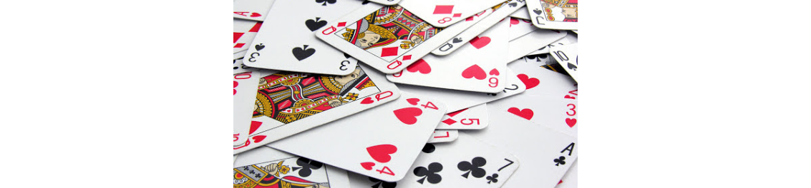
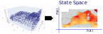
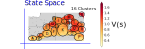
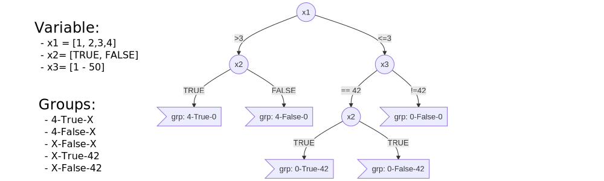
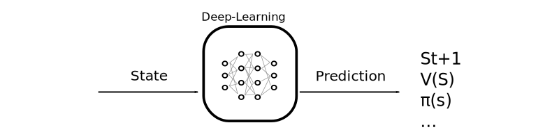

# The Curse of<br />Dimensionality

### And how to ward off it

Guillaume Lozenguez

[@imt-nord-europe.fr](mailto:guillaume.lozenguez@imt-nord-europe.fr)


---


<br/>

1. **The Curse of Dimensionality**
2. **Geometric Reduction**
3. **State Decomposition**
4. **Quid of ...**

---

## Before to go...

<br />

**Some Reminders on the Background here**

- **Statistical Automata**
- **Dynamic Programming** (simplifying a complicated problem by breaking it down into simpler sub-problems in a recursive manner)
   - Bellman and it's equation 
- **Agent Based Modeling** - **Event-Driven Programming**

---


<br/>

1. **The Curse of Dimensionality**
   - Example With 2 player 421
2. Geometric Reduction
3. State Decomposition
4. Quid of ...


---

## System Difficulty

### Directly correlated to the state space:

**The number of states:** the Cartesian product of variable domains $|S|$ <br /> (minus some unreachable states)

- **421 game:** $3$ dice-$6$ at the horizon $3$: $\left( 3 \times 6^3 = 648 \right)$ but $168$ effectives.

### Then the branching:

### Finally, the number of games:

---

## System Difficulty

### Directly correlated to the state space

### Then the branching:

**The number of possible actions and actions' outcomes.**

- **421 game:** $2^3$ actions,  $6^r$ action outcomes ($r$, the number of rolled dice - _max. 3_).

### Finally, the number of games:

**The number of all possible succession of states** until reaching an end.

$|Branching|^h$ ($h$ the horizon) - Potentially $|S|^h$. $\quad$ **421 game:** $(6^3)^3$ games

---

## Reminder over Combinatorics

**With a Classical 32-card game:** Possible distribution *$32!= \quad 2.6 \times 10^{35}$*



**Human life:** around *$5 \times 10^{7}$* seconds

Probability to play 2 times the same distribution in a human life is very close to 0

---

## Learning 2-players-421
<br />

### State space ?

<br />

### Branching ?

<br />

### First results...

---

## Learning in Combinatorics Context

<br />

### The root problem: handle large systems

- Evaluate states $\quad V: S \rightarrow \mathbb{R} \quad \text{or} \quad Q: S \times A \rightarrow \mathbb{R}$
- Build a policy $\quad \pi: S \rightarrow A$

<br />

### A first basic solution:

- **Reduce the state space definition**

---
## State reduction in QLearning

### Project the states in a smallest space (dimension and size)


By mitigate the negative impact on the resulting built policy.


---


<br/>

1. The Curse of Dimensionality
2. **Geometric Reduction**
   - Reduce the dimension (PCA)
   - Clustering (K-means)
3. State Decomposition
4. Quid of ...

---

## Geometry Reduction

- Consider that **close** states are similar.
- Based on the assumption that: _it is possible to define a distance between States_
- By using regular discretization or adaptative clustering


---

## Reduce the dimension - (Principal Component Analysis)

#### Searching the hyper-plan that better separate the data, in a given dimension.



https://en.wikipedia.org/wiki/Principal_component_analysis


---

## Clustering - (K-means)

#### regroup the states in coherent sets



**K-means:** <br />Searching the optimal *k* center positions that better group/separate the data


---

## Basic 'simple' classification method

### Principal Component Analysis (PCA)

Searching the hyper-plan that better separate the data, in a given dimension.

Python scikit-learn module: **sklearn.decomposition.PCA**

### K-means

Searching the optimal *k* center positions that better group the data together.

Python scikit-learn module: **sklearn.cluster.KMeans**

<br />
<br />

- Work well with 'linear state transitions' and different states density.
- Suppose a data set (trace) ideally with proper values


---


<br/>

1. The Curse of Dimensionality
2. Geometric Reduction
3. **State-Space Decomposition**
   - Decision Tree (Again)
   - Example With 421
4. Quid of ...


---

## State-Space Decomposition

<br />

Factorized method: Based on state variable prevalence

- Decision tree (Again) **Nodes:** variables ; **Edges:** assignment ; **leaf:** group of states



---

## Decision Tree On 421 Q-Learning

<figure>

<figure>

---

## Decision Tree On 421 Q-Learning

Simply reduce the state definition to _7_ states...

```python
def state(self):
   if self.turn == 0 :
      return 'end'
   if self.dices[2] == 1 :
      if self.dices[1] == 2 :
            if self.dices[0] == 4 :
               return "4-2-1"
            return "X-2-1"
      if self.dices[1] == 1 :
            return "X-1-1"
      return "X-X-1"
   return "X-X-X"
```

---

## Decision Tree On 421 Q-Learning

### Results:


<!-- python code: [Decision Tree Q-Learning](https://bitbucket.org/imt-mobisyst/lecture-d2u/raw/master/resources/game421-playerQ.py) - [plotting](https://bitbucket.org/imt-mobisyst/lecture-d2u/raw/master/resources/plotstat.py) -->

---

## Decision Tree Conclusion...

### Conclusion:

It is all about defining the appropriate variable prevalence (Decision Tree Structure)

### Learn the structure:

- Expert based Decision Trees or learned ([ID3 algorithm](https://en.wikipedia.org/wiki/ID3_algorithm))
- Again on python scikit learn: ([module tree](https://scikit-learn.org/stable/modules/tree.html))

### But...

The evaluation of the structure of the tree is performed by<br /> deadly execution of Q-Learning !


---


<br/>

1. The Curse of Dimensionality
2. Geometric reduction
3. State Decomposition
4. **Quid of ...**
   - the Actions Space
   - the deep-learning

---

## Dealing with combinatorial actions

<br />

### The same strategy: Decomposition

- Group together 'similar' actions > _SuperAction_
- Geometric or decomposed technic
- Learn Q-Value over _SuperActions_


---

## Dealing with combinatorial actions

<br />

At decision steps:

### From superaction to local action

Choose one of the actions of the SuperAction:

- randomly
- with the use of an heuristic.
- The 'best' one accordingly to the reached next state...


---

## Deep-Learning in decition making

<br />

**Deep-Learning an efficient tool:**



**If samples are availlable...**


- Cf. Deep-Reinforcment Learning.

---


<br/>

1. **The Curse of Dimensionality**
2. **Geometric reduction**
3. **State Decomposition**
4. **Quid...**

---

## Apply Decomposition in Risky

<br />
<br />
<br />

_My advice:_ 

- Think iterative: the last increase initializes the next learning phase.
- Start small and grow...
