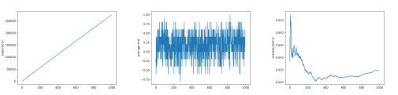

# The Curse of<br />Dimensionality

### And how to ward off it

Guillaume Lozenguez

[@imt-nord-europe.fr](mailto:guillaume.lozenguez@imt-nord-europe.fr)


---

```mermaid
graph TD;
    A-->B;
    A-->C;
    B-->D;
    C-->D;
```​


---


<br/>

1. **The Curse of Dimensionality**
2. **Geometric reduction**
3. **State Decomposition**
4. **Quid of the set of actions**

---


<br/>

1. **The Curse of Dimensionality**
   - Example With Risky
2. Geometric reduction
3. State Decomposition
4. Quid of the set of actions


---

## System Difficulty

### Directly correlated to the state space:

**The number of states:** the Cartesian product of variable domains $|S|$ <br /> (minus some unreachable states)

- **421 game:** $3$ dice-$6$ at the horizon $3$: $\left( 3 \times 6^3 = 648 \right)$ but $168$ effectives.

### Then the branching:

### Finnally the number of games:

---

## System Difficulty

### Directly correlated to the state space

**The number of states:** $|S|$

### Then the branching:

**The number of possible actions and actions' outcomes.**

- **421 game:** $2^3$ actions,  $6^r$ action outcomes ($r$, the number of rolled dice). 

### Finnally the number of games:

**The number of all possible succesion of states** until reaching an end.<br /> $|Branching|^h$ ($h$ the horizon) Potentially $|S|^h$ ($h$ the horizon).

---

## Reminder over Combinatorics

**With a Classical 32-card game:** Possible distribution *$32!= \quad 2.6 \times 10^{35}$*


**Human life:** around *$5 \times 10^{7}$* seconds

Probability to play 2 times the same distribution in a human life is very close to 0

---

## Learning Risky game

A strategic game over $12$ cells to conquer by 2 armies: State Space: ~_$(4*30)^{12}$_

#### Exloration / average end / average Q Values



- [python code]() (10000 parties, un point toute les 10 partes)

---

### The root problem: handle large systems

<br />
<br />
<br />

#### A first basic solution: reduce the state space definition

---
## State reduction in QLearning

### Project the states in a smallest space (dimention and size)


By mitigate the negative impact on the resulting built policy.


---


<br/>

1. The Curse of Dimensionality
2. **Geometric reduction**
   - Reduce the dimension (PCA)
   - Clustering (K-means)
3. State Decomposition
4. Quid of the set of actions

---

## Geometry Reduction

- Consider that **close** states are simular.
- Based on the asumption that: _it is possible to define a distance between States_
- By using regular discretisation or adaptative clustering


---

## Reduce the dimension - (Principal Conponent Analysis)

#### Searching the hyper-plan that better separate the data, in a given dimension.


https://en.wikipedia.org/wiki/Principal_component_analysis


---

## Clustering - (K-means)

#### regroup the states in coherent sets


**K-means:** <br />Searching the optimal *k* center positions that better group/separate the data


---

## Basic 'simple' classification method

### Principal Component Analysis (PCA)

Searching the hyper-plan that better separate the data, in a given dimension.

Python scikit-learn module: **sklearn.decomposition.PCA**

### K-means

Searching the optimal *k* center positions that better group the data together.

Python scikit-learn module: **sklearn.cluster.KMeans**

<br />
<br />

- Work well with 'linear state transitions' and different states density.
- Suppose a data set (trace) ideally with proper values


---


<br/>

1. The Curse of Dimensionality
2. Geometric reduction
3. **State-Space Decomposition**
   - Decision Tree (Again)
   - Example With 421
4. Quid of the set of actions


---

## State-Space Decomposition

<br />

Factorized methode: Based on state variable prevalence

- Decision tree (Again) **Nodes:** variables ; **Edges:** assignment ; **leaf:** group of states


---

## Decision Tree On 421 Q-Learning

Simply reduce the state definition to 6 states...

```Python
def state(self):
   if self.turn == 0 :
      return 'end'
   if self.dices[2] == 1 :
      if self.dices[1] == 2 :
            if self.dices[0] == 4 :
               return "4-2-1"
            return "X-2-1"
      if self.dices[1] == 1 :
            return "X-1-1"
      return "X-X-1"
   return "X-X-X"
```

---

## Decision Tree On 421 Q-Learning

### Results:


---

## Decision Tree Conclusion...

### Conclusion:

Its is all about define the appropriate variable prevalence (Decision Tree Structure)

### Learn the structure:

- Expert based Decision tree or learned ([ID3 algorithm](https://en.wikipedia.org/wiki/ID3_algorithm))
- Again on python scikit learn: ([modules tree](https://scikit-learn.org/stable/modules/tree.html))

### But...

The evaluation of the structure of the tree is performed by deadly execution of Q-Learning !


---


<br/>

1. The Curse of Dimensionality
2. Geometric reduction
3. State Decomposition
4. **Quid of the set of actions**
   - The need of SuperAction


---


<br/>

1. **The Curse of Dimensionality**
2. **Geometric reduction**
3. **State Decomposition**
4. **Quid of the set of actions**


---

## Apply Decomposition in Risky game

<br />
<br />
<br />

_My advise:_ start small and grow...

