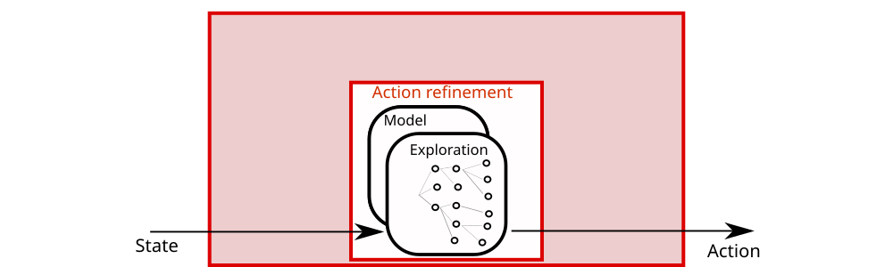
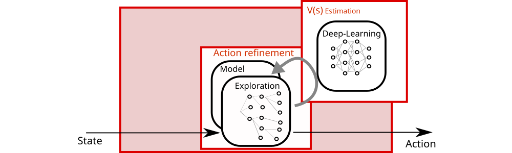
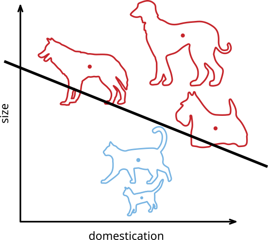
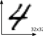
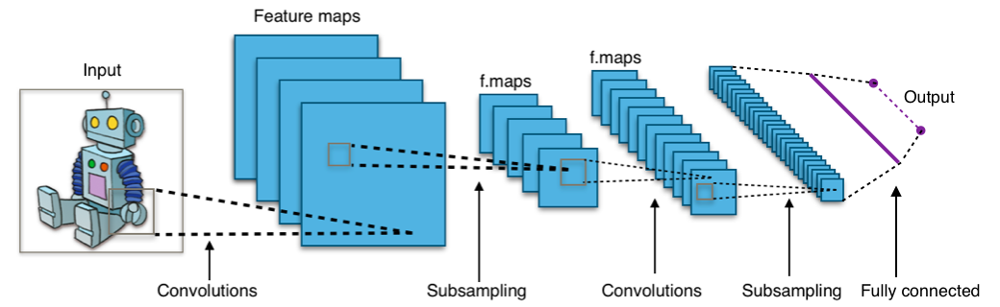
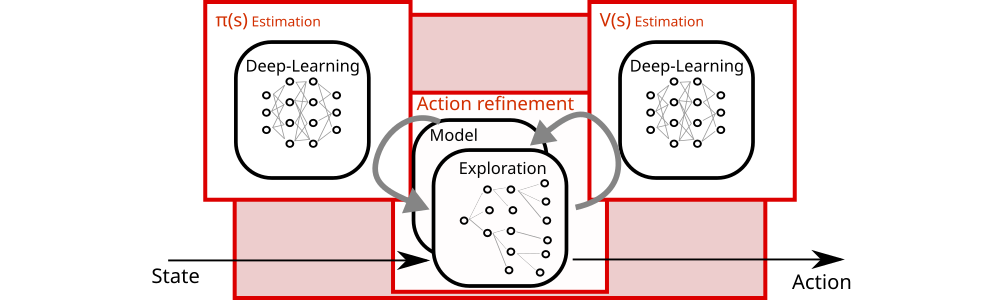
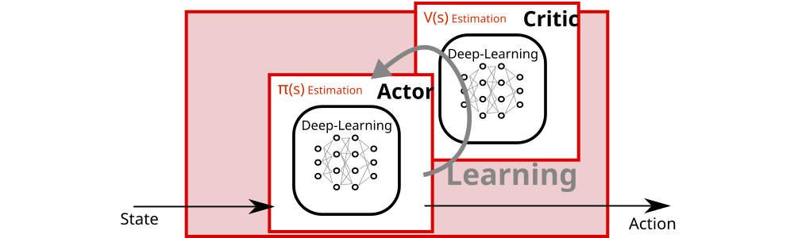

# Reinforment with   Deep Learning
### a Discution

 
 

**Guillaume.Lozenguez**
[@imt-nord-europe.fr](mailto:guillaume.lozenguez@imt-nord-europe.fr)

 

---
<!-- --------------------------------------------------------------- -->

## Basic approach - Random Exploration Tree

#### Explore locally possible evolution from the current state.

---
<!-- --------------------------------------------------------------- -->

## Basic approach - Incorporate Neural Networks

#### Incorporate Intuition as Deep Learning based Estimation

- Cut exploration branches based on a heuristic value function

---
<!-- --------------------------------------------------------------- -->

## Le Deep-Learning: un cerveau à un neurone

### Le perceptron:

$$\mathit{si:}  \quad \left( p_1 \cdot x + p_2 \cdot y > b \right)$$

Les paramètres:

- les poids: $p_1, p_2$ 
- un seuil: $b$

> Le grand problème des data-sciences: Classifier

---
<!-- --------------------------------------------------------------- -->

## Le Deep-Learning: un cerveau à un neurone

### Le perceptron:

> Le grand problème des data-sciences: Classifier

---
<!-- --------------------------------------------------------------- -->

## Le Deep-Learning: des réseaux de neurones profonds

- **La rétropropagation:**

LeNet (1989-1998) _Yan LeCun et al._

Livre: _Quand la machine Apprend_

---
<!-- --------------------------------------------------------------- -->

## Le Deep-Learning: des réseaux de neurones profonds

#### Une démocratisation de l'usage des CNN

**La classification:** pour n'importe qui, avec des donnés.

---
<!-- --------------------------------------------------------------- -->

## La "killing Architecture" - AlphaZero

#### Use both policy and value estimation.

1. Iterative process: (Play phase // Analysis phase)
2. Suppose a model of the systems (game)

---
<!-- --------------------------------------------------------------- -->

## Le Deep Reinforcement Learning

#### Both policy and value estimation, but in Reinforcement Learning approach 

Classical _Actor-Critic architecture_ (see [PPO](https://en.wikipedia.org/wiki/Proximal_policy_optimization) algorithm for example).
