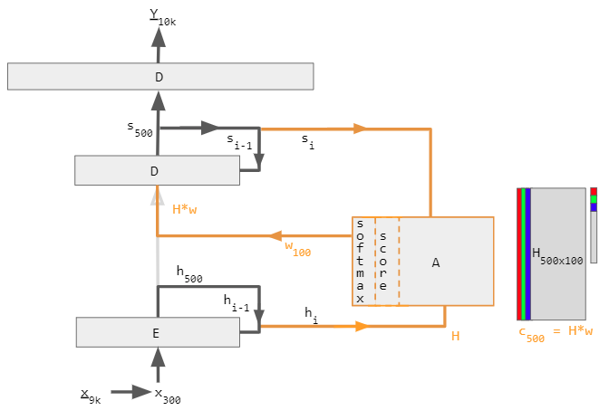

# Reinforment with   Deep Learning
### a Discution

 
 

**Guillaume.Lozenguez**
[@imt-nord-europe.fr](mailto:guillaume.lozenguez@imt-nord-europe.fr)

 

---
<!-- --------------------------------------------------------------- -->

## Basic approach - Random Exploration Tree

#### Explore locally possible evolution from the current state.

---
<!-- --------------------------------------------------------------- -->

## Basic approach - Incorporate Neural Networks

#### Incorporate Intuition as Deep Learning based Estimation

- Cut exploration branches based on a heuristic value function

---
<!-- --------------------------------------------------------------- -->

## Le Deep-Learning: un cerveau à un neurone

### Le perceptron:

$$\mathit{si:}  \quad \left( p_1 \cdot x + p_2 \cdot y > b \right)$$

Les paramètres:

- les poids: $p_1, p_2$ 
- un seuil: $b$

> Le grand problème des data-sciences: Classifier

---
<!-- --------------------------------------------------------------- -->

## Le Deep-Learning: un cerveau à un neurone

### Le perceptron:

> Le grand problème des data-sciences: Classifier

---
<!-- --------------------------------------------------------------- -->

## Le Deep-Learning: des réseaux de neurones profonds

- **La rétropropagation:**

LeNet (1989-1998) _Yan LeCun et al._

Livre: _Quand la machine Apprend_

---
<!-- --------------------------------------------------------------- -->

## Le Deep-Learning: des réseaux de neurones profonds

#### Une démocratisation de l'usage des CNN

**La classification:** pour n'importe qui, avec des donnés.

---
<!-- --------------------------------------------------------------- -->

## La "killing Architecture" - AlphaZero

#### Use both policy and value estimation.

1. Iterative process: (Play phase // Analysis phase)
2. Suppose a model of the systems (game)

---
<!-- --------------------------------------------------------------- -->

## Le Deep-Learning: IA générative... (Transformer)

> Processus _Iteratif_ couplé à un mécanisme d'_[Attetion](https://en.wikipedia.org/wiki/Attention_(machine_learning))_ (poids dans le contexte)

---
<!-- --------------------------------------------------------------- -->

## IA générative: du texte à l'image

- Génération d'image
sur la base d'un _prompt_.
- Un astronaute montant un cheval.

 
 

> Generated by: [Stable Diffusion](https://en.wikipedia.org/wiki/Stable_Diffusion)

---
<!-- --------------------------------------------------------------- -->

## Le Deep-Learning: et bien sûr ChatGPT

### Chat GPT-3 (nov. 2022):

- **Objectif:** (re)produire du texte
- _175 milliards_ de paramètres
(avec une augmentation itérative)
- _Les donnée:_ le web (80%), des livres (16%) et Wikipédia (3%)
- **Résultat:** une réponse par association de mots (le + disant)
bien construite

---
<!-- --------------------------------------------------------------- -->

## Demian ?

### Au cours de bourse actuel:

- **Classification** - coût (_financié/environnemental/societal_) négligeable
  - Massification: partout et pour n'importe quoi.
  - Principalement du Deep (si données en masse).
  - Alternative: Decisition Tree (Gradian Boost) sur des niches.
- **Prise de decision sous incertitude**
  - Nouri par des outils de classification
  - Model: Exploration guidée 
  - Sans-Model: Mechanisme d'attention
- **Apprendre le modèle ?**
