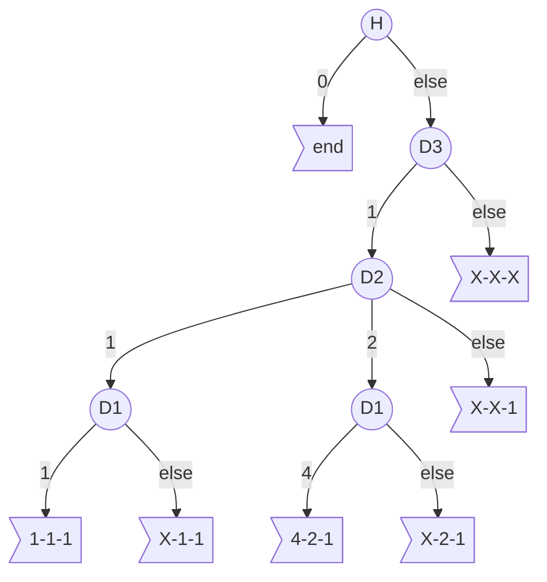

```mermaid
graph TD;
    H((H)) -- 0 --> END>end];
    H -- else --> D3;
    D3((D3)) -- 1 --> D2((D2));
    D3 -- else --> XXX>X-X-X];
    D2 -- 1 --> D11((D1))
    D2 -- 2 --> D12((D1));
    D2 -- else --> XX1>X-X-1];
    D11 -- 1 --> 111>1-1-1];
    D11 -- else --> X11>X-1-1];
    D12 -- 4 --> 421>4-2-1];
    D12 -- else --> X21>X-2-1];
```
