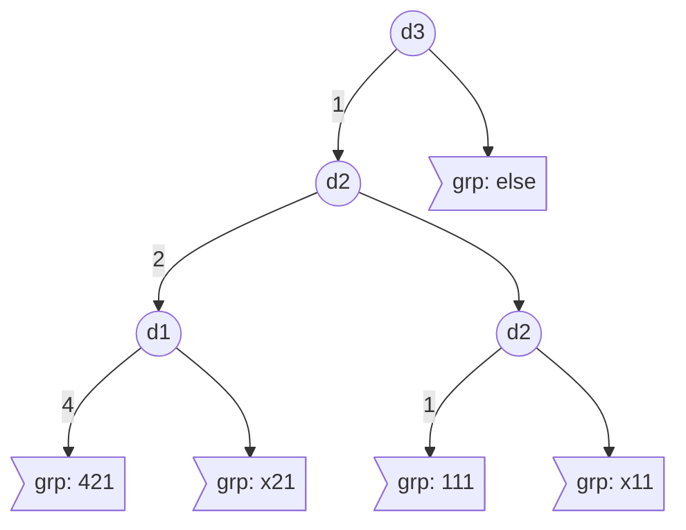

```mermaid
graph TD;
    d31((d3)) -- 1 --> d21((d2));
    d31 --> actElse>grp: else];
    d21 -- 2 --> d11((d1));
    d11 -- 4 --> act421>grp: 421];
    d11 --> actx21>grp: x21];
    d21 --> d22((d2));
    d22 -- 1--> act111>grp: 111];
    d22 --> actx11>grp: x11];
```
