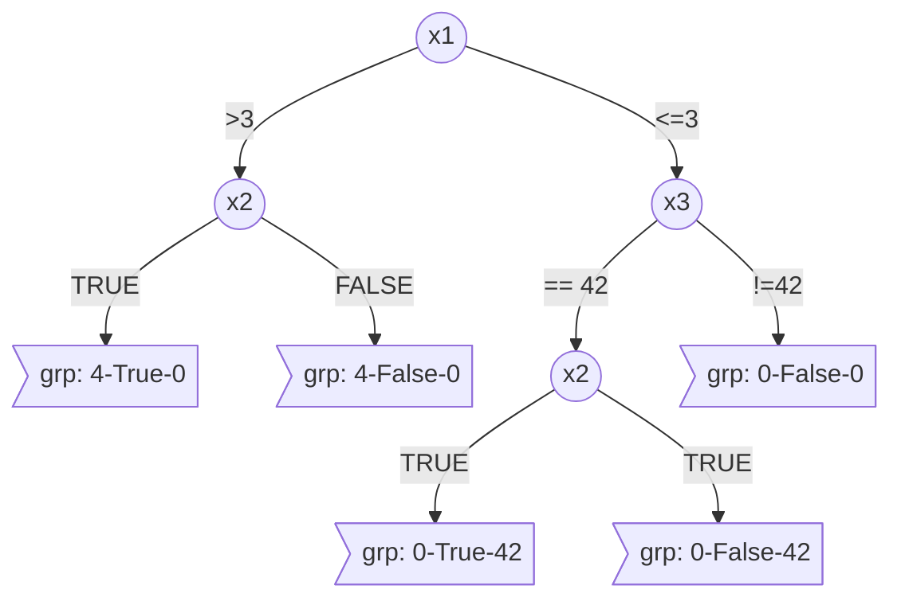

```mermaid
graph TD;
    x1((x1)) -- >3 --> x2a((x2));
    x1 -- <=3 --> x3((x3));
    x2a -- TRUE --> act21>grp: 4-True-0];
    x2a -- FALSE --> act22>grp: 4-False-0];
    x3 -- == 42 --> x2b((x2));
    x3 -- !=42 --> act31>grp: 0-False-0];
    x2b -- TRUE --> act2b3>grp: 0-True-42]
    x2b -- TRUE --> act2b4>grp: 0-False-42]
```
