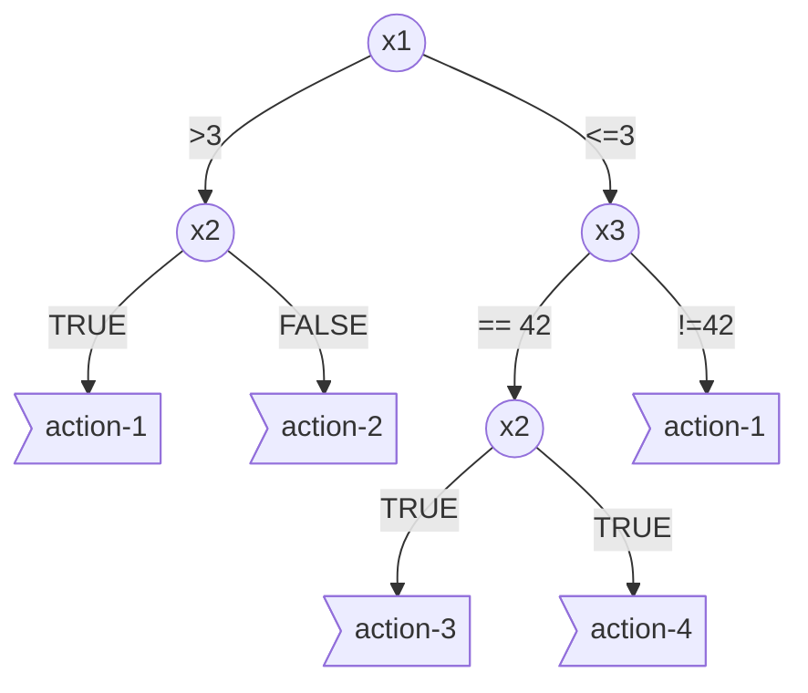

```mermaid
graph TD;
    x1((x1)) -- >3 --> x2a((x2));
    x1 -- <=3 --> x3((x3));
    x2a -- TRUE --> act21>action-1];
    x2a -- FALSE --> act22>action-2];
    x3 -- == 42 --> x2b((x2));
    x3 -- !=42 --> act31>action-1];
    x2b -- TRUE --> act2b3>action-3]
    x2b -- TRUE --> act2b4>action-4]
```
