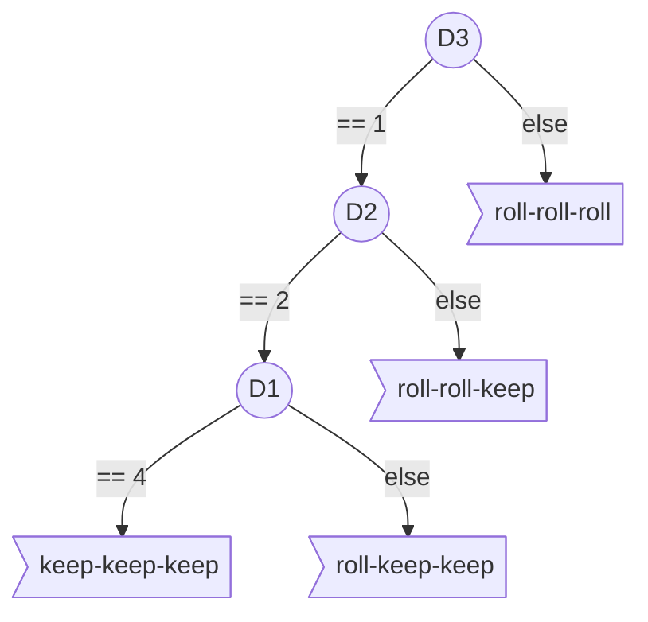

```mermaid
graph TD;
    D3((D3)) -- == 1 --> D2((D2));
    D2 -- == 2 --> D1((D1));
    D1 -- == 4 --> actKKK>keep-keep-keep];
    D1 -- else --> actKKR>roll-keep-keep];
    D2 -- else --> actKRR>roll-roll-keep];
    D3 -- else --> actRRR>roll-roll-roll];
```
