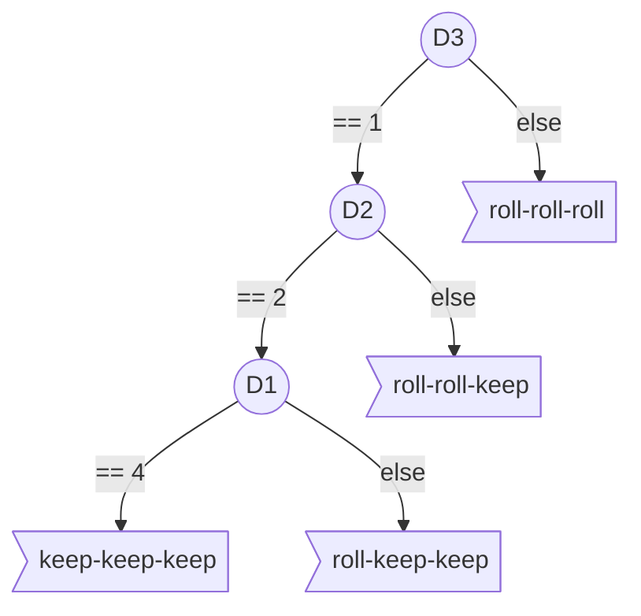

# Decision Tree

The Decition-Tree could simply target a "4-2-1" state.

## A simple first Decition-Tree



## Implementation:

The Decition-Tree could take the form of a "if-else" script :

```python
def perceive(self, perceptionStr, reward):
    values= [ int(x_str) for x_str in perceptionStr.split("-") ]
    gameState= { "H":values[0],  "D1":values[1],  "D2":values[2],  "D3":values[3] }
    # print( "Perception: "+ perceptionStr  +" with reward : " + str(reward) )
    if gameState["D3"] == 1 :
        if gameState["D2"] == 2 :
            if gameState["D1"] == 4 :
                self.actionStr= "keep-keep-keep"
            else: 
                self.actionStr= "roll-keep-keep"
        else: 
            self.actionStr= "roll-roll-keep"
    else: 
        self.actionStr= "roll-roll-roll"
```

## Experiment:


The validation of the player AI needs to be statistical. It could not be performed on a unique game.

First introduce the game in a loop in the main function and compute the average score.

```python
def main():
    total= 0
    for i in range(10000) :
        gameEngine= Engine()
        player= PlayerDT()
        gameEngine.run( player )
        total+= player.score
    print( "Average score: " + str( total/10000.0 ) )
```

That requires to increase the *PlayerDT* class with a *score* attribute.

The final example could be downloaded [here](https://raw.githubusercontent.com/ceri-num/module-DUU/master/codes/player421DT.py). Normally the proposed AI as a score arround **263 +/- 3**.
