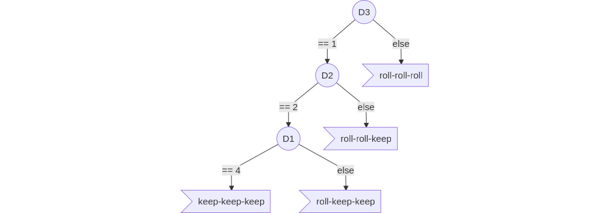

# Decision Tree

A simple example for an Decision-Tree implementation for **421** game.

## A simple first Decition-Tree

The Decition-Tree target a "4-2-1" state.



## Implementation:

The Decition-Tree could take the form of a "if-else" script :

```python
    def action(self, isValidAction ) :
        # print( "Action: " + self.actionStr)
        if self.state["D3"] == 1 :
            if self.state["D2"] == 2 :
                if self.state["D1"] == 4 :
                    self.actionStr= "keep-keep-keep"
                else: 
                    self.actionStr= "roll-keep-keep"
            else: 
                self.actionStr= "roll-roll-keep"
        else: 
            self.actionStr= "roll-roll-roll"
        # Then return the action to the engine:
        return self.actionStr
```

That supose you decompose the perceved game state (String type) into a dictionary:

```python
    def wakeUp(self, initialStateStr, actionSpace):
        values= [ int(x_str) for x_str in initialStateStr.split("-") ]
        self.state= { "H":values[0],  "D1":values[1],  "D2":values[2],  "D3":values[3] }

    def perceive(self, reachedStateStr, reward):
        values= [ int(x_str) for x_str in reachedStateStr.split("-") ]
        self.state= { "H":values[0],  "D1":values[1],  "D2":values[2],  "D3":values[3] }
```

## Experiment:

The validation of the player AI needs to be statistical. It could not be performed on a unique game.

First introduce the game in a loop in the main function and compute the average score.

```python
def main():
    total= 0
    samples= 10000
    for i in range(samples) :
        gameEngine= Engine()
        player= PlayerDT()
        gameEngine.run( player )
        total+= player.score
    print( "Average score: " + str( total/samples ) )
```

That requires to increase the *PlayerDT* class with a *score* attribute.

The final example could be downloaded [here](https://raw.githubusercontent.com/ceri-num/module-DUU/master/codes/player421DT.py). This proposed AI as a score arround **263.4 +/- 5**.
