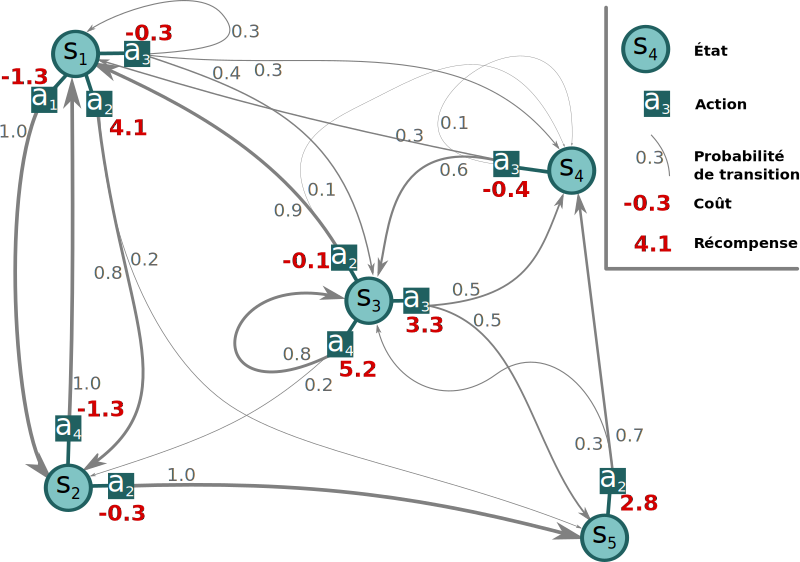
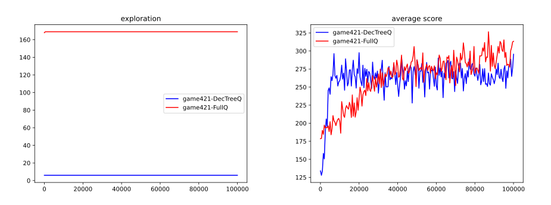

# MAD <br /> Decision Making

### Learning <br /> Complexe Behavior 

Guillaume Lozenguez
[@imt-nord-europe.fr](mailto:guillaume.lozenguez@imt-nord-europe.fr)


---


<br/>

1. **Back to Q-Learning on 421**
2. **Converging**
3. **Risky Game**
4. **Curse of Dimensionality**

---
<!-- --------------------------------------------------------------- -->


---


<br/>

1. **Back to Q-Learning on 421**
2. Converging
3. Risky Game
4. Curse of Dimensionality

---
<!-- --------------------------------------------------------------- -->


## Hypotesis: it's Markovian

#### The system to control <br /> matches a Markov Decision Process

**MDP:** $\langle S, A, T, R \rangle$:

*S :* set of system's states
*A :* set of possible actions
*T :* S × A × S → [0, 1] : transitions
*R :* S × A → R : cost/rewards



#### We do have _S_ and _A_ <br /> but not _t_ and _r_

---

## Q-Learning: the basics

<br >

- Iterative update on (**state**, **action**) evaluation
- Q-Value equation:

$$Q(s^t, a) = (1-\alpha)Q(s^t,a) + \alpha \left(r + \gamma \max_{a'\in A} Q(s^{t+1}, a')\right)$$

- Few parameters:<br /> *$\alpha$* learning rate ; *$\epsilon$* Exploration-Exploitation ratio and *$\gamma$* discount factor.  

---

## Q-Learning: for instance
<br >

- Reaching *4-2-1* at *h-1* from *6-2-1* at *h-2* by doing *roll-keep-keep*.

$$Q(\text{2-6-2-1},\ \text{r-k-k}) = (1-\alpha)Q(\text{2-6-2-1},\ \text{r-k-k}) + \alpha \left(r + \gamma \max_{a'\in A} Q(\text{1-4-2-1},\ a')\right)$$


$$Q(\text{2-6-2-1},\ \text{r-k-k}) = (1-\alpha)\ 40.0 + \alpha \left( 0.0 + 80.0 \right) \quad (a' = \text{keep}^3)$$

- With *$\alpha$* learning rate at _0.1_, $Q(\text{2-6-2-1},\ \text{r-k-k})$ is now equals to _44_

---

## Q-Learning: the basics

- With 500 steps of 500 games:


- *$\alpha$*: $0.1$ ; *$\epsilon$* : $0.1$ ; *$\gamma$* : $0.99$ ;


---

## Drawing plot in Python: pyplot

Codes: 

```python
import matplotlib.pyplot as plt

..

plt.plot( values )
plt.ylabel( "mean of the y value" )
plt.show()
```

<br />

- Where `values` is a list of values in $\mathbb{R}$

---

## Q-Learning: the basics

- With 500 steps of 500 games:


- With optimal threshold

---

## Q-Learning: the basics

- With 500 steps of 500 games:


- *$\alpha$*: $0.01$ ; *$\epsilon$* : $0.1$ ; *$\gamma$* : $0.99$ ;


---

## Q-Learning: the basics

- With 500 steps of 500 games:


- *$\alpha$*: $0.01$ ; *$\epsilon$* : $0.6$ ; *$\gamma$* : $0.99$ ;


---

## Playing with the parameters:

<br/>
<br/>
<br/>
<br/>
<br/>

- Generate rapidly "good" policies
- Converge on a maximal and stable Q-Values<br /> (an indicator for optimal policy)
- Potentially: be reactive to system modification (recovery)

#### Ideally: implement dynamic parameters

--- 

<!--     C O N V E R G I N G      -->


<br/>

1. Back to Q-Learning on 421
2. **Converging**
3. Risky Game
4. Curse of Dimensionality


--- 

<!--     C O N V E R G I N G      -->


<br/>

1. Back to Q-Learning on 421
2. **Converging**
3. Risky Game
4. Curse of Dimensionality


--- 

## Converging

<br />
<br />
<br />
<br />

Cf. tutorial:

[bitbucket.org/imt-mobisyst/hackagames/src/master/doc/index.md](https://bitbucket.org/imt-mobisyst/hackagames/src/master/doc/index.md)

--- 

<!--     R I S K Y      -->


<br/>

1. Back to Q-Learning on 421
2. Converging
3. **Risky Game**
4. Curse of Dimensionality


--- 

<!--    T H E   C U R S E      -->


<br/>

1. Back to Q-Learning on 421
2. Converging
3. Risky Game
4. **Curse of Dimensionality**

---


<br/>

# The Curse of <br /> Dimensionality

1. **The Curse**
2. **Geometric Reduction**
3. **State Decomposition**

---


<br/>

1. **The Curse of Dimensionality**
   - Example With 2 player 421
2. Geometric Reduction
3. State Decomposition


---

## System Difficulty

### Directly correlated to the state space:

**The number of states:** the Cartesian product of variable domains $|S|$ <br /> (minus some unreachable states)

- **421 game:** $3$ dice-$6$ at the horizon $3$: $\left( 3 \times 6^3 = 648 \right)$ but $168$ effectives.

### Then the branching:

### Finally, the number of games:

---

## System Difficulty

### Directly correlated to the state space

### Then the branching:

**The number of possible actions and actions' outcomes.**

- **421 game:** $2^3$ actions,  $6^r$ action outcomes ($r$, the number of rolled dice - _max. 3_).

### Finally, the number of games:

**The number of all possible succession of states** until reaching an end.

$|Branching|^h$ ($h$ the horizon) - Potentially $|S|^h$. $\quad$ **421 game:** $(6^3)^3$ games

---

## Reminder over Combinatorics

**With a Classical 32-card game:** Possible distribution *$32!= \quad 2.6 \times 10^{35}$*


**Human life:** around *$5 \times 10^{7}$* seconds

Probability to play 2 times the same distribution in a human life is very close to 0

---

## Learning 2-players-421
<br />

### State space ?

<br />

### Branching ?

<br />

### First results..

---

## Learning in Combinatorics Context

<br />

### The root problem: handle large systems

- Evaluate states $\quad V: S \rightarrow \mathbb{R} \quad \text{or} \quad Q: S \times A \rightarrow \mathbb{R}$
- Build a policy $\quad \pi: S \rightarrow A$

<br />

### A first basic solution:

- **Reduce the state space definition**

---
## State reduction in QLearning

### Project the states in a smallest space (dimension and size)


By mitigate the negative impact on the resulting built policy.


---


<br/>

1. The Curse of Dimensionality
2. **Geometric Reduction**
   - Reduce the dimension (PCA)
   - Clustering (K-means)
3. State Decomposition

---

## Geometry Reduction

- Consider that **close** states are similar.
- Based on the assumption that: _it is possible to define a distance between States_
- By using regular discretization or adaptative clustering


---

## Reduce the dimension - (Principal Component Analysis)

#### Searching the hyper-plan that better separate the data, in a given dimension.


https://en.wikipedia.org/wiki/Principal_component_analysis


---

## Clustering - (K-means)

#### regroup the states in coherent sets


**K-means:** <br />Searching the optimal *k* center positions that better group/separate the data


---

## Basic 'simple' classification method

### Principal Component Analysis (PCA)

Searching the hyper-plan that better separate the data, in a given dimension.

Python scikit-learn module: **sklearn.decomposition.PCA**

### K-means

Searching the optimal *k* center positions that better group the data together.

Python scikit-learn module: **sklearn.cluster.KMeans**

<br />
<br />

- Work well with 'linear state transitions' and different states density.
- Suppose a data set (trace) ideally with proper values


---


<br/>

1. The Curse of Dimensionality
2. Geometric Reduction
3. **State-Space Decomposition**
   - Decision Tree
   - Example With 421


---

## State-Space Decomposition

<br />

Factorized method: Based on state variable prevalence

- Decision tree (Again) **Nodes:** variables ; **Edges:** assignment ; **leaf:** group of states


---

## Decision Tree On 421 Q-Learning

<figure>

<figure>

---

## Decision Tree On 421 Q-Learning

Simply reduce the state definition to _7_ states..

```python
def state(self):
   if self.turn == 0 :
      return 'end'
   if self.dices[2] == 1 :
      if self.dices[1] == 2 :
            if self.dices[0] == 4 :
               return "4-2-1"
            return "X-2-1"
      if self.dices[1] == 1 :
            return "X-1-1"
      return "X-X-1"
   return "X-X-X"
```

---

## Decision Tree On 421 Q-Learning

### Results:



<!-- python code: [Decision Tree Q-Learning](https://bitbucket.org/imt-mobisyst/lecture-d2u/raw/master/resources/game421-playerQ.py) - [plotting](https://bitbucket.org/imt-mobisyst/lecture-d2u/raw/master/resources/plotstat.py) -->

---

## Decision Tree Conclusion..

### Conclusion:

It is all about defining the appropriate variable prevalence (Decision Tree Structure)

### Learn the structure:

- Expert based Decision Trees or learned ([ID3 algorithm](https://en.wikipedia.org/wiki/ID3_algorithm))
- Again on python scikit learn: ([module tree](https://scikit-learn.org/stable/modules/tree.html))

### But..

The evaluation of the structure of the tree is performed by<br /> deadly execution of Q-Learning !

