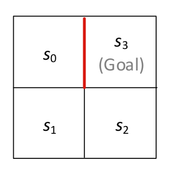

# Q-Learning

### A classical method of Reinforcement Learning

Guillaume Lozenguez

[@imt-lille-douai.fr](mailto:guillaume.lozenguez@imt-lille-douai.fr)

---

## Acting over a system evolving under uncertainty

- **States**: set of configurations defining the studied system
- **Action**: finite set of possible actions to perform
- **Transitions**: Describe the possible evolution of the system state

### Transition function:

The probabilistic evolution depends on the performed action.

$$T : S \times A \times S \rightarrow [0, 1]$$

$T(s_t,\ a,\ s_{t+1})$ return the probability to reach $s_{t+1}$ by doing $a$ from $s_t$:

$$T(s_t,\ a,\ s_{t+1}) = P(s_{t+1} | s_t,  a)$$

---
<!-- --------------------------------------------------------------- -->

## Acting to optimize Gain

Require to evaluate the interest of each action on the system evolution:

- *Reward/Cost function* (R) :

$$R : S \times A  \times S \rightarrow \mathbb{R}$$

$$R(s_t,\ a,\ s_{t+1}) \text{ is the reward by reaching } s_{t+1} \text{ from doing } a \text{ in } s_t $$

**OR**, in a simplified version:

$$R : S \times A \rightarrow \mathbb{R}$$

---
<!-- --------------------------------------------------------------- -->

## Acting to optimize gain (accumulated rewards)

- Our objective: *a policy* ($\pi$) : a function returning the action to perform  considering the current state of the system:

$$\pi : S \rightarrow A$$
$$\pi(s): \ \text{the action to perform is } s$$

- *Bellman Equation* :

$$V^\pi(s)= R(s, a) + \gamma \sum_{s'\in S} T(s,a,s') \times V^\pi(s')$$
$$\text{with :} \ a=\pi(s) \text{ and } \gamma \in [0, 1[ \text{ the discount factor (typically 0.99)}$$

---
<!-- --------------------------------------------------------------- -->

## reward in 421-game

Over the final combination only with the action "*keep*-*keep*-*keep*" or when the horizon is $0$

$\mathit{score}(\text{4-2-1}) \qquad = 800$
$\mathit{score}(\text{1-1-1}) \qquad = 700$
$\mathit{score}(\text{x-1-1}) \qquad = 400 + x$
$\mathit{score}(\text{x-x-x}) \qquad = 300 + x$
$\mathit{score}(\text{(x+2)-(x+1)-x}) = 202 + x$
$\mathit{score}(\text{2-2-1}) \qquad = 0$
$\mathit{score}(\text{x-x-y}) \qquad = 100 + x$
$\mathit{score}(\text{y-x-x}) \qquad = 100 + y$

---
<!-- --------------------------------------------------------------- -->

## Markov Decision Process

**MDP:** $\langle S, A, T, R \rangle$:

*S :* set of system's states
*A :* set of possible actions
*T :* S × A × S → [0, 1] : transitions
*R :* S × A → R : cost/rewards

**Optimal policy:**

The policy $\pi^*$ maximizing Bellman

---
<!-- --------------------------------------------------------------- -->

## Reinforcement Learning:

 
 

### Learn the optimal policy

- Without knowledge over the transition probabilities and/or the rewards,
- but, by getting feedback from acting randomly.

### 2 approaches

- **model-based:** Learn the model, then compute the optimal policy.
- **model-free:** Learn the policy directly.

---
<!-- --------------------------------------------------------------- -->

## Model-Free Approaches

### Concept

- Learn without generating **transition** and **reward** models.
- Build the **policy** directly from the interactions
- Use only the experience of sequences: 

$$state,\ action,\ reward,\ state,\ action, \ \ldots $$

### Common approaches:

- **Q-learning**: continuous computing of an expected gain (require rich feedback)
- **Monte-Carlo**: use random explorations until a 'finale' state (slow to converge).

---
<!-- --------------------------------------------------------------- -->

## Exploration–Exploitation tradeoff dilemma

The agent build an optimal behavior from trials and errors. 

- _Exploration_
    - Try new actions to learn unknown feedback
    - Better understand the dynamics of the system
    - Risky output
- _Exploitation_
    - Use the best-known action
    - Potentially suboptimal

---
<!-- --------------------------------------------------------------- -->

## Exploration–Exploitation Tradeoff Dilemma

### Examples:

- _Exploitation_: apply a known game strategy **vs** _Exploration_ investigate new actions.
- _Exploitation_: go to your favorite restaurant **vs** _Exploration_ try a new one.

### Classical approach:

- Trigger exploration *when* the old fashion strategy doesn't work anymore
  Problems:
  - Determine that "a strategy doesn't work" ?
  - Determine that "a new policy is well defined" (exploration end) ?
- Continuously Explore and Exploite with a fixed ratio.
  - (take wrong decision periodically)

<!--  ******************************************** -->
<!--  ******************************************** -->
<!--  ******************************************** -->

---

## Continuous Exploration–Exploitation : $\epsilon$-Greedy

A Simple heuristic for the Exploration–Exploitation Tradeoff Dilemma

- Random decision with:
    - a probability $\epsilon$ to choose a random action (exploration)
    - a probability $1-\epsilon$ to choose the best-known action (exploitation)
- Classically $\epsilon$ is set to $0.1$
- A $\epsilon$-greedy agent behavior punctually takes off-policy action

Then the challenge consists in varying $\epsilon$ depending of the knowledge the agent has of the area he is interacting in.

---
<!-- --------------------------------------------------------------- -->

## Q-learning

 
 
 

One of the most important discoveries in Reinforcement Learning (simple and efficient)

- At each step, **Q-learning** updates the value attached to a couple (state, action)
- Updates are performed integrate expected future gains
- The update is performed accordingly to a learning rate $\alpha \in ]0, 1[$
    $\rightarrow \alpha$ : ratio between new vs old accumulated information.

---
<!-- --------------------------------------------------------------- -->

## Q-learning based on a Q function

Considering it is not possible to evaluate state without a policy yet

$$V^\pi(s)= R(s, a) + \gamma \sum_{s'\in S} T(s,a,s') \times V^\pi(s')$$

the **Q-values** evaluate each action performed from each state:

$$ Q : S \times A  \rightarrow \mathbb{R}, \qquad Q(s,\ a) \text{ is the value of doing } a \text{ from } s $$

and, a **Q-value** is updated iteratively from succession of: $\langle s,\ a,\ s',\ r\rangle$

$$Q(s, a) = (1-\alpha)Q(s,a) + \alpha \left(r + \gamma \max_{a'\in A} Q(s', a')\right)$$

---
<!-- ************************************************************** -->

## Q-learning : the algorithm

*Input:* state and action spaces: *A* ; a step engine *Perform* ;
exploration ratio: *$\epsilon$* ; learning rate: *$\alpha$* ; discount factor *$\gamma$*

1. Read the initial state $s$
2. Initialize $Q(s,a)$ to 0 for any action $a$
3. Repeat until convergence
   1. At *$\epsilon$* random: get a random $a$ *or* $a$ maximizing $Q(s, a)$
   2. *Perform* $a$ and read the reached state $s'$ and the associated reward $r$
   3. If necessary, add $s'$ to $Q$ ( with value $0$ for any action $a$)
   4. Update $Q(s,a)$ accordingly to *$\alpha$* and *$\gamma$*
   5. set $s=\ s'$

*Output:* the **Q-values**.

---
<!-- ************************************************************** -->

## Q-learning : the algorithm

In agent-based programming:

- As an initial step : 
   1. Initialize $Q$
- At 'game' start :
   1. Read the initial state $s$
- At each itereration :
   1. Read the reached state $s'$ and the associated reward $r$
   2. If necessary, add $s'$ to $Q$ (with value $0$ for any action $a$)
   3. Update $Q(s,a)$ accordingly to *$\alpha$* and *$\gamma$*
   4. reccord $s=\ s'$
   5. At *$\epsilon$* random: get a random $a$ *or* $a$ maximizing $Q(s, a)$

---

## Q-learning : the main equation

### Update Q each time a tuple $\langle s^t, a, s^{t+1}, r \rangle$ is read

$$\mathit{newQ}(s^t, a) = (1-\alpha)Q(s^t,a) + \alpha \left(r + \gamma \max_{a'\in A} Q(s^{t+1}, a')\right)$$

- $Q : S\times A \rightarrow \mathbb{R}$ : the value function we build.
- $\alpha$ : the learning rate, $\qquad \epsilon$ : the Exploration-Exploitation ratio
- $\gamma$ : the discount factor

### The known optimal policy:

$$\pi^*(s) = \max_{a\in A} Q(s, a)$$

---
<!-- --------------------------------------------------------------- -->

## Simple Example

 
 

- **States**: 4 positions
  $s_0$, $s_1$, $s_2$ and $s_3$
- **Actions**: left, right, up, down
- **Transitions**: determinist
- **Rewards**:
  10 for reaching $s_3$, -1 else

($\epsilon= 0.1$, $\alpha= 0.1$ and $\gamma=0.99$)

---
<!-- --------------------------------------------------------------- -->

## Simple Example

- From $s_0$ get action *left* (explore)
  reaches $s_0$ with $-1$
  updates $Q(s_0, \mathit{left}) = -0.1$
- $s_0$ gets *right* (best) $\rightarrow$ ($s_0$, $-1$)
  updates $Q(s_0, \mathit{right}) = -0.1$
- $s_0$ gets *down* (exp.) $\rightarrow$ ($s_1$, $-1$)
  updates $Q(s_0, \mathit{down}) = -0.1$
...
- $s_2$ gets *up* (exp.) $\rightarrow$ ($s_3$, $10$) 
  updates $Q(s_2, \mathit{up}) = 1$
  **End Episode**

---
<!-- --------------------------------------------------------------- -->

## Simple Example

($\alpha= 0.1$, $\epsilon= 0.1$ and $\gamma=0.99$)

- **Episode 1**: ($~18$ action)

S           |  $s_0$  |  $s_1$  | $s_2$ |
------------|---------|---------|-------|
$\mathit{max}\ Q$    | $-0.39$ | $-0.19$ |   $1$ |

- **Episode 2**: ($~15$ action)

S           |    s_0  |   s_1  | s_2 |
------------|---------|--------|-----|
$\mathit{max}\ Q$ | $-0.43$ |  $0.9$ | $1.9$ |

...

---
<!-- --------------------------------------------------------------- -->

## Simple Example

($\alpha= 0.1$, $\epsilon= 0.1$ and $\gamma=0.99$)

 
 

- **Episode N**: ($3$-$4$ actions)

S           |  $s_0$  |  $s_1$  | $s_2$ |
------------|---------|---------|-------|
$\mathit{max}\ Q$    |   $7.8$ |   $8.9$ |  $10$ |
$\mathit{argmax}\ Q$ | $\downarrow$ | $\rightarrow$ | $\uparrow$ |

---

 
 
 
 
 

#### Let's go....
