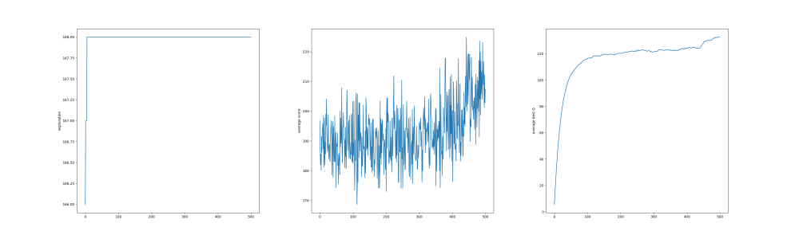

# Going further in <br /> reinforcement learning

<br />
<br />
<br />
<br />

Guillaume Lozenguez

[@imt-lille-douai.fr](mailto:guillaume.lozenguez@imt-lille-douai.fr)


---

## Q-Learnin: the basics


<br />
<br />
<br />

- Iterative update on (State, Action) interest.
- Q-value equation:

$$Q(s^t, a) = (1-\alpha)Q(s^t,a) + \alpha \left(r + \gamma \max_{a^*\in A} Q(s^{t+1}, a^*)\right)$$

- Parrameters:<br />*$\alpha$* - learning rate ; *$\epsilon$* - thexploration-Exploitation ratio ; *$\gamma$* - discount factor


---

## Q-Learnin: Game 421 (Single PLayer)

<br />

- State Space: Horizon $\in [2, 0]$, Dice $\in [1, 6] \times 3$ : (~ 168 états)
- Action Space: **Keep** or **Roll** each dice $2^3$ : (8 actions)
- Potentially **$168 \times 8 \times 168$** Transition.
- Game score (unique final reward): [0 (*2-2-1*), 800 (*4-2-1*)]
- Random policy score : **~170**

<br />
<br />

- Correction: [playerQ.py (raw file)](https://raw.githubusercontent.com/ceri-num/module-DUU/master/codes/playerQ.py)

---

## Q-Learnin: Game 421 (Single PLayer)

- With **500** steps of **500** games:


- *$\alpha$* : 0.1 ; *$\qquad \epsilon$* :  0.1 ; *$\qquad \gamma$* : 0.99

---

## Convergence: effect of the learning rate

- With **500** steps of **500** games:



- *$\alpha$* : 0.01 ; *$\qquad \epsilon$* :  0.1 ; *$\qquad \gamma$* : 0.99

---

## Convergence: effect of the exploration ratio

- With **500** steps of **500** games:


- *$\alpha$* : 0.01 ; *$\qquad \epsilon$* :  0.6 ; *$\qquad \gamma$* : 0.99

---

## Playing with the parameters:

<br />
<br />
<br />
<br />
<br />

- Generated rapidly "good" policies
- Converge on maximal and stable Q values <br />(an indicator for optimal policy)

<br />
<br />

- Be reactive to system modification (recovery)
  (no more equiprobable dice for instance)

---

## Optimize Q-Learning:

<br />

### A first solution: use dynamic parameters

- Balance **learning rate** and **exploration ratio**<br /> by taking into account known and unknown areas:

*Typically*: Count the number of performed transitions, for each couple of (state, action)

*Problem*: The dynamic will depend on other parameters

*Danger*: Quid of the recovery mode

---

## Optimize Q-Learning:

<br />

### A second solution: use expert kownledge

- Drive the exploration with an expert knowledge.

*Typically*: initialize the Q(s, a) with coherent value to take advantage<br /> of exploitation from the very beginning.

*Problem*: calibrate the "weight" of the initial knowledge.

*Danger*: Wrong initialization could slow down the learning process.

---

## Model-based learning (the other RL technic)

### Main Idea:

- Random trajectories (a lot)
- Until each transition is visited several times.
- Compute an optimal policy.

### Potentially: 

- Require driving exploration
- Only incomplete exploration can be performed

<!---

## Parrentesis:

<br />
<br />

Exploration driven learning.

- Human exploration []()
- Applied to a robot []()
-->

---
<!-- --------------------------------------------------------------- -->


## Markov Decision Process

<br />

**MDP:** $\langle S, A, T, R \rangle$:

*S :* set of system's states
*A :* set of possible actions
*T :* S × A × S → [0, 1] : transitions
*R :* S × A → R : cost/rewards


**Optimal policy:**

The policy $\pi^*$ maximizing Bellman

---
<!-- --------------------------------------------------------------- -->

## Solving MDP: Value Iteration

*Input:* an **MDP:** $\langle S, A, T, R \rangle$ ; precision error: *$\epsilon$* ; discount factor *$\gamma$* ; initial $V(s)$
1. Repeat until the **maximal delta** < $\epsilon$
For each state $s \in S$
      - Search the action $a^*$ maximizing the Bellman Equation
      - Update $\pi(s)$ and $V(s)$ by considering action $a^*$
      - Compute the delta value between the previous and the new $V(s)$

*Output:* an optimal **$\pi^*$** and associated **V-values**.

$$V^\pi(s)= R(s, a) + \gamma \sum_{s'\in S} T(s,a,s') \times V^\pi(s')$$

---
<!-- --------------------------------------------------------------- -->

## Application to 421

- Python implementation - [playerMDP.py](https://raw.githubusercontent.com/ceri-num/module-DUU/master/codes/playerMDP.py) :

```Python
solver= MDP()
solver.learnModel( Engine() )
solver.valueIteration()

player= PiPlayer( solver.policy() )
```
<br />

- Learning phase: Estimate **t** and **r**:
  - *10 000* simulations for each couple (s, a)
- Value iteration:
  - *3* iterations (directed and finit game)
- Average score (100 000 games): **~338**

(To notice: decreasing the learning phase impact the average score)

---
<!-- --------------------------------------------------------------- -->

<br />
<br />
<br />
<br />
<br />

#### Let's play to a more complicated game: Zombie Dice....
