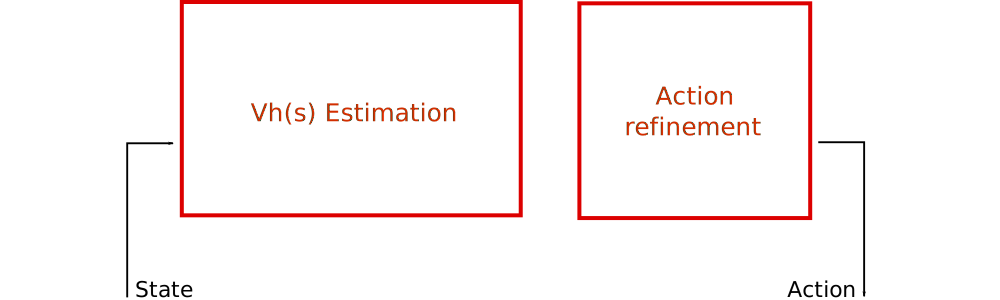
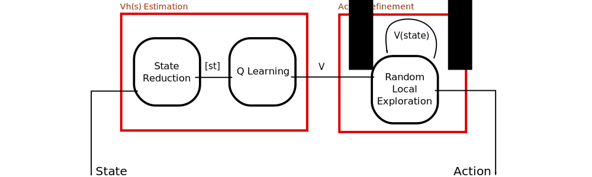
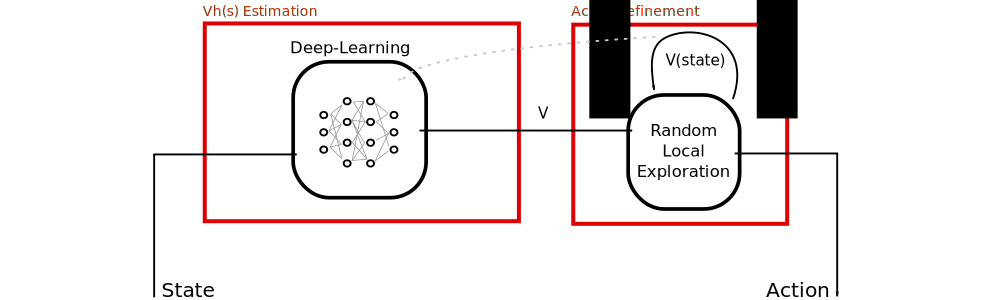

# Scaling

 
 
 
 

Guillaume Lozenguez

[@imt-lille-douai.fr](mailto:guillaume.lozenguez@imt-lille-douai.fr)

---

## Decision Making

### Is about controlling linked variables:

- Learning correlation
- Optimize trajectories

### Matematically: 

- Manipulate Cartesian Product (Set Theory)
- Estimate functions
- Exploring large graph

---

## Dealing with large State Space

 
 
 
 

#### Reduce the state space

#### Work locally

#### A combination of these 2 solutions

---

## A Complete Decision Architecture

 
 
 

---

## A Complete Decision Architecture

 
 
 

---

## State reduction (or identification) 

### Approach:

Distance based approach:

- Principal Component Analysis (**PCA**) (+ Discretization)
- Clustering: **k-means**, Simple Vector Machine (**SVM**)

Discrete approach:

- Decision-Tree (ID3 algorithm family)

### Goals:

**Macro-States** merge states with supposed similar values.

---

## Deep-Learning-based Decision Architecture

### Requirement:

Labeled data with valid *values*...

---

## Action refinement at run time

 

#### Local computation of the Values and the policy from current state.

- Constrained Value Iteration (from the current state, with a limited horizon)
- Monte Carlo Approach (based on deep, but random trajectories)

### Requirement:

Simulation: a model of the controlled system

---

## The Curse of Dimensionality in MDP

### Fonction de Transition:

---

## Factored Model:

### Factored Transition function:

---

## Factored Model:

### Factored Transition function:

---

## Bayesian Network:

Model complex system from local dependencies

### Example: Rain, Sprinkler and Grass Wet:

---

## Example: 421

*Transition in two steps, but only the first isstokastic.*

---

## Example: Zombie Dice

 

 **Eat maximum brains  
 without dying (3 damages)**

 - Players are zombies.
 - They try to catch humans   three at a time.
 - Humans are dice   with probability to fight back.

---

## Example: Zombie Dice

### Matrice complète

---

## Example: Zombie Dice

### Dynamic Bayesian Network:

---

## Model-Based Learning:

#### It’s more about estimate variable correlations than transition probabilities.

- Determines variable dependencies (ie. Bayesian Network)
- Learn conditional probabilities (Gaussian Noise, Poisson’s law)
- Validate the model regarding it entropy

#### Then decide from exploring limited search spaces

- Limited horizon Value or Policy Iteration
- random trajectories: Algorythm Monte-Carlo

---

#### To conclude

---

## Conclusion

- Problem: Control Dynamic System
- Hypothesis: Markov Decision Process (but unknown)
- Reinforcement Learning:
  * Model-free: QLearning
  * Model-based: Bellman Values function
- The root difficulty: the curse of dimensionality 
  * Use factored model

### 

- The solution requires to:
  * identify the model structure
  * have a lot of data 
- Optimasation from an iterative/incremental process
