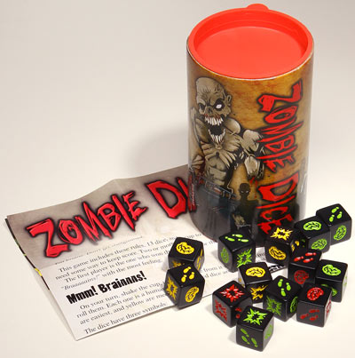

# Learning: Scalling

 
 
 
 

Guillaume Lozenguez

[@imt-lille-douai.fr](mailto:guillaume.lozenguez@imt-lille-douai.fr)

---

## Model-based learning

## The Curse of Dimensionality

### Fonction de Transition:

---

## Le fléau de la dimension

### Factored Transition function:

---

## Le fléau de la dimension

### Factored Transition function:

---

---

### Lets play to a more complexe game...

---

## Example: Zombie Dice

 

 **Eat maximum brains  
 without dying (3 damages)**

 - Players are zombies.
 - They try to catch humans   three at a time.
 - Humans are dice   with probability to fight back.

---

## Example: Zombie Dice

### Matrice complète

---

## Example: Zombie Dice

### Dynamic Bayesian Network (Continue)

