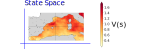

# The Curse of Dimensionality

 
 
 
 

Guillaume Lozenguez

[@imt-lille-douai.fr](mailto:guillaume.lozenguez@imt-lille-douai.fr)

---

## System Difficulty

### Directly correlated to the state space:

**The number of states:** the Cartesian product of variable domains $|S|$   (minus some unreachable states)

- **421 game:** $3$ dice-$6$ at the horizon $3$: $\left( 3 \times 6^3 = 648 \right)$ but $168$ effectives.

### Then the branching:

### Finnally the number of games:

---

## System Difficulty

### Directly correlated to the state space

**The number of states:** $|S|$

### Then the branching:

**The number of possible actions and actions' outcomes.**

- **421 game:** $2^3$ actions,  $6^r$ action outcomes ($r$, the number of rolled dice). 

### Finnally the number of games:

**The number of all possible succesion of states** until reaching an end.  Potentially $|S|^h$ ($h$ the horizon).

---

## Reminder over Combinatorics

**With a Classical 32-card game:** Possible distribution *$32!= \quad 2.6 \times 10^{35}$*

**Human life:** around *$5 \times 10^{7}$* seconds

Probability to play 2 times the same distribution in a human life is very close to 0

---

### The root problem: handle large systems

 
 
 

#### A first basic solution: reduce the state space definition

---
## State reduction in QLearning

### Project the states in a smallest space (dimention and size)

By mitigate the negative impact on the resulting built policy.

---
## State reduction in QLearning

### Project the states in a smallest space (dimention and size)

- From evaluated observations.

---
## State reduction in QLearning

### Project the states in a smallest space (dimention and size)

- Group together similar states.

---
## State reduction in QLearning

### A classical unsupervised learning problem

- Group similar states :
  * close state (in the transition succession)
  * similar reward distributions.

### Potentially: a supervised learning problem

- Group similar states :
  * similar Value
  * similar action outcome

 (suppose to have some valued states)

---

## With a geometric approach

### Principal Component Analysis (PCA)

Searching the hyper-plan that better separate the data, in a given dimension.

### K-means

Searching the optimal *k* center positions that better group the data together.

 
 
 
 
 

- Work well with 'linear state transitions' and different states density.
- Suppose a data set (trace)

---

## Based on state variable prevalence

### Decision Tree

**Nodes:** variables ; **Edges:** assignment ; **leaf:** group of states

- Expert based Decision tree or learned ([ID3 algorithm](https://en.wikipedia.org/wiki/ID3_algorithm))

---

## Based on state variable prevalence

### Decision Tree

***(Example for 421 game)***

---

## Learning: an iterative process:

 
 
 

- **1** - Define a first state reduction $\mathit{red}_0(s)$ with a first $Q_0$ estimation
- **2** - Optimise $Q_i$ and learn a behavior accordingly to $\mathit{red}_i(s)$
- **3** - Generate a new reduction $\mathit{red}_{i+1}(s)$ (more accurate)
- **4** - Propagate value from $Q_i$ to $Q_{i+1}$ 
- **5** - goto **2**

---

### Let's go

#### Trying state reduction in ZombieDice

<!-- **ZombieDice:**  $3$ dice-$3$ in $3$ stocks (and $2$ scores:) $\left( 4^3\times7\times5\times4\times4\ (\times 2 \times 14) = 35 840\right)$ -->
