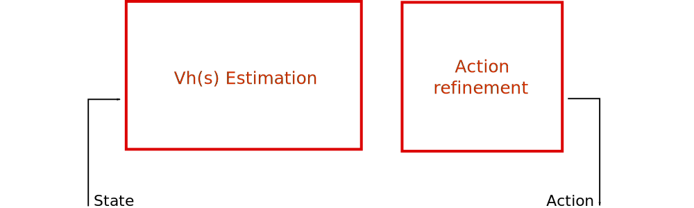
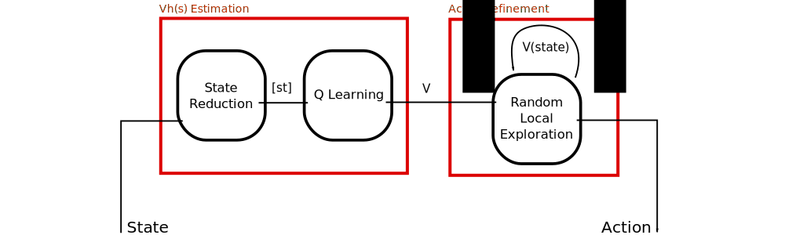
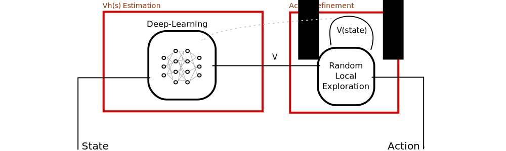

# The Curse of Dimensionality

 
 
 
 

Guillaume Lozenguez

[@imt-lille-douai.fr](mailto:guillaume.lozenguez@imt-lille-douai.fr)

---

## With a Classical 32-card game

Possible distribution *$32!= \quad 2.6 \times 10^{35}$*

**Human life:** around *$5 \times 10^{7}$* seconds

Probability to play 2 times the same distribution in a human life is very close to 0

---

## Decision Making

### Is about controlling linked variables:

- Learning correlation
- Optimize trajectories

### Matematically: 

- Manipulate Cartesian Product (Set Theory)
- Estimate functions
- Exploring large graph

---

## Dealing with large State Space

 
 
 
 

#### Reduce the state space

#### Work locally

#### A combination of these 2 solutions

---

## A Complete Decision Architecture

 
 
 

---

## A Complete Decision Architecture

 
 
 

---

## State reduction (or identification) 

### Approach:

Distance based approach:

- Principal Component Annalysis (**PCA**) (+ Discretization)
- Clustering: **k-means**, Simple Vector Machine (**SVM**)

Discrete approach:

- Decision-Tree (ID3 algorithm family)

### Goals:

**Macro-States** merge states with supposed similar values.

---

## Deep-Learning-based Decision Architecture

### Requirement:

Labeled data with valid *values*...

---

## Action refinement at run time

 

#### Local computation of the Values and the policy from current state.

- Constrained Value Iteration (from the current state, with a limited horizon)
- Monte Carlo Approach (based on deep, but random trajectories)

### Requirement:

Simulation: a model of the controlled system

---

## Action refinement at run time

 

#### Local computation of the Values and the policy from current state.

- Constrained Value Iteration (from the current state, with a limited horizon)
- Monte Carlo Approach (based on deep, but random trajectories)

### Requirement:

Simulation: a model of the controlled system

