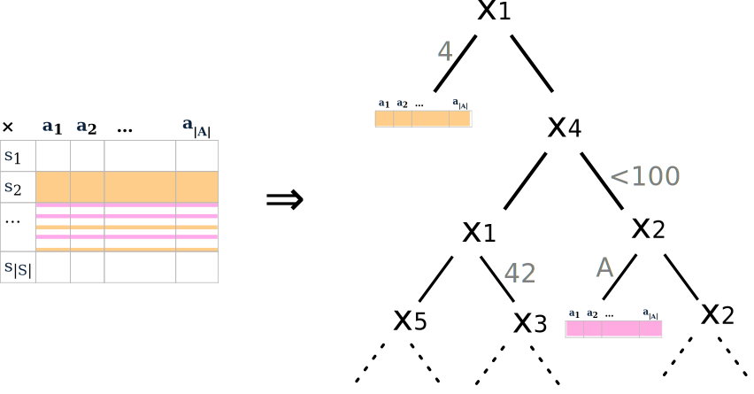
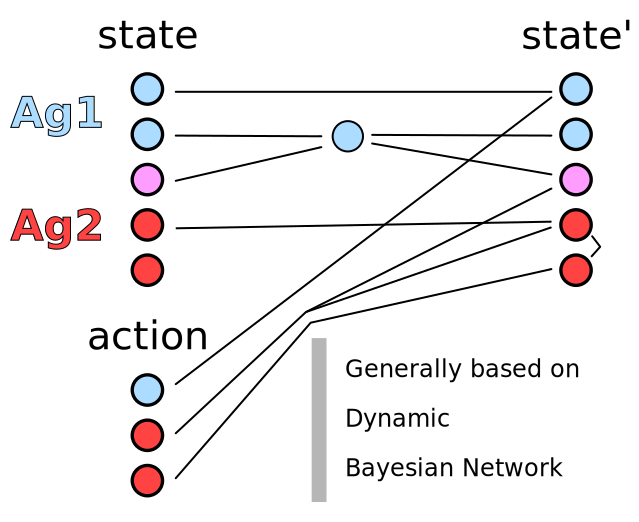
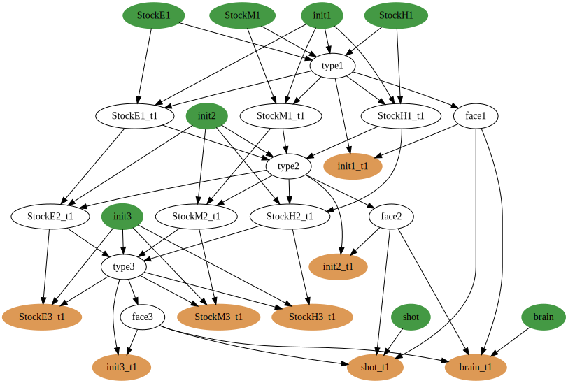

## Représentation factorisée : arbre de décision

**Au 421:** si l'adversaire possède un *4-2-1* il y a *56* combinaisons, 
mais seulement *4* possibilités: j'ai *4-2-1*, il me manque 1, 2, ou 3 dés

 

- Méthode concurrente: **Les réseaux de neurones**

---

## Le fléau de la dimension (model base)

### Fonction de Transition:

---

## Le fléau de la dimension

### Factored Transition function:

---

## Le fléau de la dimension

### Factored Transition function:

---

## Example: Zombie Dice

 

 **Eat maximum brains  
 without dying (3 damages)**

 - Players are zombies.
 - They try to catch humans   three at a time.
 - Humans are dice   with probability to fight back.

---

## Example: Zombie Dice

### Matrice complète

---

## Example: Zombie Dice

### Dynamic Bayesian Network (Playing)

