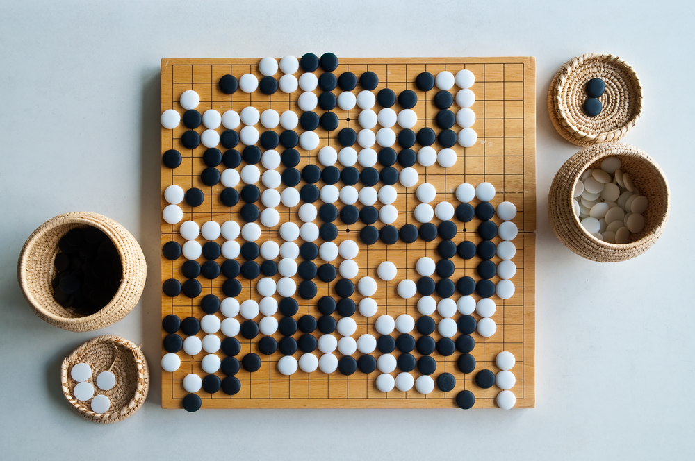
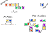
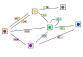
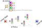
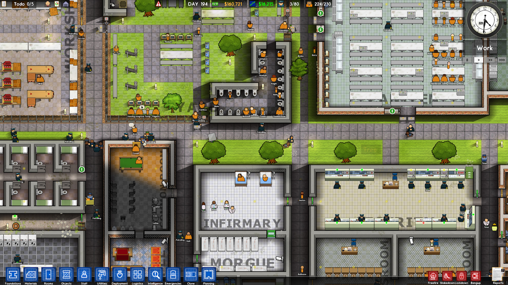
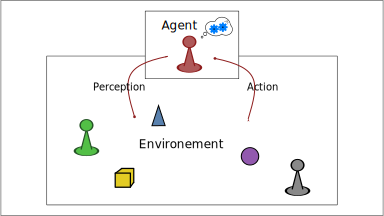

# Decision Under Uncertainty

### An introduction

### UV - MAD

Guillaume Lozenguez  
[at imt-lille-douai.fr](mailto:Guillaume Lozenguez)

## Last improvement in Artificial Intelligence

- *Nov. 2007*, Carnegie-Mellon gagne le Darpa Urban Challenge ($2M\$$)

- *Oct. 2015*, Victory of d'\emph{AlphaGo} over professional player

GO: $10^{170}$ positions, $10^{600}$ games (chess: $10^{120}$ games)

## Last improvement in Artificial Intelligence

In France:

- *March 2018*, Rapport Villani   [www.aiforhumanity.fr](http://www.aiforhumanity.fr)

## Return to the notion of complexity (Go)

  GO: $10^{170}$ positions, $10^{600}$ games (chess: $10^{120}$ games)

  

  A classical $3$ GHz computer: $3\times10^9$ op. per second  
  $\rightarrow$ $~ 2.6 \times 10^{14}$ op. a day $\rightarrow$ $~ 10^{17}$ op. a year

  Enumerating all games $O(n)$ with $n=10^{600}$: arround $10^{583}$ years.  
  $\rightarrow$ requires decomposed model and statistics...

<!--   (Durée de vie de notre univers: $10^30$ années) -->

## Introduction - This Course

### Decision Under Uncertainty

Is an introduction to models and algorithms 
to perform decision-making at a time step *t* 
by considering potential effects.

- 19 hours (5 sessions)
- Mainly as tutorials
- A simple dice game as a playground

## Contents

- Introduction
- Class of problems
- The notion of Agent
- Decision Making Process of an agent

## Class of problems - Deterministic Planning

is the process that determines *a succession of actions* 
to drive a system from an initial state to a target state.

**Deterministic case**:

- the effects, by doing an action, from a specific state  is certain.

## Class of problems - Deterministic Planning

Is the process that determines *a succession of actions* 
to drive a system from an initial state to a target state.

**Deterministic case**:

- The effects, by doing an action, from a specific state  is certain.

## Class of problems - Determine a Plan

Finding a *path* in a *graph* modeling all possible evolutions

## Class of problems - Plan Optimization

Finding an *optimized* path in a *weighted* Graph

## Class of problems - Stokastic Planning

Build a *policy*:

- Associate an *action* to perform  
*to each* reachable *state*

## Class of problems - Stokastic Planning

Then the effective succession of actions remains stochastic

## Class of problems - Game theory

*Few entities* control the same system (with different goals)

- Which actions for each entity ?
- Which consequences ?

## Class of problems - Game theory

Few entities control the same system 
With different goals.

- *Uncertainty*: At last on the actions of the others.

## Class of problems - Control Complex systems

Complex systems:
- A lot of entities in interactions

- *Uncertainty*: ...

## Vocabulary

 
 

- **graph** composed of **node** and **edges**
- **graph** composed of **state** and **action** (State Automata)
- **planning**: finding a valid succession of **actions**
- **determinist** versus **uncertain** / **stochastic**
- **system**, **control** (automation)
- **Multi-Agent System**, **Decision Making** (AI)

## Notion of Agent

 
 
**"I act therefore I am"**
 
 
 

- my actions have an effect on the world
- **and** I have the choice to act or not

 
 
 
 
 
 

cf. "BullShit Jobs" - David Graeber (2019)
(p.132-133 fr. in version )

or the joy to be cause - Karl Groos (1901)

<!-- Pour approfondir: : broucek francis « the sense of self » 1977 - Klein G. S. « the vital pleasures » 1976.-->

## Notion of Agent - Simple definition

 
 
 

### Entity capable of perception and action  evolving in an environment.

 
 
 

### Question:

### How to choose appropriate action to perform  considering the perception at a each time step ?

 
 
 

## Notion of Agent - Simple definition

### Open loop control

rarely determinist, mostly uncertain (even stochastic)

## Notion of Agent - Complementary Notions

### Agent:

- defining by a perception-state, goals and a policy to achieve its 
(*BDI* model: Belief - Desire - Intention)
- with different positions in social structure 
(*AGR* model: Agent - Group - Role )
- capable of communication
- capable of adaptation (learning)
- driven by emotions
- ...

## Course notion to acquire
  

  From *reactive control*

  **to**

  *deliberative control*

  Immediate response 
  to stimuli

   

  Script:   
  if .... then ...    
  else if ...   

      
  **versus**

  model and statistical 
  decision-making

## Course notion to acquire

    

### Decision-making under uncertainty

- Script, Policy and Decision Tree
- Statistical evolution: Bayesian Network
- Planning: Markov Decision Process

## Zombie dice

### A Stokastic Dice Game

- Players are Starved Zombies
- dice are humans
- Zombies eat human brains
- and can't take more than 2 shots

## Zombie dice

### A Stokastic Dice Game

**Decision:**

- Score or Continue

**Uncertainty:**

- dice selection
- dice result
- score evolution

