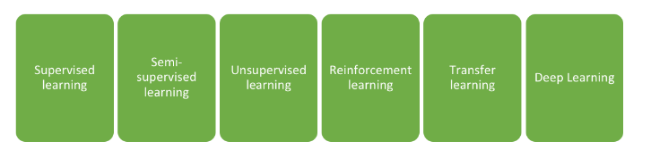
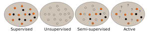
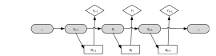
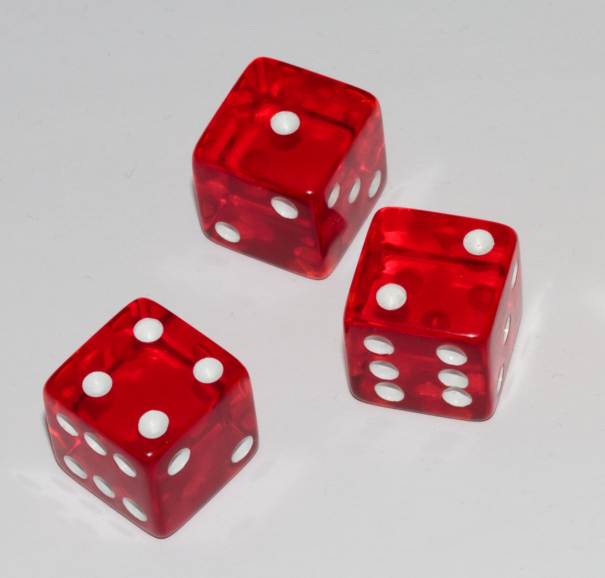
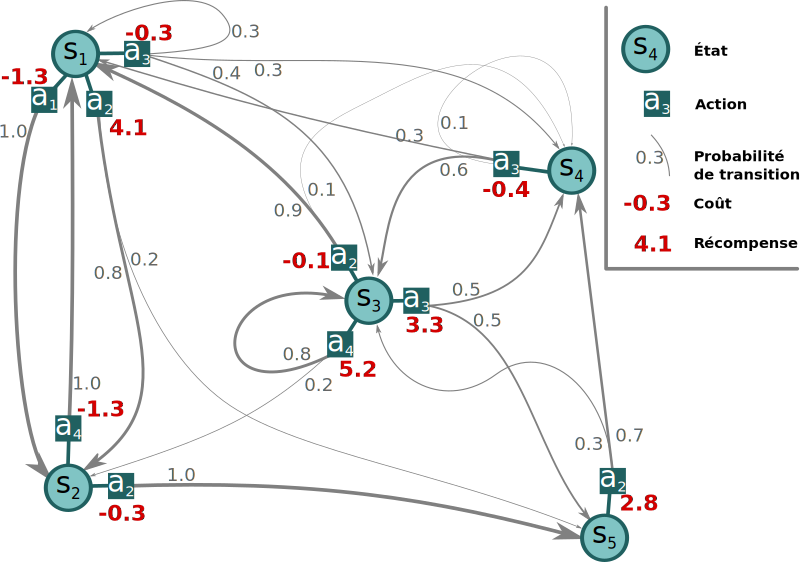

<!-- --------------------------------------------------------------- -->

# Reinforcement Learning

### Understand Dynamic Model and   Sequencial Decision Making.

 
 
 

Abir KARAMI
_>_ Guillaume LOZENGUEZ

 

---
<!-- --------------------------------------------------------------- -->

## Who we are ?

**Abir Karami**
Assistant Professor   Institut Catholique de Lille
Ph.D. Computing Science and AI
Human Centered Intelligent System
Application to compagnon robots, Smart Home,   Serious-Games ... 

---
<!-- --------------------------------------------------------------- -->

## Who we are ?

**Guillaume Lozenguez**
Assistant Professor   Institut Mines Télécom Lille Douai
Ph.D. Computing Science and AI
Distributed AI and coordination
Application to mobile robotics and transport systems 

---
<!-- --------------------------------------------------------------- -->

- **Introduction**
  - Reinforcement Learning in AI
  - Example: the 4-2-1 game 
- **Decision Under Uncertainty**
- **Reinforcement Learning**
- **Examples**

---
<!-- --------------------------------------------------------------- -->

## Learning in Articial Intelligence Domain

A machine capable of **learning** from **data** to optimize an **objectif**

<!-- AI regroupe toute les approches qui essaye de rendre une machine ..... machine : robot, réseaux sociaux, netflix. Données : image, vidéo/observation, fichier. Objectif : assister/aide à la décision, faire une tache, satisfaire.
Comment ? Beaucoup de travaux et des méthodes et tout dépends de type de données et des objectifs. -->

<!-- ---
<!-- --------------------------------------------------------------- -- >

## Automatic Learning

<!--  en 1980  selon les données et l'environnement-- >

- Data :
    - En position ou à découvrir ?
    - Étiquetées ou non étiquetées ?
    - Concerne mon environnement ou un environnement similaire ?
    - ...
- The environement :
    - Statique ou dynamique ?
    - Modelisable ou pas ?
    - ...

<!--  ******************************************** -->

---
<!-- --------------------------------------------------------------- -->

## Automatic Learning

 
 
 

- **Supervised Learning** - Finding structure from labelled data
- **Unsupervised Learning** - Finding hidden structure
- **Unsupervised Learning** - Propagate labels over non labelled data
- **Active Learning** - Exploring while minimizing Oracle requests

---
<!-- --------------------------------------------------------------- -->

## Automatic Learning 

 

* **Reinforcement Learning**
  - From interactions between the system and its environment

#### (natural method, human-like learning)

---
<!-- --------------------------------------------------------------- -->

## Reinforcement Learning for Sequencial Decision Making

 

- Learning a _sequential behavior_
- Good responces maximize _long-term gains_ (accumulated rewards and penalties)

---
<!-- --------------------------------------------------------------- -->

## Example with 421-game

### Game :

- Get the best combinaison
- by rolling 3 dices

### Goal :

- Optimize the 2 re-roll possibility
- by choising dices to roll again

---
<!-- --------------------------------------------------------------- -->

- Introduction
- **Decision Under Uncertainty**
  - Artificial Intelligence 
  - Control probabilistic evolutions 
- Reinforcement Learning
- Examples

---
<!-- --------------------------------------------------------------- -->

##  Acting over a dynamic system: the agent

 

### Open loop Control: feedback

Rarelly deterministic, Mostly uncertain

---
<!-- --------------------------------------------------------------- -->

## Agent Based Modeling

 

Can be modeled as an _Agent_ or a fleet of Agents distributed on an environment.

### Questions  :

1. Comment choisir l'action appropriée   en considérant se que l'IA perçoit du monde ?

#### (PLANNIFICATION)

2.  Comment tirer profit de l'expérience,   la succession des choix précédents ?

#### (LEARNING)

---
<!-- --------------------------------------------------------------- -->

## Rationnal Agent 

#### "I act, therefore I am"

- My actions has an effet over the world **AND** I have the choice to act or not

cf. "BullShit Jobs" - David Graeber (2019) <!-- [ref. to Karl Groos (1901)] -->
(p.132-133 in french version)

<!-- Pour approfondir: : broucek francis « the sense of self » 1977 - Klein G. S. « the vital pleasures » 1976.-->

### Deliberativ Architecture - BDI:

 - _Believe_: refers to the knowledge of the agent
 - _Desire_: The agent's goals (classically states to reach)
 - _Intention_: the succession of actions to perform orriented toward the goals

<!--
### Apprentissage:

construire les *intentions* (actions à faire) sans:

 - *Believe*: je n'ai qu'une perception, je ne sais pas comment le système évolue
 - *Desire*: je ne sais pas ce qui est bien ou non (apprentissage inverse)
-->

<!--  ******************************************** -->
<!--  ******************************************** -->
<!--  ******************************************** -->

---
<!-- --------------------------------------------------------------- -->

## Acting over a system : formaly

 

### Markov Chain (Andreï Markov 1856-1922)

A tuple: $\langle States\ (S),\ Transitions\ (T) \rangle$

- **States**: set of configurations defining the studied system
- **Transitions**: Describe the possible evolution of the system state

$$T : S \times S \rightarrow [0, 1]$$
$$T(s_t,\ s_{t+1}) = P(s_{t+1} | s_t)$$

 
 

_Vocabulary Parrenthesis_: Hidden Markov Chain 
$\quad$_>_ The system state is not derectly observable.

---
<!-- --------------------------------------------------------------- -->

## Acting over a system : formaly

 

### Impact of the actions

- **Actions**: finit set of possible actions to perform

### Updated Transition function:

The probabilistic evolution depends on the performed action.

$$T : S \times A \times S \rightarrow [0, 1]$$

$T(s_t,\ a,\ s_{t+1})$ return the probability to reach $s_{t+1}$ by doing $a$ from $s_t$:

$$T(s_t,\ a,\ s_{t+1}) = P(s_{t+1} | s_t,  a)$$

<!-- Hypothesis de Markov: l'évolution ne dépend pas de l'historique
_ou_ l'état contient l'ensemble des informations nécessaires.-->

---
<!-- --------------------------------------------------------------- -->

## Model of 421: States and actions

- **States**:
  - The value of each die's face ($d_n \in [1, 6]$)
    and the re-roll number ($h \in [2, 0]$)
  - So:  ***168** states (56 combinaisons over an horizon of 3).
- **Actions**:
  - The choice of roll again each die: $[\mathit{roll},\ \mathit{keep}]$
  - so **8** actions ($2^3$)

### Action Example :

By choising to "roll-*keep*-roll" in state: "6-*4*-3 (2)" to expect a "4-2-1 (1)"

---
<!-- --------------------------------------------------------------- -->

## Model of 421: Transition function with 421-game

- **Transitions**: 
  - All reachable states by rolling somes dices 
    with the probability to reach them.

---

## Model of 421: Transition function with 421-game

### Transitions Example :

Chosing to "roll-*keep*-roll" from "6-*4*-3 (2)" implies *21* reachable states:

P(...) | = | [0, 1] | | P(...) | = | [0, 1]
-------|---|--------|-|--------|---|--------|
*4*-1-1 (1)| =  | $1/36$ | | ... 
*4*-2-1 (1)| =  | $1/18$ | | 6-*4*-4 | = | $1/18$
*4*-2-2 (1)| =  | $1/36$ | | 6-5-*4* | = | $1/18$
...      |    |          | | 6-6-*4* | = | $1/36$

---
<!-- --------------------------------------------------------------- -->

## Choising : building a policy of action

- *a policy* ($\pi$) : a function returning witch action to perform 
    Considering the current state of the system:

$$\pi : S \rightarrow A$$
$$\pi(s): \ \text{the action to perform is } s$$

---
<!-- --------------------------------------------------------------- -->

## Choising : building a policy of action

### Example of policy :

Always target a 4-2-1:  keeping only one **4**, one **2** and one **1**

$s$ | $\pi^{421}(s)$ | | $s$ | $\pi^{421}(s)$ |
------------|------------------|-|-----------|-------------
*1*-1-1   | *keep*-roll-roll   | | ...
*2*-*1*-1 | *keep*-*keep*-roll | | *4*-*2*-*1* | *keep*-*keep*-*keep*
3-*1*-1   | roll-*keep*-roll   | | ...
*4*-*1*-1 | *keep*-*keep*-roll | | 6-6-5 | roll-roll-roll
... |                          | | 6-6-6 | roll-roll-roll

(Invarient over the horizon h)

---
<!-- --------------------------------------------------------------- -->

## Choising to optimise

 
 

Require to evaluate the interest of each action on the system evolution:

- *Reward/Cost function* (R) :

$$R : S \times A \rightarrow \mathbb{R}$$

$R(s_t,\ a)$ is the reward by doing $a$ from $s_t$.

- *Bellman Equation* :

$$V^\pi(s)= R(s, a) + \gamma \sum_{s'\in S} T(s,a,s') \times V^\pi(s')$$
$$\text{with :} \quad a=\pi(s) \text{ and } \gamma \in [0, 1[ \text{ the discount factor}$$

---
<!-- --------------------------------------------------------------- -->

## reward in 421-game

Over the final combinaison only with the action "*keep*-*keep*-*keep*" or when horizon is $0$

$\mathit{score}(\text{4-2-1}) \qquad = 800$
$\mathit{score}(\text{1-1-1}) \qquad = 700$
$\mathit{score}(\text{x-1-1}) \qquad = 400 + x$
$\mathit{score}(\text{x-x-x}) \qquad = 300 + x$
$\mathit{score}(\text{(x+2)-(x+1)-x}) = 202 + x$
$\mathit{score}(\text{2-2-1}) \qquad = 0$
$\mathit{score}(\text{x-x-y}) \qquad = 100 + x$
$\mathit{score}(\text{y-x-x}) \qquad = 100 + y$

---
<!-- --------------------------------------------------------------- -->

## Recap:  Markov Decision Process

**MDP:** $\langle S, A, T, R \rangle$:

*S :* set of system's states
*A :* set of possible actions
*T :* S × A × S → [0, 1] : transitions
*R :* S × A → R : cost/rewards

**Optimal policy:**

The policy $\pi^*$ maximizing Bellman

---
<!-- --------------------------------------------------------------- -->

## Reinforcement Learning:

Learn the optimal policy

- without knoledges over the transition nether the reward functions,
- but, by getting fedback from acting randomly.
