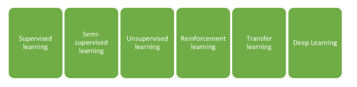
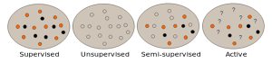
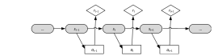

<!-- --------------------------------------------------------------- -->

# Reinforcement Learning

### Understand Dynamic Model and   Sequencial Decision Making.

 
 
 

Abir KARAMI
_>_ Guillaume LOZENGUEZ

 

---
<!-- --------------------------------------------------------------- -->

## Who are we ?

**Abir Karami**
Assistant Professor   Institut Catholique de Lille
Ph.D. Computing Science and AI
Human-Centered Intelligent System
Application to compagnon robots, Smart Home,   Serious-Games ... 

---
<!-- --------------------------------------------------------------- -->

## Who are we ?

**Guillaume Lozenguez**
Assistant Professor   Institut Mines Télécom Lille Douai
Ph.D. Computing Science and AI
Distributed AI and coordination
Application to mobile robotics and transport systems 

---
<!-- --------------------------------------------------------------- -->

- **Introduction**
  - Reinforcement Learning in AI
  - Example: the 4-2-1 game 
- **Decision Under Uncertainty**
- **Reinforcement Learning**
- **Examples**

---
<!-- --------------------------------------------------------------- -->

## Learning in Artificial Intelligence Domain

A machine capable of **learning** from **data** to optimize an **objective**

<!-- AI regroupe toute les approches qui essaye de rendre une machine ..... machine : robot, réseaux sociaux, netflix. Données : image, vidéo/observation, fichier. Objectif : assister/aide à la décision, faire une tache, satisfaire.
Comment ? Beaucoup de travaux et des méthodes et tout dépends de type de données et des objectifs. -->

<!-- ---
<!-- --------------------------------------------------------------- -- >

## Automatic Learning

<!--  en 1980  selon les données et l'environnement-- >

- Data :
    - En position ou à découvrir ?
    - Étiquetées ou non étiquetées ?
    - Concerne mon environnement ou un environnement similaire ?
    - ...
- The environnement :
    - Statique ou dynamique ?
    - Modelisable ou pas ?
    - ...

<!--  ******************************************** -->

---
<!-- --------------------------------------------------------------- -->

## Automatic Learning

 
 
 

- **Supervised Learning** - Finding structure from labelled data
- **Unsupervised Learning** - Finding hidden structure
- **Unsupervised Learning** - Propagate labels over non-labelled data
- **Active Learning** - Exploring while minimizing Oracle requests

---
<!-- --------------------------------------------------------------- -->

## Automatic Learning 

 

* **Reinforcement Learning**
  - From interactions between the system and its environment

#### (natural method, human-like learning)

---
<!-- --------------------------------------------------------------- -->

## Reinforcement Learning for Sequencial Decision Making

 

- Learning a _sequential behavior_
- Good responses maximize _long-term gains_ (accumulated rewards and penalties)

---
<!-- --------------------------------------------------------------- -->

## Example with 421-game

### Game :

- Get the best combination
- by rolling 3 dices

### Goal :

- Optimize the 2 re-roll possibility
- by choosing dices to roll again.
