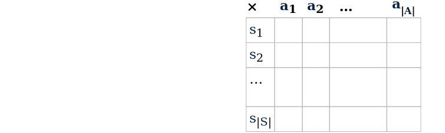

<!-- --------------------------------------------------------------- -->

- Introduction
- Decision Under Uncertainty
- **Reinforcement Learning**
  * QLearning
  * Curse of dimensionality
- Examples

---
<!-- --------------------------------------------------------------- -->

## Idea

- Planning in an unknown environment
- No model : **T** and **R** need to be explored by the agent
- Way : Gathering information by interacting with the environment

<!--the use of samples to optimize performance and the use of function approximation to deal with large environments.-->
<!--  ******************************************** -->
<!--  ******************************************** -->
<!--  ******************************************** -->

---
<!-- --------------------------------------------------------------- -->

## Model-free vs. Model-based R.L.

 
 

Goal: Building the optimal polity (and the associated value function)

**Model-based R.L.**

- Considering that an **MDP** can model the system
- Approach:
  -  learn the **MDP**: **T** and **R** (or an approximation)
  -  compute the optimal polity 

**Model-free RL**

- An **MDP** can model the system, but is hard to learn
- Approach:
  - compute the optimal polity directly from the interactions

---
<!-- --------------------------------------------------------------- -->

##  Model-Based Approaches

### Concept

1. **Collect trajectories** from a random policy.
2. **Learn** T(s,a,s') in order to minimize $\sum ||T(s,a) - s'||^2$ and R(s,a)
2. **Plan** (compute an optimal policy with Bellman Equation)

### Inconvenient of Model-Based RL

- Transition probabilities are, in general, unreachable (hidden models) or hard to learn
- In those contexts, learning is insolvable or with an intractable number of trajectories.

<!--  ******************************************** -->
<!--  ******************************************** -->
<!--  ******************************************** -->

---
<!-- --------------------------------------------------------------- -->

## Model-Free Approaches

### Concept

- Learn without generating transition or reward models.
- Build the policy directly from the interactions
- Use only the experience of sequences: state, action, reward, state, ...

### Common approaches:

- **Monte-Carlo**: simple random explorations until a finale state (slow to converge).
- **Q-learning**: continuous computing of an expected gain (require rich feedback)

---
<!-- --------------------------------------------------------------- -->

## Exploration–Exploitation tradeoff dilemma

The agent build an optimal behavior from trials and errors. 

- _Exploration_
    - try new actions to learn unknown feedback
    - Better understand the dynamics of the system
- _Exploitation_
    - Use the best-known action
    - Potentially suboptimal

---
<!-- --------------------------------------------------------------- -->

## Exploration–Exploitation Tradeoff Dilemma

### Examples:

- _Exploitation_: apply a known game strategy **vs** _Exploration_ investigate new actions.
- _Exploitation_: go to your favorite restaurant **vs** _exploration_ try a new one.

### Classical approach:

- Trigger exploration *when* the old fashion strategy doesn't work anymore
  Problems:
  - Determine that "a strategy doesn't work" ?
  - Determine that "a new policy is well defined" (exploration end) ?
- Continuously Explore and Exploite with a fixed ratio.
  - (take wrong decision periodically)

<!--  ******************************************** -->
<!--  ******************************************** -->
<!--  ******************************************** -->

---

## Continuous Exploration–Exploitation : $\epsilon$-Greedy

A Simple heuristic for the Exploration–Exploitation Tradeoff Dilemma

- Random decision with:
    - a probability $\epsilon$ to choose a random action (exploration)
    - a probability $1-\epsilon$ to choose the best-known action (exploitation)
- Classically $\epsilon$ is set to $0.1$
- A $\epsilon$-greedy agent behavior punctually takes off-policy action

Then the challenge consists in varying $\epsilon$ depending of the knowledge the agent has of the area he is interacting in.

<!--  ******************************************** -->
<!--  ******************************************** -->
<!--  ******************************************** -->

<!--
## Monte-Carlo
- Les méthodes de Monte-Carlo ne nécessitent aucune connaissance de la transition comme dans les MDP
- Effectuer l'apprentissage par renforcement à partir d'une séquence d'interactions
- Imiter l'itération de la politique pour trouver la politique optimale
- Estimer la valeur de chaque action Q (s, a) au lieu de V (s)
- Je stocke les récompenses moyennes dans la table des actions d'état

| État  |$a_1$        $a_2$|  Optimal Policy |
|-------|------------------|-----------------|
| $s_1$ |  2            1  |   $a_1$         |
| $s_2$ |  1            3  |   $a_2$         |
| $s_3$ |  2            4  |   $a_2$         |

## Monte-Carlo : l'algorithm

- Initialiser une table d'état-action arbitraire
    - Souvent, toutes les récompenses sont initialement mises à zéro
- Observer le premier état
- (*) choisir une action en fonction de la sélection d'action $\epsilon$-greedy, c.-à-d.
    - avec la probabilité $\epsilon$, choisir une action aléatoire
    - sinon, choisir l'action avec la récompense attendue la plus élevée
- Mettre à jour le tableau avec une nouvelle récompense (moyenne)
- Observer le nouvel état
- Passez à l'étape (*)

**Désavantage**

- Temps de calcul élevé et donc convergence lente
    - La méthode doit fréquemment évaluer une politique sous-optimale

-->

<!--  ******************************************** -->
<!--  ******************************************** -->
<!--  ******************************************** -->

---
<!-- --------------------------------------------------------------- -- >

## Curiosity guided exploration

TODO: if times

---
<!-- --------------------------------------------------------------- -->

## Q-learning

One of the most important discoveries in Reinforcement Learning (simple and efficient)

- At each step, **Q-learning** updates the value attached to a couple (state, action)
- By looking at the maximal value of the new reached state.
- The update is performed accordingly to a learning rate $\alpha \in ]0, 1[$
    $\rightarrow \alpha$ : ratio between new vs old accumulated information.

---
<!-- ************************************************************** -->

## Q-learning : the algorithm

 
 

1. Initialize a table $Q(s,a)$ to 0 for any couple $(s, a)$
2. Repeat until convergence
  1. Read the current state $s$
  2. at $\epsilon$ random $a$
       - get a random action $a$ 
       - get the action $a$ that maximize $Q(s, a)$
  3. get the reward $r$ and the next state $s'$ by doing $a$
  4. Update $Q(s,a)$:

 $$Q(s, a) = (1-\alpha)Q(s,a) + \alpha \left(r + \gamma \max_{a'\in A} Q(s', a')\right)$$

---

## Q-learning : the main equation

 
 
 

$$Q(s, a) = (1-\alpha)Q(s,a) + \alpha \left(r + \gamma \max_{a'\in A} Q(s', a')\right)$$

- $Q : S\times A \rightarrow \mathbb{R}$ : the value function we build.
- $\alpha$ : the learning rate
- $\epsilon$ : the Exploration-Exploitation ratio
- $\gamma$ : the discount factor

 

### The optimal policy:

$$\pi^*(s) = \max_{a\in A} Q(s, a)$$

<!-- $$Q(s, a) = Q(s,a) + \alpha r + \gamma max Q(s', a) - Q(s, a)$$ -->

<!-- Maximise la valeur espérée de la récompense totale sur toutes les évolutions possibles, à partir de l'état actuel
$\gamma$ ?? -->

---
<!-- --------------------------------------------------------------- -->

## Simple Example

 
 

- **States**: 4 positions
  $s_0$, $s_1$, $s_2$ and $s_3$
- **Actions**: left, right, up, down
- **Transitions**: determinist
- **Rewards**:
  10 for reaching $s_3$, -1 else

---
<!-- --------------------------------------------------------------- -->

## Simple Example

 
 

($\alpha= 0.1$, $\epsilon= 0.1$ and $\gamma=0.99$)

- From $s_0$ get action *left* (explore)
  reaches $s_0$ with $-1$
  updates $Q(s_0, \mathit{left}) = -0.1$
- $s_0$ gets *right* (best) $\rightarrow$ ($s_0$, $-1$)
  updates $Q(s_0, \mathit{right}) = -0.1$
- $s_0$ gets *down* (exp.) $\rightarrow$ ($s_1$, $-1$)
  updates $Q(s_0, \mathit{down}) = -0.1$
...
- $s_2$ gets *up* (exp.) $\rightarrow$ ($s_3$, $10$) 
  updates $Q(s_2, \mathit{up}) = 1$
  **End Episode**

---
<!-- --------------------------------------------------------------- -->

## Simple Example

 
 

($\alpha= 0.1$, $\epsilon= 0.1$ and $\gamma=0.99$)

- **Episode 1**: ($~18$ action)

S           |  $s_0$  |  $s_1$  | $s_2$ |
------------|---------|---------|-------|
$\max Q$    | $-0.39$ | $-0.19$ |   $1$ |

- **Episode 2**: ($~15$ action)

S           |    s_0  |   s_1  | s_2 |
------------|---------|--------|-----|
$\max Q$ | $-0.43$ |  $0.9$ | $1.9$ |

...

---
<!-- --------------------------------------------------------------- -->

## Simple Example

 

($\alpha= 0.1$, $\epsilon= 0.1$ and $\gamma=0.99$)

 

- **Episode N**: ($3$-$4$ actions)

S           |  $s_0$  |  $s_1$  | $s_2$ |
------------|---------|---------|-------|
$\max Q$    |   $9.8$ |   $9.9$ |  $10$ |

<!---
<!-- ------------------------------------------------------------ -- >

## Apprendre le 421

TODO some figures.

- Appliquer le Q-Learning pour apprendre les bonnes options
- Limiter l’horizon d'apprentissage à 3
- Cumuler l'apprentissage en changeant l'état initial

 
 
 

### Pour aller plus loin:

- pour bien faire, on ne jouera pas de la même façon  
  s'il reste 3 lancers ou un seul.

--->

---
<!-- --------------------------------------------------------------- -->

## The curse of dimensionality

 
 

### Fonction Q (model free):

$$Q: S \times A \rightarrow \mathbb{R}$$

<!--img src="fig/qtable.svg" alt="Q table" width="300px" /-->

- Combinatorial size over the state and action variables:

$$|S|= Dom(X1) \times Dom(X2) \times  \ldots  \times  Dom(XN) \quad \geq 2^{n}$$

- Need several visits of each system states
  
---
<!-- --------------------------------------------------------------- -->

## Petite Parenthèse sur la combinatoire

 
 

- Possible order in a classical card game: $32! = 2.6 \times 10^{35}$ conbinaisons

- The sun: a life esperance of 6 billon years <!-- milliards d'Années. -->

So: $6 \times 10^9 \times 3.154 \times 10^7 = 2 \times 10^{17}$ secondes

---
<!-- --------------------------------------------------------------- -->

## Some solutions

### Guided Reinforcement Learning

- Reduction of the state space and/or the action space
- Heuristic initialization of Q
- Increment iteratively the system complexity
- Control the randomness
- ...

### Use factorized representation

- hierarchic / decomposed / distributed
