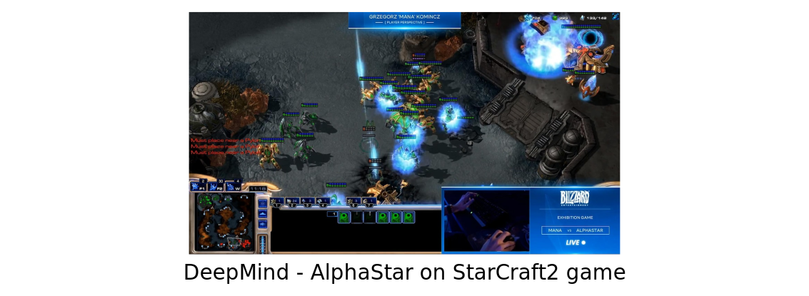
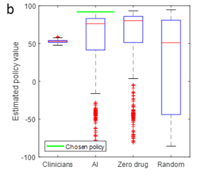

<!-- --------------------------------------------------------------- -->

- Introduction
- Decision Under Uncertainty
- Reinforcement Learning
- **Examples**
    * Two-player strategic game
    * Robotic
    * Health

---
<!-- --------------------------------------------------------------- -->

## Two-player strategic game

 
 

Peu d'entités contrôlent un système relativement simple

- *incertitude*: liée aux actions de l'adversaire.
- *optimisation*: **1** gagner, **-1** perdu, **0** null.

---
<!-- --------------------------------------------------------------- -->

## Dans le cadre du Go:

*Oct. 2015*, Victory of *AlphaGo* over professional player

GO: $10^{170}$ positions, $10^{600}$ partis possibles ($10^{120}$ aux échecs)

---
<!-- --------------------------------------------------------------- -->

## Notion de complexité (Go)

 
 

A $3$ GHz computer:
$$3\times10^9 \text{ op. per second} \rightarrow 2.6 \times 10^{14} \text{ op. a day} \rightarrow  10^{17} \text{ op. a years} $$

An enumeration of all the games: $10^{600}$ operations so: $10^{583}$ years.

---
<!-- --------------------------------------------------------------- -->

## Supremacy of AI over human: GO

### AlphaGo Strategy

- Planning with random exploration (Monte-Carlo)
- Estimation of Q(s,a) with neural networks

### AlphaGo 2016

- By analysing millions of professional games
- Intensive training (reinforcement learning)

### AlphaGo Zero

- Intensive training from scratch

---
<!-- --------------------------------------------------------------- -->

## Supremacy of AI over human: next challenges

 
 

- More complex games */* Multiplayer */* Generic AI

<!-- DeepMind - AlphaStar on StarCraft2 game -->

---
<!-- --------------------------------------------------------------- -->

## In Robotic domain

### Plenty of examples:

[Simulation and real Robot](https://www.youtube.com/watch?v=WtEYMELvRHI) - [rubiks cube manipulation](https://spectrum.ieee.org/automaton/robotics/robotics-hardware/openai-demonstrates-sim2real-by-with-onehanded-rubiks-cube-solving)
[curiosity-driven learning](https://www.youtube.com/watch?v=NOLAwD4ZTW0) - [robot-juggle](https://spectrum.ieee.org/automaton/robotics/robotics-hardware/uc-berkeley-cassie-cal-robot-juggle)
[Walking tree branches' robot](https://spectrum.ieee.org/automaton/robotics/robotics-hardware/robots-tree-branches-deep-learning-walk) - [learning-to-slice-onion](https://spectrum.ieee.org/automaton/robotics/robotics-hardware/video-friday-this-robot-is-learning-to-slice-onions)
[robot q-learning videos](https://www.youtube.com/results?search_query=robot+q-learning) ...

### Specificity:

- Experience is time consuming
- But hierarchical and incremental approach are efficient
- An interesting playground for "small data" approaches

---
<!-- --------------------------------------------------------------- -->

## RL and Healht-Care

**Opportunities**

- Many problems are sequential
- More data available every day
- Actually : Sequential aspect is mostly ignored (only quick recovery)
    $\rightarrow$ Decisions do not integrate long-term evolution

---
<!-- --------------------------------------------------------------- -->

## Reinforcement Learning and Healht-Care

**Obstacles**

- Combinatorial explosion: 
  - patient descriptors (all its history ?)
  - treatments and molecules possibilities
- Trial and errors: complicated (quid of the exploration aspect)
- Learn from available data: biases linked to data construction
- Defining the reward function:
    - Already complicated for doctors (over ethics questions)
    - Multi-criterion (more or less rapid recovery, life quality vs longevity ...)

---
<!-- --------------------------------------------------------------- -->

## RL example in Healht-Care

 
 
 
 
 

Learning for sepsis
in intensive care.

 
 
 
 
 
 

Komorowski, Matthieu, et al. "**The artificial intelligence clinician learns optimal treatment strategies for sepsis in intensive care.**"
Nature medicine 24.11 (2018)

---
<!-- --------------------------------------------------------------- -->

## RL example in Healht-Care

- Traitement d'épilepsie
- Stratégies de traitement pour cancer de poumon
- Traitement de sepsis
- Traitement d'anémie

Escandell-Montero, Pablo, et al. "**Optimization of anemia treatment in hemodialysis patients via reinforcement learning.**" Artificial intelligence in medicine 62.1 (2014): 47-60.

---
<!-- --------------------------------------------------------------- -->

###  Conclusion

---
<!-- --------------------------------------------------------------- -->

## Conclusion

 
 

### Introduction to Reinforcement Learning

Inspired from natural learning (humain/animal in real environments)
Dedicated to sequential system

- Over AI and Decision Under Uncertainty theory basis
- Strength:
  - "Fast" learning by continuously integrating interaction feedback
  - Possible interpretation of the decisions
- Weakness:
  - Exploration based on trials and errors interactions
  - Sensitive to the curse of dimensionality

